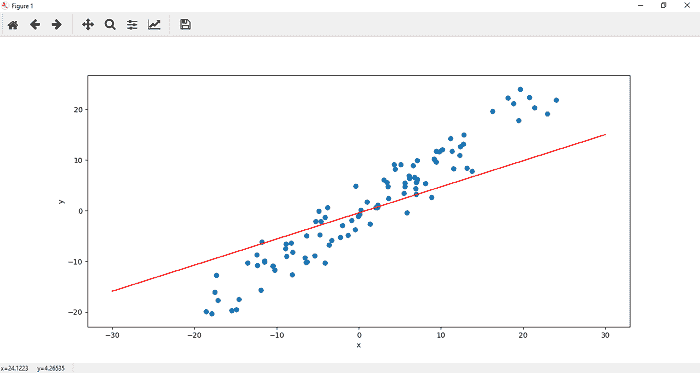
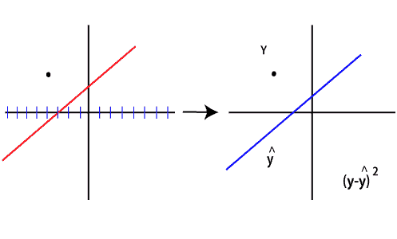
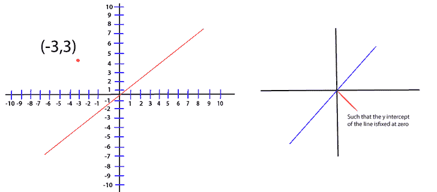
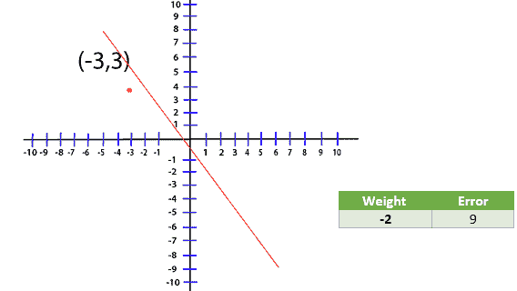
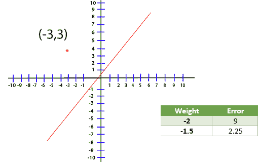
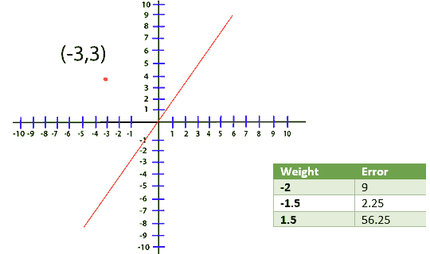
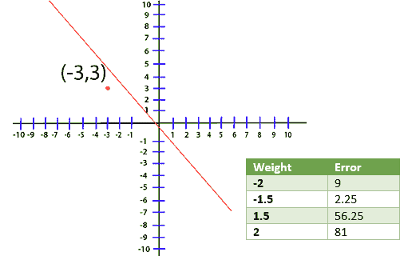
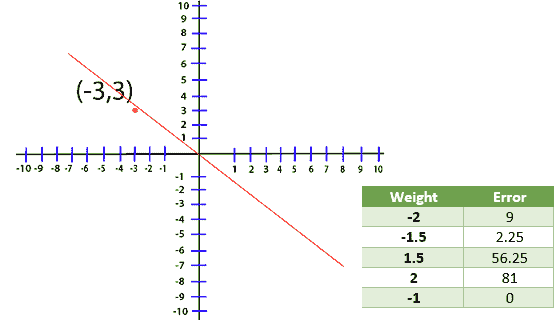
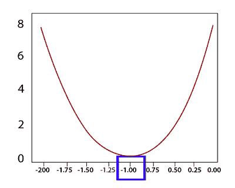

# PyTorch 中的损失函数

> 原文：<https://www.javatpoint.com/pytorch-loss-function>

在前一个主题中，我们看到该线没有正确地拟合到我们的数据。为了使其最佳匹配，我们将使用梯度下降更新其参数，但在此之前，它要求您了解损失函数。

因此，我们的目标是找到一条线的参数，它将很好地拟合这些数据。在我们前面的例子中，线性函数最初将随机权重和偏差参数分配给带有以下参数的线。



这条线不能很好地代表我们的数据。我们需要一些优化算法，根据总误差调整这些参数，直到我们得到一条包含合适参数的线。

现在，我们如何确定这些参数？

为了更好地理解，我们将讨论限制在一个数据点。

误差通过从实际 y 值中减去该点的预测值来确定。



预测越接近数值，误差越小。你已经知道的预言可以写成

```
Ax1+b

```

然而，我们正在处理一个点。这样可以画出无限多的直线。为此，我们消除了偏见。现在去掉这个额外的自由度，我们通过将偏置值固定为零来抵消它。

```
(y-y^)2
(y-(Ax+b))2
(y-(Ax+0))2
(y-Ax)2

```



现在，无论我们处理的是哪条线，最佳线都将具有一个权重，该权重将尽可能将该误差减小到接近零。现在，我们正在处理点(-3，3)，对于这个损失，函数将转换为

```
Loss=(3-A(-3))2
Loss=(3+3A)2

```

现在，我们创建一个表，尝试不同的 A 值，看看哪一个给我们的误差最小











出于可视化目的，我们在我的绘图级别中为不同的权重绘制了不同的误差值。



绝对最小值，在这种情况下，对应于负一的权重，现在，我们知道如何评估对应于我们的线性方程的误差。

我们如何训练一个模型知道这个重量？为此，我们使用[梯度下降](pytorch-gradient-descent)。

* * *