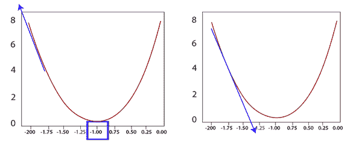
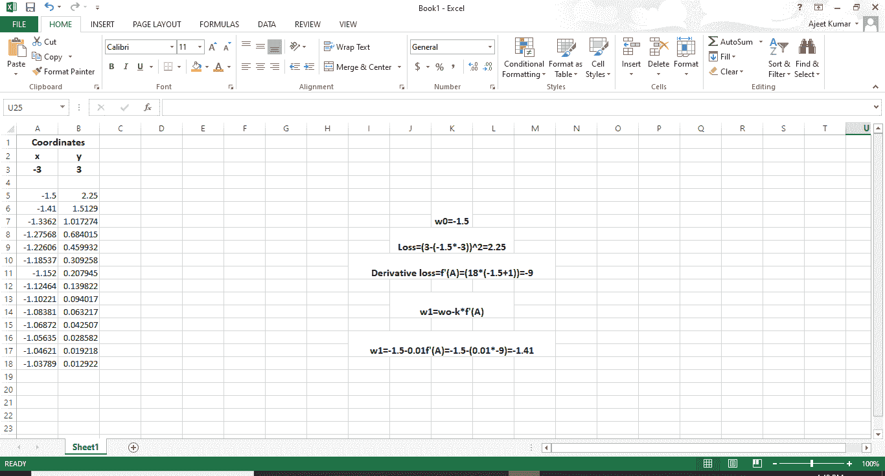

# PyTorch 中的梯度下降

> 原文：<https://www.javatpoint.com/pytorch-gradient-descent>

我们最大的问题是，我们如何训练一个模型来确定权重参数，这将最小化我们的误差函数。让我们开始梯度下降如何帮助我们训练我们的模型。

首先，当我们用线性函数初始化模型时，线性模型将从随机初始参数调用开始。它确实给了我们一个随机的初始参数。

让我们暂时忽略偏差值，根据与这个初始参数 a 相关的误差。我们的动机是朝着给我们较小误差的方向移动。

如果我们取误差函数的梯度，在我们遇到的当前值的切线斜率的导数，这个导数会把我们带到误差最高的方向。

```
Loss=(3+3A)2
f' (A)=18(A+1)

```

所以，我们把它移到梯度的负方向，这将把我们带到误差最小的方向。我们把电流作为权重，在同一点上减去那个函数的导数。

```

A1=A0-f'(A)

```

它会把我们带向最少错误的方向。



概括地说，首先，我们要计算损失函数的导数，然后提交当前的线的权重值。不管权重是多少，他们都会给你梯度值。然后从当前权重 A0 中减去该梯度值，得到新的更新权重 A1。新的权重应该比上一个权重产生更小的误差。我们将反复这样做，直到我们为我们的线模型获得最佳参数来拟合数据。

然而，我们正随着梯度下降，以确保最佳结果。一个人应该以最小的步伐下降。因此，我们将梯度乘以一个最小的数，称为 ***学习率*** 。学习率的价值是经验性的。虽然一个好的标准起始值往往是十分之一或百分之一，但学习率需要足够小，因为当线自我调整时，你永远不想在一个方向上剧烈移动，因为这会导致不必要的发散行为。

在本文中，我们将学习根据经验结果调整收益率，稍后我们将编写一个梯度下降算法，但接下来是我们的梯度下降示例。让我们参考 excel 上的演示来可视化梯度下降的效果。



我们将在后面的代码中实现它。

* * *