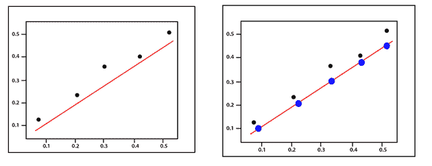
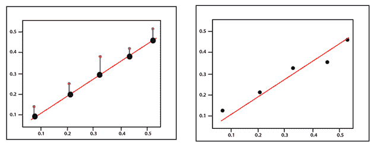
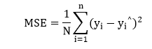
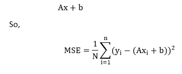
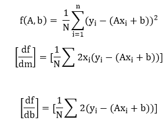

# 均方误差

> 原文：<https://www.javatpoint.com/pytorch-mean-squared-error>

**均方误差**的计算方法与之前的一般损耗方程非常相似。我们还将考虑偏差值，因为这也是一个需要在训练过程中更新的参数。

**(y-Ax+b) 2**

均方误差最好用一个例子来解释。

假设我们有一组值，我们从绘制一些回归线参数开始，这些参数由一组随机的权重和偏差值确定大小，就像以前一样。

误差对应于实际值与预测值的距离——它们之间的实际距离。

对于每一个点，误差是通过比较我们的线模型的预测值和实际值来计算的，使用以下公式

每个点都与一个误差相关联，这意味着我们必须对每个点的误差求和。我们知道这个预测可以改写为

在计算均方误差时，我们必须通过除以数据点的数量来取平均值。现在前面提到的误差函数的梯度应该把我们带到误差增加最大的方向。

向成本函数梯度的负值移动，我们向误差最小的方向移动。我们会用这个坡度作为指南针，一直带我们走下坡路。在梯度下降中，我们忽略了偏差的存在，但是对于误差，需要定义参数 A 和 b。

现在，我们接下来要做的是计算每一个的部分导数，就像我们开始任何 A 和 b 值对之前一样。

基于上面提到的两个偏导数，我们使用梯度下降算法在误差最小的方向上更新 A 和 b。对于每次迭代，新的权重等于

**A1= A0-∝f’(A)**

并且新的偏置值等于

**b【1】= b【0】-【f】(b)**

编写代码的主要思想，也就是说，我们从一些随机模型开始，这些模型具有一组随机的权重和偏差值参数。这种随机模型往往会有很大的误差函数，很大的代价函数，然后我们用梯度下降法在误差最小的方向上更新我们模型的权重。最小化该错误以返回优化结果。

* * *