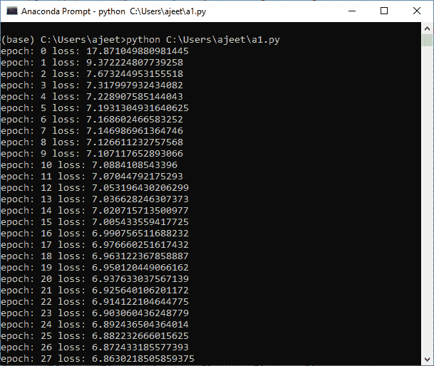
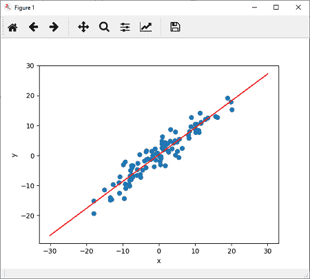

# 线性模型的训练

> 原文：<https://www.javatpoint.com/pytorch-training-of-linear-model>

给定随机参数，我们绘制了我们的线性模型。我们发现它不太符合我们的数据。我们要做的。我们需要训练这个模型，使模型有最佳的权重和偏差参数，并拟合这个数据。

**训练模型有以下步骤:**

**第一步**

我们的第一步是指定损失函数，我们打算将其最小化。PyTorch 提供了一种非常有效的方法来指定丢失的函数。PyTorch 提供了 MSELoss()函数，称为均方损失，用于计算损失

```

criterion=nn.MSELoss()

```

**第二步**

现在，我们的下一步是更新我们的参数。为此，我们指定使用梯度下降算法的优化器。我们使用称为随机梯度下降的 SGD()函数进行优化。SGD 一次最小化一个样本的总损失，并且通常收敛得更快，因为它将在相同的样本大小内频繁更新我们模型的权重。

```

optimizer=torch.optim.SGD(model.parameters(),lr=0.01) 

```

这里，lr 代表学习率，最初设置为 0.01。

**第三步**

我们将针对指定数量的时期训练我们的模型(我们计算了误差函数，并反向传播了该误差函数的梯度下降以更新权重)。

```

epochs=100

```

现在，对于每个时代，我们必须将模型系统的误差降至最低。误差只是模型预测值和实际值之间的比较。

```

Losses=[]
For i in range (epochs):
	ypred=model.forward(x)	#Prediction of y
	loss=criterion(ypred,y)	#Find loss
	losses.append()		# Add loss in list 
	optimizer.zero_grad() # Set the gradient to zero
	loss.backward()	#To compute derivatives 
	optimizer.step()	# Update the parameters 

```

**第四步**

现在，最后，我们通过简单地调用 plotfit()方法来绘制新的线性模型。

```

plotfit('Trained Model')

```

* * *

## 完全码

**程序**

```

import torch
import torch.nn as nn
import matplotlib.pyplot as plt
import numpy as np
X=torch.randn(100,1)*10
y=X+3*torch.randn(100,1)
plt.plot(X.numpy(),y.numpy(),'o')
plt.ylabel('y')
plt.xlabel('x')
class LR(nn.Module):
	def __init__(self,input_size,output_size):
		super().__init__()
		self.linear=nn.Linear(input_size,output_size)
	def forward(self,x):
		pred=self.linear(X)
		return pred	
torch.manual_seed(1)	#For consistency of random result 
model=LR(1,1)
criterion=nn.MSELoss()	#Using Loss Function
optimizer=torch.optim.SGD(model.parameters(),lr=0.01)  #Using optimizer which uses GD algorithm
print(model)
[a,b]=model.parameters()	#Unpacking of parameters
epochs=100
losses=[]
for i in range(epochs):
	ypred=model.forward(X)
	loss=criterion(ypred,y)
	print("epoch:",i,"loss:",loss.item())
	losses.append(loss)
	optimizer.zero_grad()
	loss.backward()
	optimizer.step()
defgrtparameters():
       return(a[0][0].item(),b[0].item())
defplotfit(title):
	plt.title=title
	a1,b1=grtparameters()
	x1=np.array([-30,30])
	y1=a1*x1+b1
	plt.plot(x1,y1,'r')
	plt.scatter(X,y)
	plt.show()
plotfit('Trained Model')

```

**输出:**





* * *