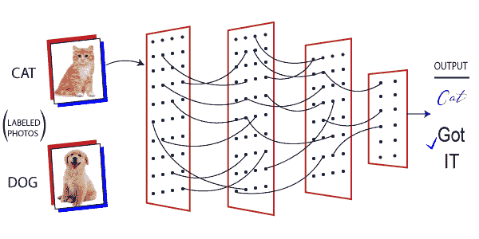
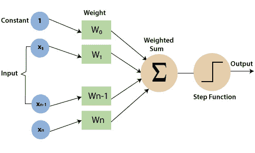
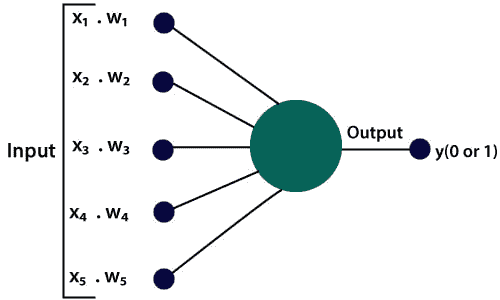
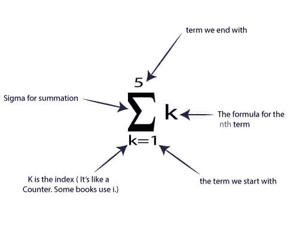
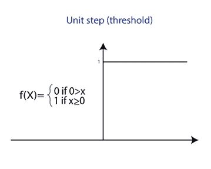

# 感知器

> 原文：<https://www.javatpoint.com/pytorch-perceptron>

**感知器**是一个**单层神经网络**，或者我们可以说一个神经网络是一个多层感知器。感知器是一种二元分类器，用于监督学习。ANN中生物神经元的简单模型被称为**感知器**。

一个能够决定一个由数字向量表示的输入是否属于某个特定类别的函数被称为二进制分类器。二元分类器是一种线性分类器。线性分类器是一种分类算法，它基于将一组权重与特征向量相结合的线性预测函数来进行预测。

感知器算法被设计成将受试者分类为两种类型之一，视觉输入分类和用线分隔组。分类是**图像处理**和**机器学习**的关键部分。感知器算法对模式进行分类，即使用机器学习算法通过许多不同的方式进行查找和分类，并通过查找通过数字或视觉输入接收的不同对象和模式之间的线性分离进行分组。

正常的神经网络如下图所示。

感知器由四个部分组成，在 **PyTorch** 中实现感知器模型需要理解这四个部分。

*   **输入值或一个输入层**
    感知器的输入层由人工输入神经元构成，将初始数据带入系统进行进一步处理。
*   **权重和偏差**
    **权重**代表单位之间连接的强度或维度。如果从节点 1 到节点 2 的权重具有更大的数量，那么神经元 1 对神经元 2 具有更大的影响。输入对输出的影响有多大，是由权重决定的。
    **偏差**类似于线性方程中加入的截距。它是一个附加参数，任务是调整输出以及神经元输入的加权和。
*   **激活功能**
    一个神经元该不该被激活，是由一个激活功能决定的。激活函数计算一个加权和，并进一步加上偏差以给出结果。

**神经网络**是基于感知器的，所以如果我们想知道神经网络的工作原理，就要学习感知器是如何工作的。

**感知器按照如下三个简单的步骤工作:**

a)在第一步中，所有的输入 x 都乘以它们的权重，表示为 k。这一步是必不可少的，因为这一步的输出将被输入到下一步。

b)下一步是将 K 1 到 K n 的所有相乘值相加。它被称为加权和。这个加权和将被视为下一步的输入。

c)在下一步中，将根据上一步计算的加权和应用于正确的激活函数。

**例如**

单位阶跃激活功能

#### 注 1: 重量表示特定节点的强度。

#### 注 2: 偏置值允许您向上或向下移动激活函数曲线。

#### 注 3: 激活功能用于在所需值(0，1)或(-1，1)之间映射输入

#### 注 4: 感知器通常用于将数据分为两部分。因此，它也被称为线性二元分类器。

* * *