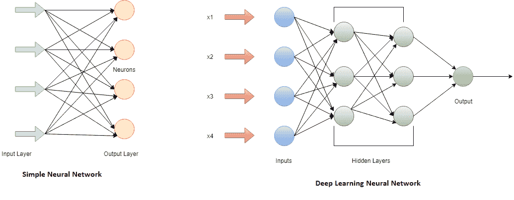

# 深度学习

> 原文：<https://www.javatpoint.com/pytorch-deep-learning>

深度学习是**机器学习**中使用的一套算法。它是基于ANN的机器学习方法的一部分。学习可以是有监督的、无监督的或半监督的。

深度学习架构，即深度神经网络、递归神经网络和卷积神经网络，已被应用于自然语言处理、计算机视觉、语音识别、音频识别、社交网络过滤、机器翻译、药物设计、生物信息学、医学图像分析、材料检验和棋盘游戏程序等领域，它们在某些情况下产生了优于人类专家并可与之媲美的结果。

深度学习用于

*   自动驾驶汽车
*   医疗保健方面的深度学习
*   语音搜索和语音激活助理
*   自动为无声电影添加声音
*   自动机器翻译
*   自动文本生成
*   自动手写生成
*   图像识别
*   自动生成图像字幕
*   自动着色

## 神经网络和深度学习神经网络

**ANN**或**神经网络**仿照人脑建模。人类有在特定情况下思考和执行任务的头脑，但是机器怎么能做到呢？为此，设计了一个人工大脑，称为神经网络。由于人脑有传递信息的神经元，类似地，神经网络也有节点来执行这项任务。节点是数学函数。

神经网络基于生物神经网络的结构和功能。神经网络本身根据输入和输出进行改变或学习。由于ANN的学习和变化特性，流经网络的信息会影响其结构。

**深度学习神经网络**是神经网络的高级形式。与简单的神经网络不同，深度学习神经网络有多个隐藏层。深度学习神经网络获取更复杂的数据集，您的模型可以从中学习。深度学习神经网络是

## 神经网络的优势

| S.No | 优势 | 描述 |
| 1. | 在整个网络中存储信息。 | 在传统编程中，信息存储在整个网络上，而不是数据库上。如果某条信息在某个地方丢失，它不会阻止网络运行。 |
| 2. | 知识不全的工作 | 当我们的ANN被训练时。数据可能会产生输出，要么是完整的信息，要么是不完整的信息。这里，损失表现取决于缺失信息的重要性。 |
| 3. | 分布式存储器 | 为了训练ANN，有必要确定例子，并通过展示这些例子根据期望的输出训练它。网络会产生错误输出，即无法向网络显示事件。 |
| 4. | 制作机器学习的能力 | ANN有能力让机器学习。ANN通过对类似事件的评论来学习事件和做出决策。 |
| 5. | 容错功能 | 如果一个或多个单元中有损坏，不会阻止它生成输出，此功能使其具有容错能力。 |
| 6. | 并行处理 | ANN可以同时执行多项工作，因为它的数字强度质量。 |

## 神经网络的缺点

| S.No | 不足之处 | 描述 |
| 1. | 硬件依赖性 | Ann 要求处理器根据其结构具有并行处理能力。由于这个原因，设备的实现是依赖的。 |
| 2. | 网络无法解释的行为 | 这是ANN最重要的问题之一。当它产生一个试探性的解决方案时，它没有给出任何关于为什么和如何的线索。 |
| 3. | 确定适当的网络结构 | 对于确定神经网络的结构，没有具体的规则可用。在经验、尝试和错误的帮助下，实现了合适的网络结构。 |
| 4. | 向网络显示问题的难度 | ANN处理数字信息，以便在引入ANN之前将问题转化为数值。因此，很难向网络展示问题。 |

* * *