# 创建感知器模型数据集

> 原文：<https://www.javatpoint.com/pytorch-creating-dataset-of-perceptron-model>

现在，我们将了解如何创建、学习和测试感知器模型。感知机模型在 PyTorch 中的实现是通过几个步骤完成的，例如为模型创建数据集、建立模型、训练模型和测试模型。

让我们从第一步开始，即创建数据集。

为了创建数据集，我们将直接从 SDK learn 导入数据集。SDK-learn 为我们提供了许多预先准备好的数据集。我们将通过简单地导入一个数据集来访问所有这些数据集。在这种情况下，我们还使用 numpy 库对这些数据进行进一步的操作和分析，最后将导入最常用的用于绘制数据集的库，即 matplotlib.pyplot。

在这种情况下，我们首先使用 SDK 学习来创建一个线性可分离的数据集，然后使用 torch 创建一个基于感知的神经网络。之后，神经网络将训练学习如何拟合我们的数据集，以便它能够将我们的数据分成两个离散的类。这将使用您可能熟悉的优化算法(梯度下降)来完成。

在本文中，我们将使用 make_blobs()方法。该函数将创建一组数据点，这些数据点都随机地集中在为该组选择的一个中心点上。

让我们看看创建数据集的步骤

1.第一步是导入所有需要的库，如 torch、sklearn、numpy 和 matplotlib.pyplot。

```

import torch
import numpy as np
import matplotlib.pyplot as plt
fromsk learn import datasets

```

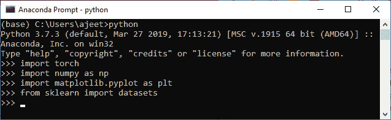

2.在第二步中，我们定义数据点的数量，然后使用 make_blobs()函数创建数据集。正如我告诉你的，这个函数将创建一组数据点。

```

no_of_points=100
datasets.make_blobs()

```

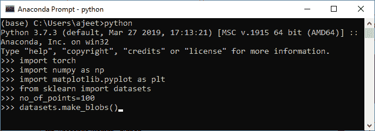

3.在调用 make_blobs()函数之前，我们需要创建一个嵌套列表，该列表指定了我们的集群中心的坐标。因此，我们必须调用列表中心，并按照以下方式定义集群的中心坐标。

```

centers=[[-0.5,0.5],[0.5,-0.5]]

```

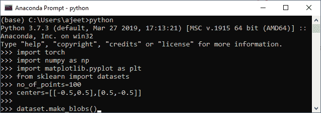

4.现在，我们将创建数据集，并将数据点存储到变量 x 中，同时将值存储到变量 y 中，我们将稍微利用我们的标签。

```

x,y=dataset.make_blobs()

```

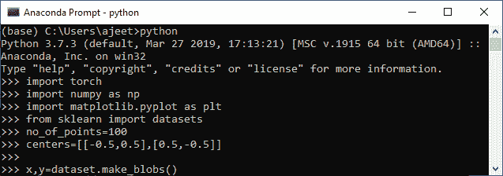

5.我们的数据集尚未创建，因为我们没有传递该函数的任何适当参数。所以我们在这里传递所有的论点。第一个参数表示样本点数；第二个参数是随机状态，第三个参数是中心和最后一个参数，它将允许我们生成第一个线性可分的数据集，即 cluster std。

```

x,y=datasets.make_blobs(n_samples=no_of_points,random_state=123,centers=centers,cluster_std=0.4)

```

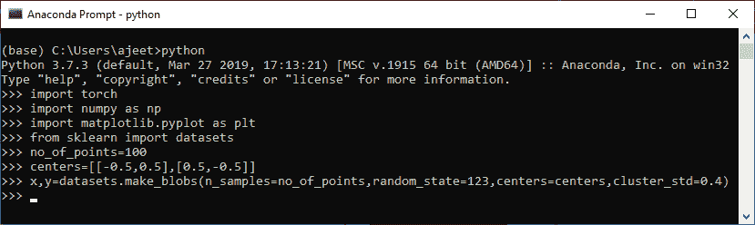

6.在下一步中，我们通过打印 x 和 y 坐标来可视化数据，如下所示

```

print(x)
print(y)

```

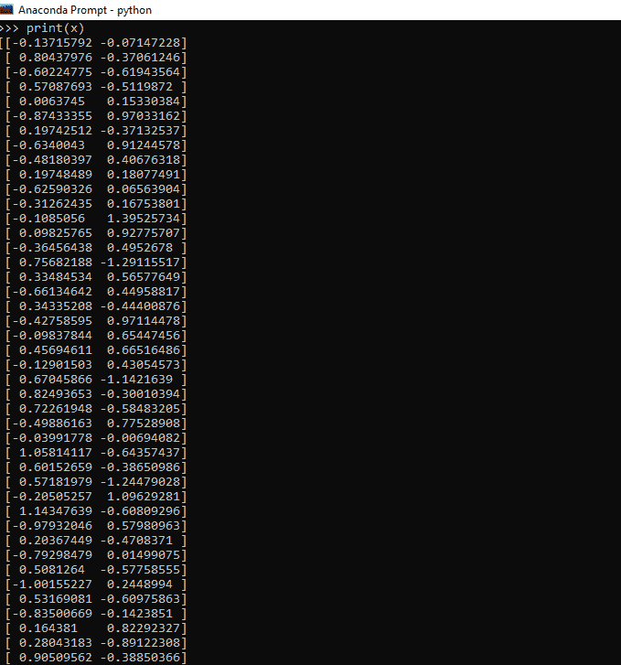
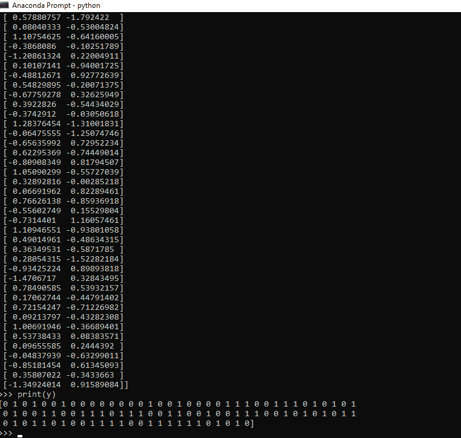

7.现在，在根据需要定制数据集之后，我们可以使用 plt.scatter()函数来绘制和可视化它。我们定义每个标签数据集的 x 和 y 坐标。让我们从标签为 0 的数据集开始。它绘制了我们数据的顶部区域。0 标记数据集的散点图函数定义为

```

plt.scatter(x[y==0,0],x[y==0,1])

```

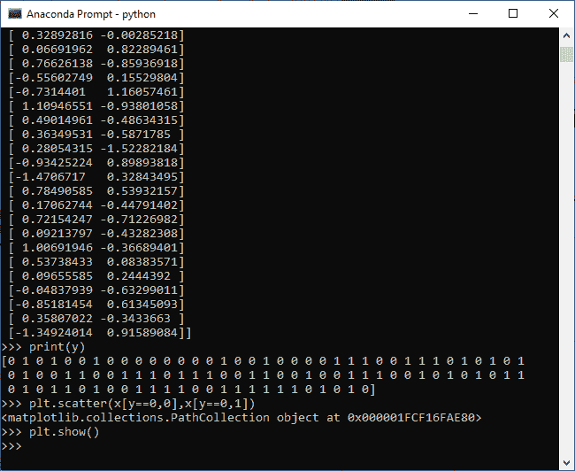
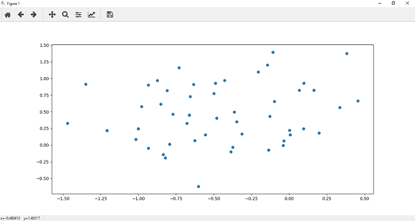

8.现在，我们在数据的下部绘制点。一个标记数据集的散点图函数()定义为

```

plt.scatter(x[y==1,0],x[y==1,1])

```

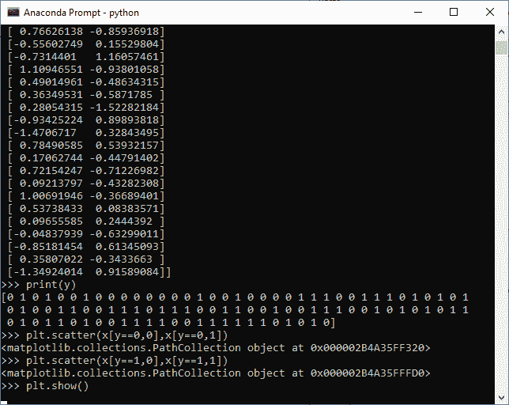
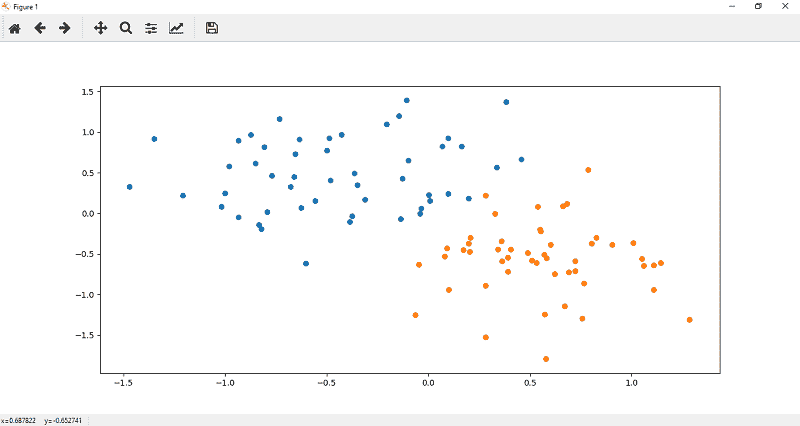

9.记住要训练一个模型 x，y 坐标都应该是 numpy 数组。所以我们要做的是将 x 和 y 值转换成张量，如

```

xdata=torch.Tensor(x)
ydata=torch.Tensor(y)

```

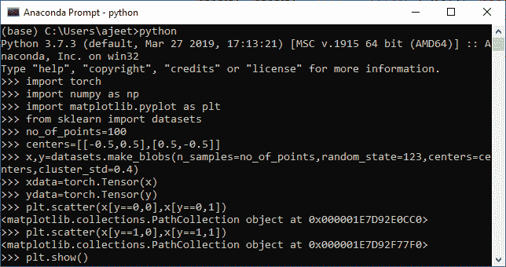
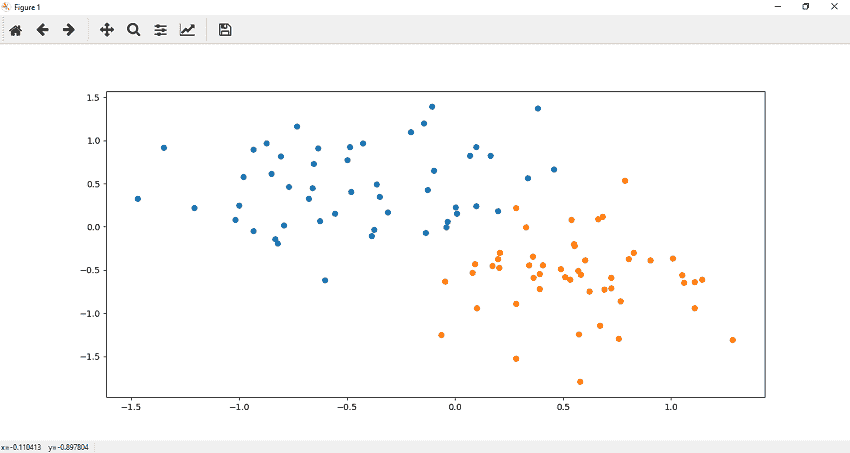

* * *