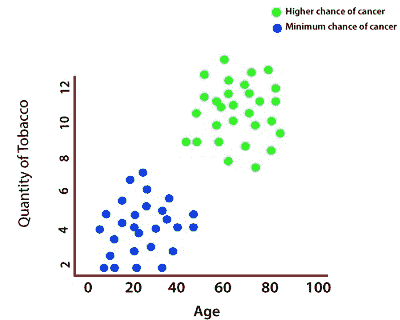
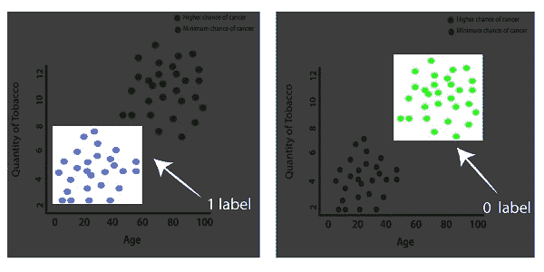
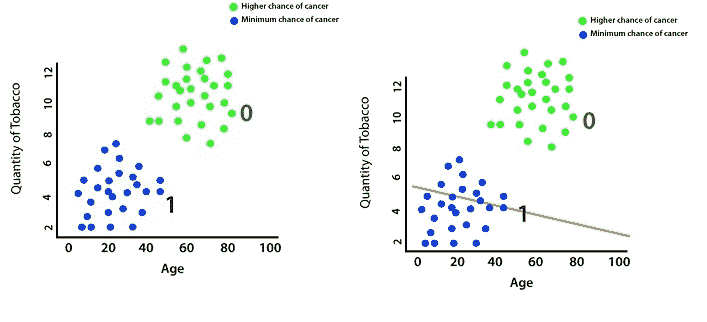
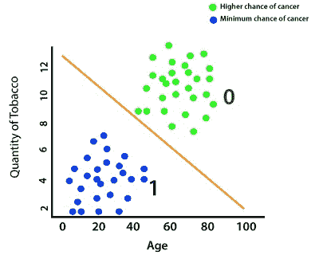
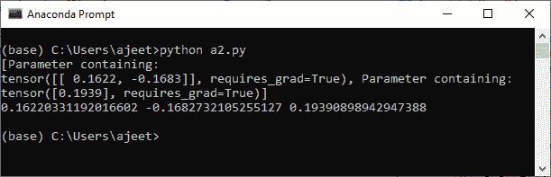
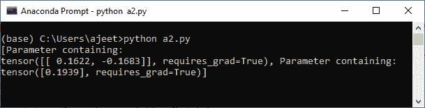
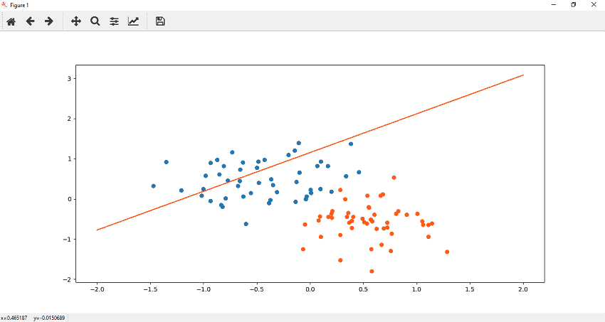

# 感知器模型

> 原文：<https://www.javatpoint.com/pytorch-perceptron-model>

了解感知器模型和一些关键术语(如交叉熵、sigmoid 梯度下降等)是至关重要的。那么什么是感知器模型，它是做什么的？

让我们看一个例子来理解感知器模型。想象一下，有一家医院每年要为成千上万的病人做手术，并告诉你创建一个预测模型，能够准确地确定某人是否有可能患癌症。

借助于先前确定的数据，我们预测某人是否有可能患癌症——基于他们的年龄(穿过 x 轴)和他们吸入的烟草量(穿过 y 轴)。



因此，年龄越大、吸烟量越多的人患癌症的几率就越高，如果一个人的年龄和吸烟量最低，患癌症的几率也就最低。

每一个绿色的点，表示患癌几率较高，最初被指定为 0，每一个蓝色的点，表示患癌几率较低，最初被指定为 1。



因此，我们将从一个随机模型开始，该模型不会正确地对我们的数据进行分类，但随后将通过一些优化算法来训练该模型。该模型将通过多次迭代进行训练，直到达到参数值，这可以正确地对我们的数据进行分类。我们使用以前标记的数据，这里的一切都标记为 1，这里的一切都标记为 0。



我们使用这些标记的数据来建立一个预测模型，将我们的数据分为两个离散的类别。使用该模型，我们现在可以对新输入的数据进行预测，这些数据没有基于该点是在线下方还是在线上方的标签。我们将训练我们的模型，它可以确定这个人属于一类，这样他们最有可能是健康的。



现在，最大的问题是计算机技术如何得出这个线性模型。为此，我们将计算与此模型相关的误差，然后重新调整模型的参数，以最小化误差并对数据点进行适当分类。我们将使用**交叉熵()**函数来寻找误差，**乙状结肠梯度下降**来优化参数。让我们开始实现代码，其中我们将看到如何使用交叉熵函数和 sigmoid 梯度下降。

因此，我们处理上一节中创建的数据集。现在，在这个数据集的帮助下，我们将开始实现我们的代码，并创建一个基本的感知器模型。

首先，我们将 plt.scatter(x[y==0，0]，x[y==0，1])和 plt.scatter(x[y==1，0]，x[y==1，1])放入一个函数中，以便进一步用作

```

def Scatter():
plt.scatter(x[y==0,0],x[y==0,1])
plt.scatter(x[y==1,0],x[y==1,1])

```

**要创建一个基本的感知器模型，我们必须遵循以下步骤:**

**第一步。**

我们的第一步是创建一个线性模型。为此，我们必须创建我们的模型类，就像我们在线性回归模型中用 init()方法和 forward()方法实现的那样。init()方法类似，但 forward()方法与线性回归模型大不相同。我们将 forward()定义为在第一个参数替换 self 之前，之后，我们需要传递输入 x。

之后，我们通过将数据 x 传递到我们的线性模型中来进行预测。

```

Class Perceptron_model(nn.Module):
def __init__(self,input_size,output_size):
		super().__init__()
		self.linear=nn.Linear(input_size,output_size)
	def forward(self,x):
		pred=self.linear(X)
		return pred

```

这还不够，我们必须通过应用 sigmoid()方法将值转换为概率，如下所示:

```

def forward(self,x):
	pred=torch.sigmoid(self.linear(x))
	return pred

```

我们的初始化已经完成，现在，我们准备使用它。

**第二步**

我们将使用感知器 _model()构造函数初始化一个新的线性模型，并传递 input_size 和 output_size 作为参数。现在，打印分配给它的随机重量和偏差值，如下所示:

```

model= Perceptron_model(2,1)
print(list(model.parameters()))

```

在此之前，为了确保我们的随机结果的一致性，我们可以用 torch 手动种子来播种我们的随机数发生器，我们可以如下放置一个二的种子

```

torch.manual_seed(2)

```

**第三步**

我们的下一步是通过解包模型来提取模型参数。这些参数以双元素列表的形式提取，即 A、B，并按如下方式打印两个值:

```

[A,b]=model.parameters()
A1,A2=A.view(2)
B1=B[0]
print(A1.item(), A2.item(),B1.item())

```

这里，A 是权重，B 是偏向。



为了保持干净，我们使用返回值 A1.item()、A2.item()和 B1[0]的函数。项()的方式如下

```

def get_perameters():
	return(A1.item(),A2.item(),B[0].item())

```

**第四步**

现在，我们用以列表形式提取的参数绘制我们的线性模型。我们用标题、线方程等等。我们创建一个用户定义函数来绘制数据。让我们看看绘制线性模型的代码。

```

def plotfit(title):
	plt.title=title
	A1, A2, B1 = get_perameters()
	x1=np.array([-2.0,2.0])
	y1=((A1*x1)+B1)/-A2
plt.plot(x1,y1,'r') 
Scatter()
plotfit('Initial Model') 

```




* * *