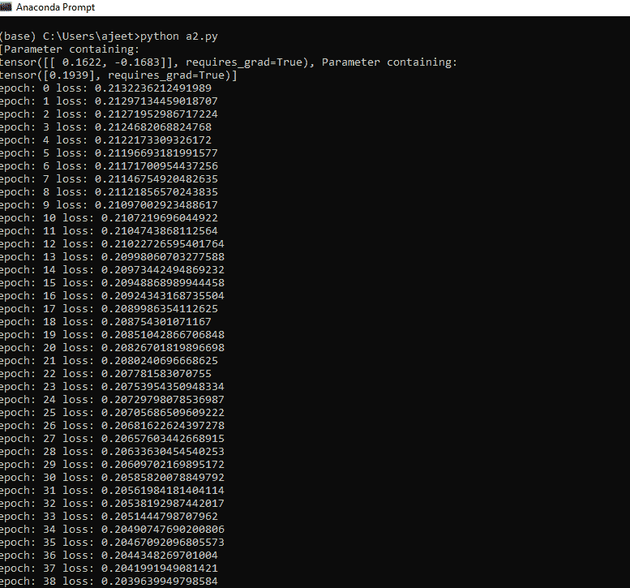
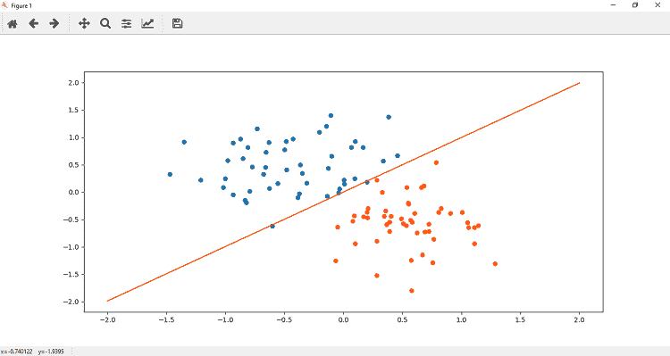

# 感知器模型的训练

> 原文：<https://www.javatpoint.com/pytorch-training-of-perceptron-model>

感知器模型的训练类似于线性回归模型。我们初始化我们的神经模型，它在输入层有两个输入节点和一个带有 sigmoid 激活函数的输出节点。当我们将我们的模型绘制到数据上时，我们发现它并不适合我们的数据。我们需要训练这个模型，使模型有最佳的权重和偏差参数，并拟合这个数据。

**训练模型有以下步骤:**

**第一步**

第一步，我们计算模型误差的标准是召回交叉熵。我们的损失函数将在二元交叉熵损失(BCELoss)的基础上进行测量，因为我们只处理两类。从神经网络模块导入。

```

criterion=nn.BCELoss()

```

**第二步**

现在，我们的下一步是使用优化器更新参数。因此，我们定义了使用梯度下降算法(随机梯度下降)的优化器。

```

optimizer=torch.optim.SGD(model.parameters(),lr=0.01) 

```

**第三步**

现在，我们将为特定数量的时代训练我们的模型，就像我们在线性模型中所做的那样。所以代码类似于线性模型

```

epochs=1000
losses=[]
fori in range(epochs):
	ypred=model.forward(xdata)
	loss=criterion(ypred,ydata)
	print("epoch:",i,"loss:",loss.item())
	losses.append(loss)
	optimizer.zero_grad()  # Set the gradient to zero
	loss.backward()	#To compute derivatives 
	optimizer.step()	# Update the parameters 

```

现在，最后我们通过简单地调用 plotfit()方法来绘制新的线性模型。

```

plotfit('Trained Model')

```




* * *