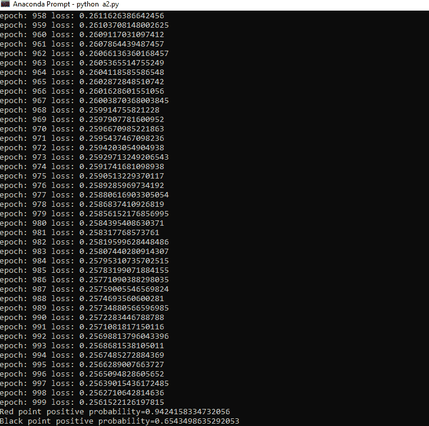
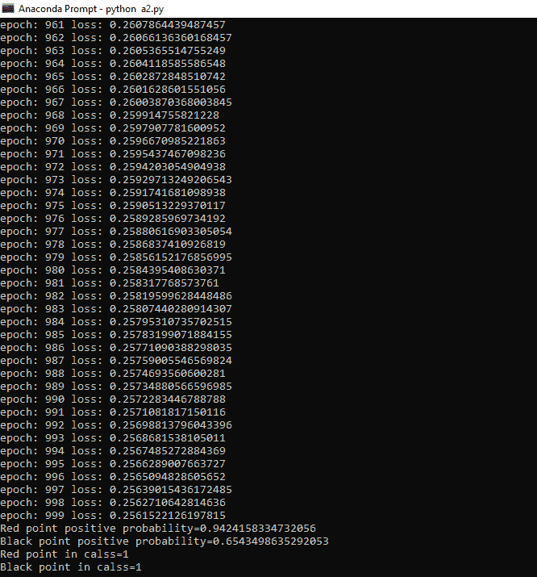
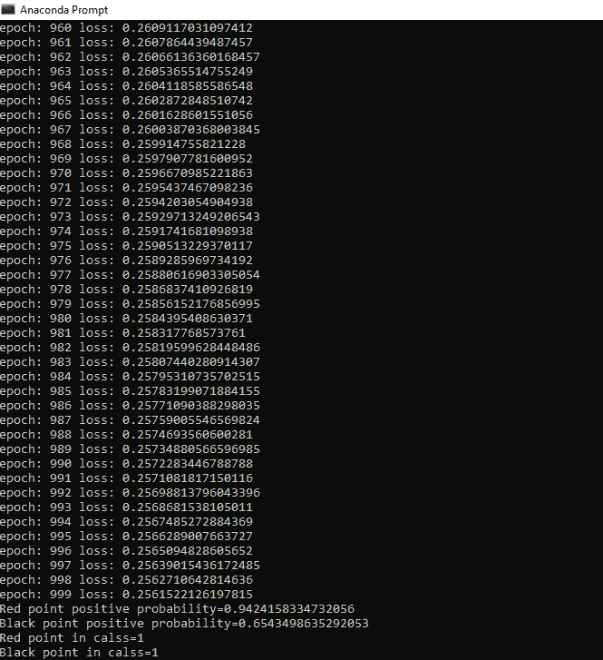
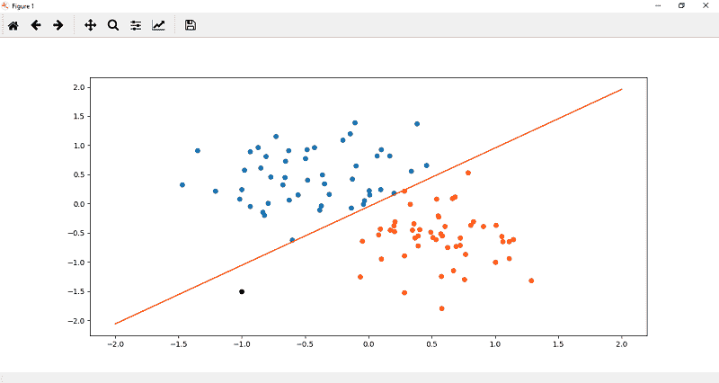

# 感知器模型的测试

> 原文：<https://www.javatpoint.com/pytorch-testing-of-perceptron-model>

感知器模型的目的是对我们的数据进行分类，并告诉我们患癌症的几率，即基于先前标记的数据的最大值或最小值。

我们的模型经过训练，现在，我们测试我们的模型，以了解它的工作是否顺利，并给出准确的结果。为此，我们必须在代码中添加更多的功能。

**测试我们的模型有以下步骤:**

**第一步**

我们将重新绘制我们的拟合模型，为此，我们必须对我们将初始化的随机点进行预测。在我们的案例中，为了更好地理解，我们将采取两点。

```

p1=torch.Tensor([1.0,-1.0])
p2=torch.Tensor([-1.0,-1.5])

```

**第二步**

现在，我们的下一步是为了可视化的目的绘制这些点，这样我们就可以确定这两个点在哪个类中，是 1 还是 0。

```

plt.plot(p1[0],p1[1],'ro')
plt.plot(p2[0],p2[1],'ko')

```

点 p1 和 p2 最初是张量的形式，所以我们通过类型转换把这些点变成 numpy。

```

plt.plot(p1.numpy()[0],p1.numpy()[1],'ro')
plt.plot(p2.numpy()[0],p2.numpy()[1],'ko')

```


**第三步**

我们现在可以对每一点进行预测。我们将预测每个点属于正区域 2 类 1 的概率。我们知道所有的橙色点都标为 1，所有的蓝色点都标为 0。所以概率确定为

```

print("Red point positive probability={}".format(model.forward(p1).item()))
print("Black point positive probability={}".format(model.forward(p2).item()))

```

红点和黑点的概率等于它的预测。



**第四步**

现在，我们将返回到我们的类初始化，并创建一个名为 predict 的方法，它有一个参数。我们用 self.forward(x)来求概率。如果概率大于 0.5，那么我们将返回类 1，否则返回 0。

```

def predict(self,x):
	pred=torch.sigmoid(self.linear(x))
	if pred>=0.5:
		return 1
	else:
		return 0 

```

**第五步**

最后，我们将添加两个打印语句，用 predict 方法告诉我们关于这个类的信息

```

print("Red point in calss={}".format(model.predict(p1)))
print("Black point in calss={}".format(model.predict(p2)))

```



很明显，我们的模型运行平稳，并且用随机数据给出了准确的结果。

* * *

## 完全码

```

import torch
import numpy as np
import matplotlib.pyplot as plt
import torch.nn as nn
from sklearn import datasets
no_of_points=100
centers=[[-0.5,0.5],[0.5,-0.5]]
x,y=datasets.make_blobs(n_samples=no_of_points,random_state=123,centers=centers,cluster_std=0.4)
xdata=torch.Tensor(x)
ydata=torch.Tensor(y.reshape(100,1))
def Scatter():
	plt.scatter(x[y==0,0],x[y==0,1])
	plt.scatter(x[y==1,0],x[y==1,1])
class Perceptron_model(nn.Module):
	def __init__(self,input_size,output_size):
		super().__init__()
		self.linear=nn.Linear(input_size,output_size)
	def forward(self,x):
		pred=torch.sigmoid(self.linear(x))
		return pred
	def predict(self,x):
		pred=torch.sigmoid(self.linear(x))
		If pred>=0.5:
			return 1
		else:
			return 0
torch.manual_seed(2)
model= Perceptron_model(2,1)
criterion=nn.BCELoss()
optimizer=torch.optim.SGD(model.parameters(),lr=0.01)
print(list(model.parameters()))
[A,B]=model.parameters()
A1,A2=A.view(2)
B1=B[0]
epochs=1000
losses=[]
fori in range(epochs):
	ypred=model.forward(xdata)
	loss=criterion(ypred,ydata)
	print("epoch:",i,"loss:",loss.item())
	losses.append(loss)
	optimizer.zero_grad()
	loss.backward()
	optimizer.step()
def get_perameters():
	return(A1.item(),A2.item(),B[0].item())
def plotfit(title):
	plt.title=title
	A1,A2,B1=get_perameters()
	x1=np.array([-2.0,2.0])
	y1=((A1*x1)+B1)/-A2
	plt.plot(x1,y1,'r')
	Scatter()
	plt.show()
p1=torch.Tensor([1.0,-1.0])
p2=torch.Tensor([-1.0,-1.5])
plt.plot(p1.numpy()[0],p1.numpy()[1],'ro')
plt.plot(p2.numpy()[0],p2.numpy()[1],'ko')
print("Red point positive probability={}".format(model.forward(p1).item()))
print("Black point positive probability={}".format(model.forward(p2).item()))
print("Red point in calss={}".format(model.predict(p1)))
print("Black point in calss={}".format(model.predict(p2)))
plotfit('Initial Model')

```

**输出**




* * *