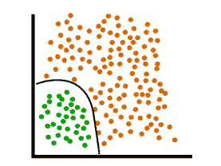
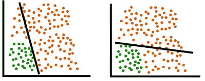
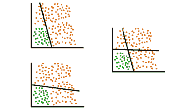
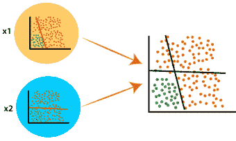
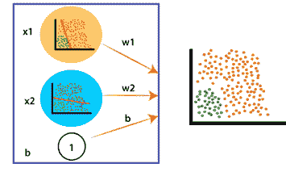
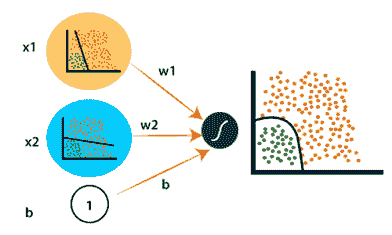
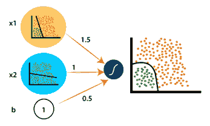
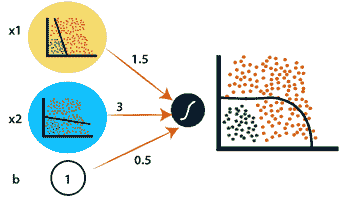

# 深度神经网络中的非线性边界

> 原文：<https://www.javatpoint.com/pytorch-non-linear-boundary-in-deep-neural-network>

在感知器模型中，我们使用线性模型对两个数据区域进行分类。真实的数据要复杂得多，而且不总是按直线分类。为此，我们需要一个非线性边界来分隔我们的数据。感知器模型是工作在一个神经网络的最基本的形式，但是对于现实的数据分类，我们使用了**深度神经网络**。

当我们的模型无法表示一组数据时，我们使用非线性模型来代替它。非线性模型用于以下情况

在上图中，有一条曲线可以完美地对我们的数据进行分类，但是我们如何才能获得这条曲线。为此，我们将两个感知器组合成第三个感知器。这是非常典型的理解，为了更好的理解，我们采用两个线性模型，并将其组合成一个单一的**非线性模型**。

从上面的图片可以明显看出，这两种模型都无法对我们的数据进行分类。以下是用于从两个线性模型形成非线性模型的一些步骤:

**第一步:**

让我们从组合每个线性模型来形成一个非线性模型开始。如果我们有两个线性模型，那么通过组合它们，得到的模型将看起来像

输出模型是另外两个模型的**线性组合**。

**第二步:**

现在，我们要做的是，我们将两个线性模型都视为包含一些线性方程的输入节点。我们把第一个模型表示为 x1，第二个表示为 x2。

**第三步:**

在我们的下一步中，我们将我们的模型乘以一些**权重**，例如 w1 和 w2，我们还考虑了偏差，因此我们也将**偏差**值视为一个节点。

**第四步:**

现在，添加所有内容以获得线性组合。为此，我们将应用 sigmoid 激活函数，它给出了预期曲线。

**第五步:**

我们将以数学方式将所有节点乘以其权重值，例如 w1=0.4、w2=1 和 b=0.5，并应用 sigmoid，则生成的曲线如下:

**第六步:**

在第二个线性模型 x2 中，如果我们取权重值 3，得到的模型会给我们一条意想不到的曲线，它看起来像

从第 5 步和第 6 步可以清楚地看到，用权重值 1.5 和 1 创建的模型对我们的数据进行了最好的分类，而不是用权重值 1.5 和 3 创建的模型。权重定义了非线性模型的非线性边界。

将两个线性模型结合起来形成非线性模型的过程并没有那么简单。理解神经网络的**结构对于实现深度神经网络的非线性边界是非常必要的。**

* * *