# 神经网络体系结构

> 原文：<https://www.javatpoint.com/pytorch-architecture-of-deep-neural-network>

我们通过将两个线性模型与一些方程、权重、偏差和 sigmoid 函数相结合，找到了一个非线性模型。让我们开始更好的阐述，了解**神经网络**和**深度神经网络**的架构。

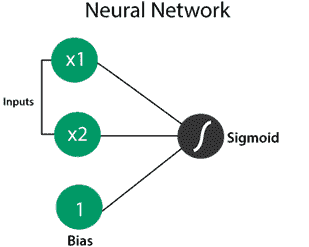

让我们看一个例子，以便更好地理解和说明。

假设有一个线性模型，其直线表示为-4x 1 -x 2 +12。我们可以用下面的感知器来表示。

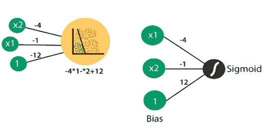

输入层中的权重为-4、-1 和 12，表示输入被传递到的线性模型中的等式，以获得它们处于正区域的概率。再取一个线表示为- 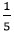 x  1  -x  2  +3 的模型。因此，我们可以通过预期感知器将其表示如下:

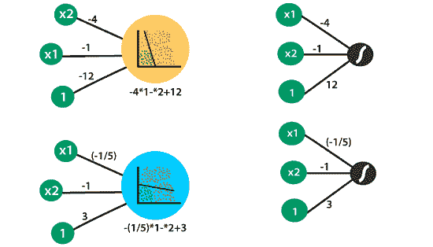

现在，我们要做的是，我们将这两个感知器组合起来，通过将这两个模型乘以一组权重并添加偏差来获得非线性感知器或模型。之后，我们应用 sigmoid 获得如下曲线:

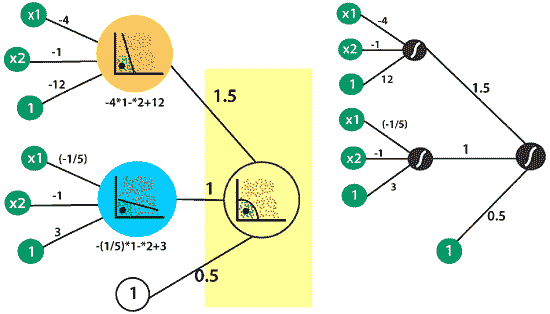

在前面的例子中，假设我们有两个输入 x1 和 x2。这些输入表示坐标(2，2)处的单个点，我们希望获得该点位于正区域和非线性模型中的概率。这些坐标(2，2)传递到由两个线性模型组成的第一个输入层。

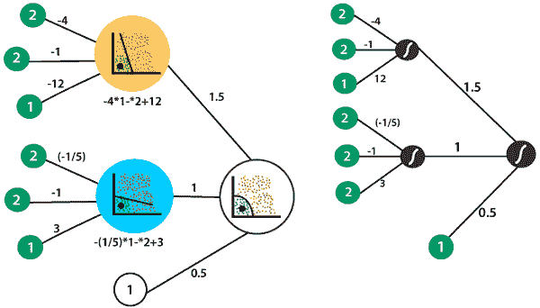

在第一线性模型中处理两个输入，通过基于模型的权重和偏差将输入作为线性组合，然后取 sigmoid，获得点位于正区域的概率，并获得点 0.88 的概率。

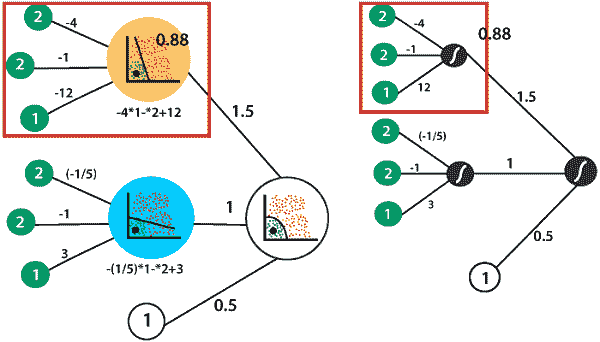

同样的，我们会在第二个模型中发现点在正区域的概率，我们发现点的概率是 0.64。

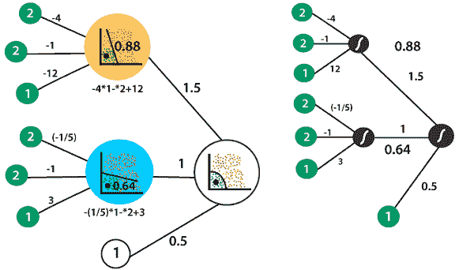

当我们结合这两个模型时，我们将把概率加在一起。我们将采用相对于权重 1.5、1 和偏差值 0.5 的线性组合。我们将把第一个模型乘以第一个权重，把第二个模型乘以第二个权重，把所有的东西和偏差相加，得到分数，因为我们将对得到新模型的两个模型的线性组合取 sigmoid。我们将对我们的点做同样的事情，这将它转换为 0.92 的概率，它在正区域和非线性模型中。

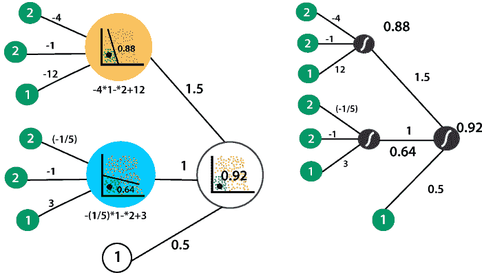

这是一个深度神经网络的前馈过程。为了提高效率，我们可以重新排列这个神经网络的符号。我们不是将我们的点表示为两个不同的 x1 和 x2 输入节点，而是将其表示为 x1 和 x2 节点的一对

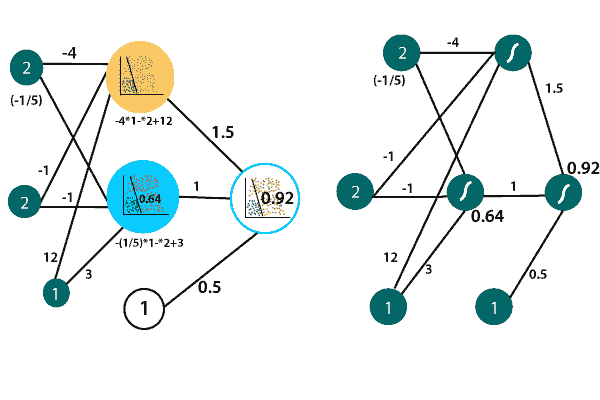

这说明了神经网络的独特结构。因此有一个包含输入的输入层，第二层是线性模型的集合，最后一层是输出层，输出层是由我们的两个线性模型组合得到的非线性模型。

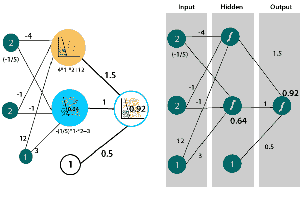

## 深度神经网络

我们将使用模型和隐藏层来组合它们，并创建非线性模型来对我们的数据进行最佳分类。有时候我们的数据太复杂了，为了分类，我们不得不结合非线性模型来创建更多的非线性模型。

我们可以用更多的隐藏层多次这样做，并获得高度复杂的模型

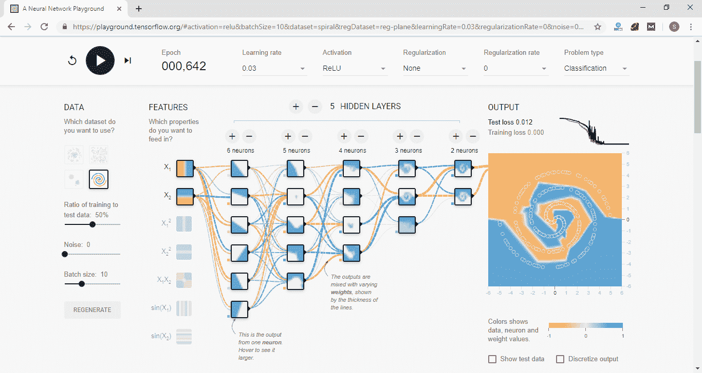

对这类数据进行分类更为复杂。它需要许多隐藏的模型层，这些模型层通过一定的权重组合在一起，以获得完美分类这些数据的模型。

之后，我们可以通过前馈操作产生一些输出。在产生输出之前，输入必须经过神经网络的整个深度。它只是一个多层感知器。在深度神经网络中，我们的数据趋势并不是直线前进的，所以这个非线性边界只是一个准确的模型，可以正确地对一组非常复杂的数据进行分类。

需要许多隐藏层来获得这种非线性边界，并且每一层都包含模型，这些模型相互组合以产生这种非常复杂的边界，从而对我们的数据进行分类。

深度神经网络可以用更复杂的函数来训练，以对更复杂的数据进行分类。

* * *