# 深度神经网络中的前馈过程

> 原文：<https://www.javatpoint.com/pytorch-feed-forward-process-in-deep-neural-network>

现在，我们知道了不同权重和偏差的线组合如何产生非线性模型。神经网络如何知道每一层的权重和偏差值？这与我们对基于单一感知器的模型所做的没有什么不同。

我们仍然在使用梯度下降优化算法，该算法通过在最陡下降的方向上迭代移动来最小化我们模型的误差，该方向在确保最小误差的同时更新我们模型的参数。它更新每一层中每个模型的权重。稍后我们将更多地讨论优化算法和反向传播。

识别我们神经网络的后续训练很重要。识别是通过将我们的数据样本划分到某个决策边界来完成的。

“接收输入以产生某种输出来进行某种预测的过程称为前馈。”前馈神经网络是卷积神经网络等许多其他重要神经网络的核心。

在前馈神经网络中，网络中没有任何反馈回路或连接。这里只是一个输入层、一个隐藏层和一个输出层。

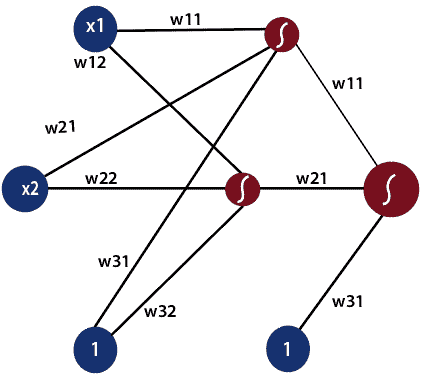

可以有多个隐藏层，这取决于您正在处理的数据类型。隐藏层的数量被称为神经网络的深度。深度神经网络可以从更多的函数中学习。输入层首先向神经网络提供数据，然后输出层基于一系列函数对该数据进行预测。ReLU 函数是深度神经网络中最常用的激活函数。

为了更好地理解前馈过程，让我们从数学上来看一下。

1)第一输入被馈送到网络，该网络被表示为矩阵 x1、x2 和 1，其中 1 是偏置值。

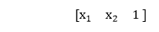

2)每个输入相对于第一和第二模型乘以权重，以获得它们在每个模型中处于正区域的概率。

因此，我们将使用矩阵乘法将输入乘以权重矩阵。

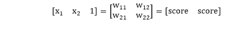

3)之后，我们将取分数的 sigmoid，并给出这两个模型中该点位于正区域的概率。

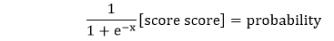

4)我们将从上一步获得的概率乘以第二组权重。无论何时进行输入组合，我们总是包含一个偏差。

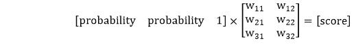

正如我们知道的那样，为了获得该点位于该模型正区域的概率，我们采用 sigmoid，从而在前馈过程中产生最终输出。

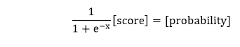

让我们将之前的神经网络与下面的线性模型和隐藏层结合起来，在输出层形成非线性模型。

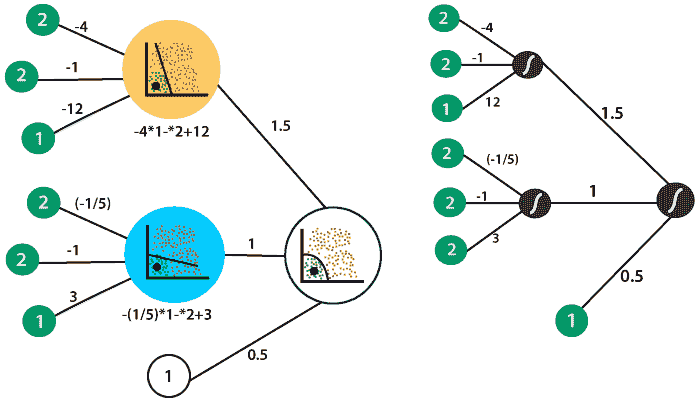

所以，我们要做的是使用我们的非线性模型产生一个输出，描述点在正区域的概率。这一点用 2 和 2 表示。除了偏差，我们还将输入表示为

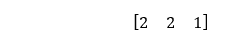

隐藏层中的第一个线性模型调用和方程定义了它

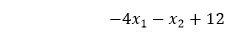

这意味着在获得线性组合的第一层中，输入乘以-4，-1，偏置值乘以 12。

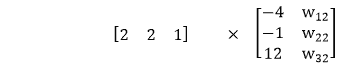

输入的权重乘以-1/5，1，偏差乘以 3，得到第二个模型中相同点的线性组合。

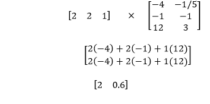

现在，为了获得该点相对于两个模型位于正区域的概率，我们将 sigmoid 应用于两个点，如下所示

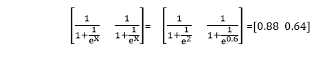

第二层包含支配第一层中的线性模型的组合的权重，以获得第二层中的非线性模型。权重为 1.5，1，偏差值为 0.5。

现在，我们必须将第一层的概率乘以第二组权重，如下所示

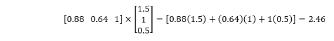

现在，我们来看看最后的分数

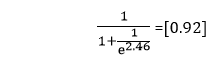

它是前馈过程背后的完整数学，其中来自输入的输入穿过神经网络的整个深度。在这个例子中，只有一个隐藏层。无论是一个隐藏层还是二十个隐藏层，所有隐藏层的计算过程都是一样的。

* * *