# 深层神经网络中的反向传播过程

> 原文：<https://www.javatpoint.com/pytorch-backpropagation-process-in-deep-neural-network>

**反向传播**是神经网络的重要概念之一。我们的任务是对我们的数据进行最佳分类。为此，我们必须更新参数和偏差的权重，但是如何在深度神经网络中做到这一点呢？在线性回归模型中，我们使用梯度下降来优化参数。类似地，这里我们也使用梯度下降算法使用反向传播。

对于单个训练示例，**反向传播**算法计算**误差函数**的梯度。反向传播可以写成神经网络的函数。反向传播算法是一组用于有效训练人工神经网络的方法，遵循利用链式规则的梯度下降方法。

反向传播的主要特征是迭代、递归和有效的方法，通过这种方法，它计算更新的权重以改进网络，直到它不能执行它被训练的任务。反向传播需要在网络设计时已知激活函数的导数。

现在，误差函数是如何在反向传播中使用的，反向传播是如何工作的？让我们从一个例子开始，用数学方法来理解如何使用反向传播准确地更新权重。

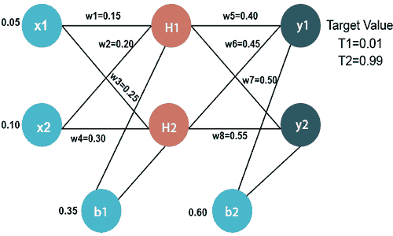

### 输入值

X1=0.05
X2=0.10

### 初重

w1 = 0.15 w5 = 0.40
W2 = 0.20 w6 = 0.45
W3 = 0.25 w7 = 0.50
W4 = 0.30 w8 = 0.55

### 偏差值

b1=0.35 b2=0.60

### 目标值

T1=0.01
T2=0.99

现在，我们首先通过向前传递计算 H1 和 H2 的值。

### 前进传球

为了找到 H1 的值，我们首先将权重的输入值乘以

H1 = x1w1+x2w2+B1
H1 = 0 . 050 . 15+0 . 100 . 20+0.35
+T6】H1 = 0.3775

为了计算 H1 的最终结果，我们执行 sigmoid 函数如下

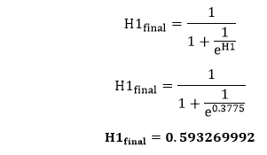

我们将像计算 H1 一样计算 H2 的价值

H2 = x1w3+x2w4+B1
H2 = 0 . 050 . 25+0 . 100 . 30+0.35
+T6】H2 = 0.3925

为了计算 H1 的最终结果，我们执行 sigmoid 函数如下

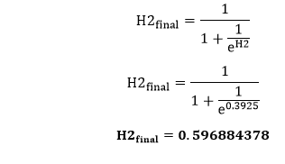

现在，我们计算 y1 和 y2 的值，就像计算 H1 和 H2 一样。

要找到 y1 的值，我们首先将输入值乘以权重，即 H1 和 H2 的结果，如下所示

y1 = H1w5+H2w6+B2
y1 = 0.5932699920.40+0.5968843780.45+0.60
+T6】y1 = 1.10590597

为了计算 y1 的最终结果，我们执行 sigmoid 函数如下

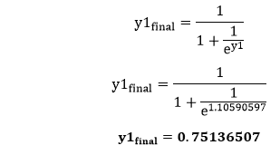

我们将以与 y1 相同的方式计算 y2 的值

y2 = H1w7+H2w8+B2
y2 = 0.5932699920.50+0.5968843780.55+0.60
+T6】y2 = 1.2249214

为了计算 H1 的最终结果，我们执行 sigmoid 函数如下

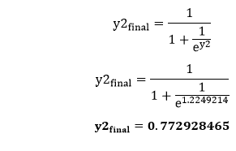

我们的目标值是 0.01 和 0.99。我们的 y1 和 y2 值与我们的目标值 T1 和 T2 不匹配。

现在，我们将找到**总误差**，它只是输出与目标输出之间的差值。总误差计算如下

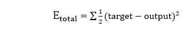

总误差是

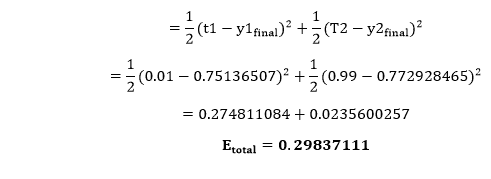

现在，我们将反向传播这个错误，使用反向传递来更新权重。

### 输出层的反向传递

为了更新权重，我们在总误差的帮助下计算每个权重对应的误差。重量 w 的误差是通过将总误差与 w 进行微分来计算的。

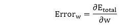

我们执行反向过程，因此首先考虑最后一个权重 w5

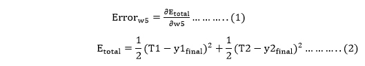

从方程二，很明显，我们不能部分地区分它和 w5，因为没有任何 w5。我们把方程一分解成多个项，这样我们就可以很容易地把它和 w5 区分为

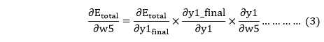

现在，我们逐一计算每一项，将 E 总计与 w5 区分为

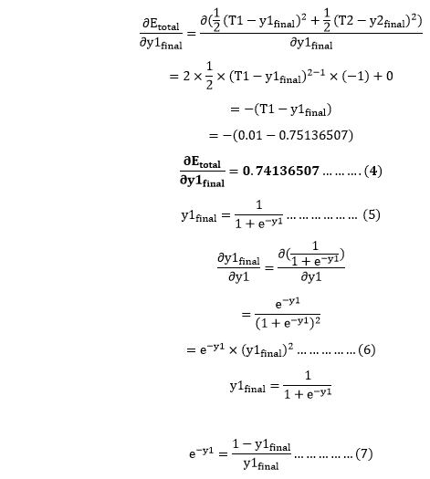

将 e -y 的值放入等式(5)

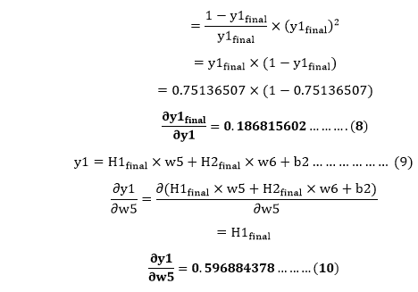

因此，我们将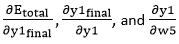的值放在等式(3)中，以找到最终结果。

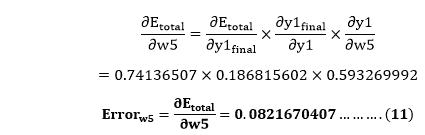

现在，我们将借助以下公式计算更新后的权重 w5 新的

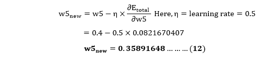

同样，我们计算 w6 新，w7 新，以及 w8 新，这将给出以下值

**w5 新增= 0.35891648**T4**w6新增= 408666186**T9**w7新增= 0.511301270**
T15】w8新增 =0.561370121

### 隐藏层的反向通过

现在，我们将反向传播到我们的隐藏层，并更新权重 w1、w2、w3 和 w4，就像我们对 w5、w6、w7 和 w8 权重所做的那样。

我们将 w1 处的误差计算为

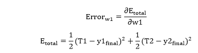

从等式(2)中可以清楚地看出，我们不能部分区分它与 w1 的关系，因为没有任何 w1。我们将等式(1)分解为多个项，这样我们就可以很容易地将其与 w1 区分为

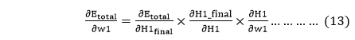

现在，我们逐一计算每一项，将 E 总计相对于 w1 微分为

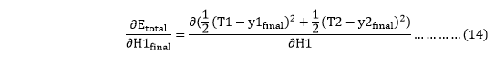

我们再一次把这个分开，因为在 E 中没有任何 H1 最终术语，总的来说为

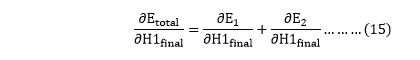

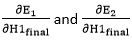将再次分裂，因为在 E1 和 E2 中没有 H1 项。拆分按如下方式进行

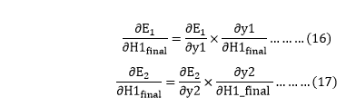

我们再次分割两个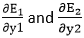，因为在 E1 和 E2 中没有任何 y1 和 y2 项。我们把它分成

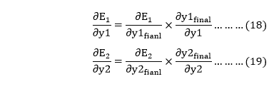

现在，我们通过将等式(18)和(19)中的值表示为

根据等式(18)

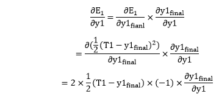

根据等式(8)

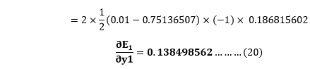

根据等式(19)

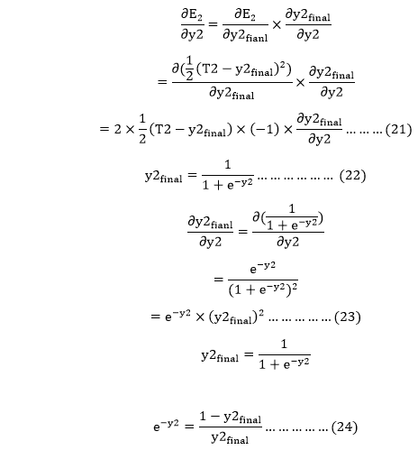

将 e -y2 的值代入等式(23)

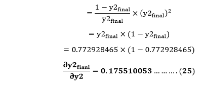

根据等式(21)

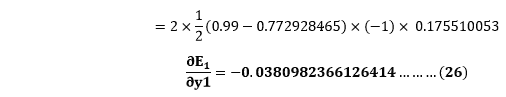

现在从等式(16)和(17)

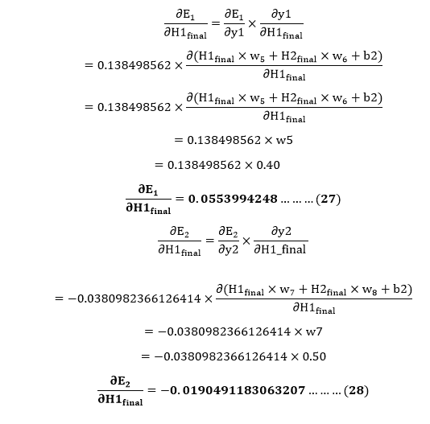

将等式(15)中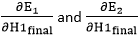的值表示为

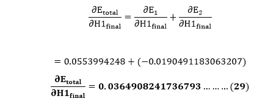

我们有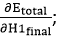我们需要算出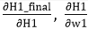为

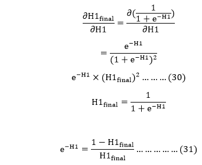

将 e -H1 的值放入等式(30)

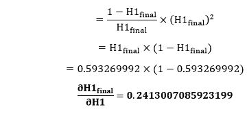

我们计算 H1 总净输入相对于 w1 的偏导数，与计算输出神经元的方法相同:

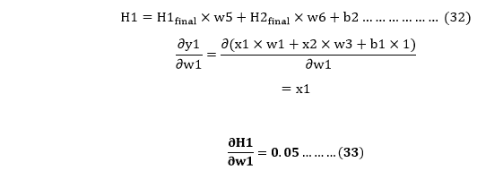

因此，我们将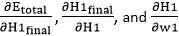的值放在等式(13)中，以找到最终结果。

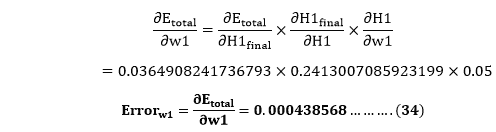

现在，我们将借助以下公式计算更新后的权重 w1 新的

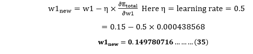

同样，我们计算 w2 新，w3 新，和 w4，这将给出以下值

**w1 新增= 0.149780716**T4**w2新增= 0.19956143**T9**w3新增= 0.24975114**
T15】w4新增 =0.29950229

我们已经更新了所有的重量。当我们前馈 0.05 和 0.1 输入时，我们在网络上发现了错误 0.298371109。在第一轮反向传播中，总误差下降到 0.291027920005 重复此过程 10，000 次后，总误差降至 0.0000351085。此时，输出神经元生成 0.159121960 和 0.984065734，即在我们前馈 0.05 和 0.1 时的目标值附近。

* * *