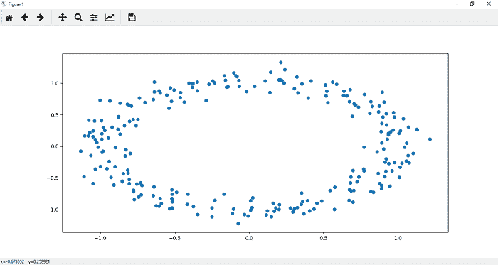
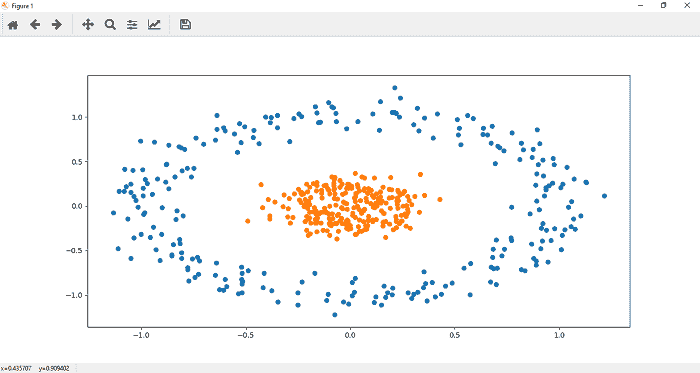
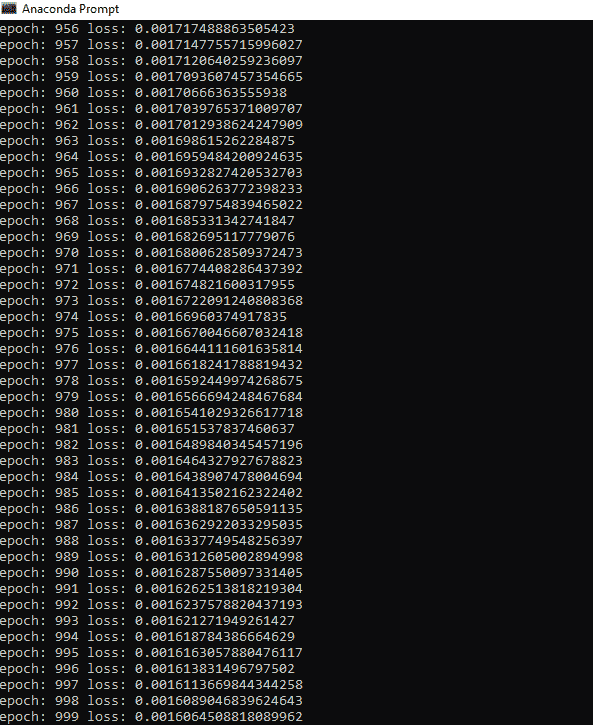

# 深度神经网络的实现

> 原文：<https://www.javatpoint.com/pytorch-implementation-of-deep-neural-network>

了解了反向传播的过程后，让我们开始看看如何使用 PyTorch 实现深度神经网络。实现深度神经网络的过程类似于感知器模型的实现。在实施过程中，我们必须执行以下步骤。

**第一步:**

在第一步中，我们将导入所有需要的库，如 torch、numpy、datasets 和 matplotlib.pyplot。

```

import torch
import numpy as np
import matplotlib.pyplot as plt
from sklearn import datasets

```

**第二步:**

在第二步中，我们定义了数据点的数量，然后使用 make_blobs()函数创建数据集，这将创建数据点的集群。

```

no_of_points=500
datasets.make_blobs()

```

**第三步:**

现在，我们将创建数据集，并将数据点存储到变量 x 中，同时将值存储到变量 y 中，我们将稍微利用我们的标签。

```

x,y=datasets.make_blobs()

```

**第四步:**

现在，我们将 make_blobs()更改为 make _ cicrcle()，因为我们希望数据集呈圆形。我们在 make_circle()函数中传递适当的参数。第一个参数表示样本点的数量，第二个参数是随机状态，第三个参数是噪声，指的是**高斯**噪声的标准差，第四个参数是指较小的内圆区域相对于较大的内圆区域的相对大小。

```

x,y=datasets.make_circles(n_samples=no_of_points,random_state=123,noise=0.1,factor=0.2)=

```

**第四步:**

现在，根据需要定制数据集后，我们可以使用 plt.scatter()函数对其进行绘图和可视化。我们定义每个标签数据集的 x 和 y 坐标。让我们从标签为 0 的数据集开始。它绘制了我们数据的顶部区域。0 标记数据集的散点图函数定义为

```

plt.scatter(x[y==0,0],x[y==0,1])

```



**第五步:**

现在，我们在数据的下部绘制点。一个标记数据集的散点图函数()定义为

```

plt.scatter(x[y==1,0],x[y==1,1])

```



单行不能对上述数据集进行分类。为了对这个数据集进行分类，需要更深层次的神经网络。

我们将 plt.scatter(x[y==0，0]，x[y==0，1])和 plt.scatter(x[y==1，0]，x[y==1，1])放入一个函数中，以便进一步用作

```

def Scatter():
	plt.scatter(x[y==0,0],x[y==0,1])
	plt.scatter(x[y==1,0],x[y==1,1])

```

**第六步:**

在这一步中，我们将创建我们的模型类，就像我们在线性回归和感知器模型中实现的那样。不同的是，这里我们使用的隐藏层也在输入和输出层之间。在 init()方法中，我们将传递一个加法参数 h1 作为隐藏层，我们的输入层与隐藏层连接，然后隐藏层与输出层连接。因此

```

class Deep_neural_network(nn.Module):
def __init__(self,input_size, h1, output_size):
        		super().__init__()
        		self.linear=nn.Linear(input_size, h1)   # input layer connect with hidden layer 
             self.linear1=nn.Linear(h1, output_size)   # hidden layer connect with output layer

```

现在，我们必须在我们的正向函数中添加这个额外的隐藏层，这样任何输入都必须通过神经网络的整个深度才能进行预测。因此

```
def forward(self,x):
	x=torch.sigmoid(self.linear(x))	# Return the prediction x 
	x=torch.sigmoid(self.linear1(x))	# Prediction will go through the next layer.
	return x				# Returning final outputs

```

我们的初始化已经完成，现在，我们准备使用它。记住要训练一个模型 x，y 坐标都应该是 numpy 数组。所以我们要做的是把 x 和 y 值变成张量

```

xdata=torch.Tensor(x)
ydata=torch.Tensor(y)

```

**第 7 步**

我们将使用 Deep_neural_network()构造函数初始化一个新的线性模型，并传递输入大小、输出大小和隐藏大小作为参数。我们现在打印随机权重和分配给它的偏差值，如下所示:

```

print(list(model.parameters()))

```

在此之前，为了确保我们的随机结果的一致性，我们可以用 torch 手动种子来播种我们的随机数发生器，我们可以如下放置一个二的种子

```

torch.manual_seed(2)

```

**第八步:**

我们用来计算模型误差的标准叫做**交叉熵**。我们的损失函数将基于二元交叉熵损失(BCELoss)来测量，因为我们只处理两类。它是从神经网络模块导入的。

```

criterion=nn.BCELoss()

```

现在，我们的下一步是使用优化器更新参数。因此，我们定义了使用梯度下降算法的优化器。在这里，我们将使用亚当优化器。Adam 优化器是众多优化算法中的一种。Adam 优化算法是随机梯度下降的另外两个扩展的组合，例如 **Adagrad** 和 **RMSprop** 。学习率在优化中起着重要的作用。

```

optimizer=torch.optim.Adam(model.parameters(),lr=0.01) 

```

如果我们选择最小的学习速率，它会导致非常缓慢地收敛到最小值，如果选择非常大的学习速率，会阻碍收敛。Adam 优化器算法最终为每个参数计算自适应学习速率。

**第九步:**

现在，我们将针对特定数量的时代训练我们的模型，就像我们在线性模型和感知器模型中所做的那样。所以代码类似于感知器模型

```

epochs=1000
losses=[]
For i in range (epochs):
	ypred=model.forward(x)	#Prediction of y
	loss=criterion(ypred,y)   #Find loss
	losses.append()		# Add loss in list 
	optimizer.zero_grad() 	# Set the gradient to zero
	loss.backward()    #To compute derivatives 
	optimizer.step()    # Update the parameters 

```



* * *