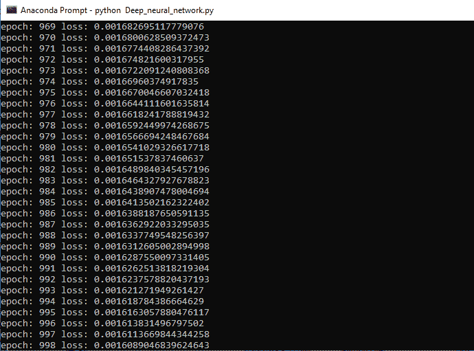
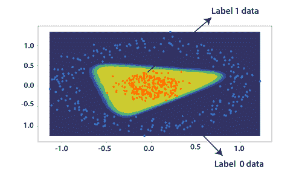
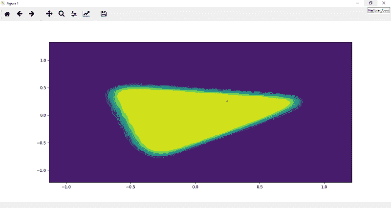
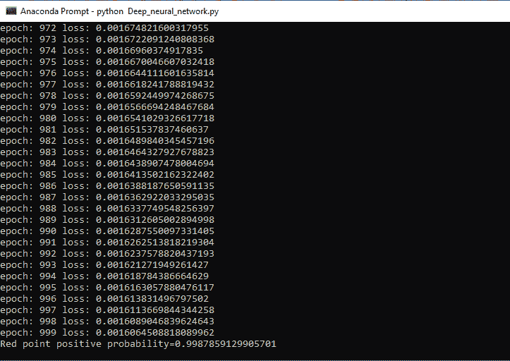
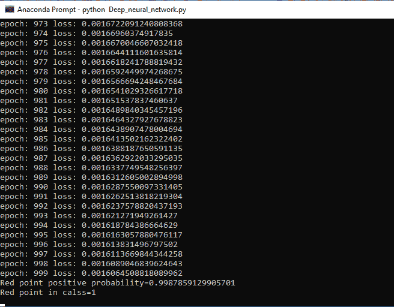
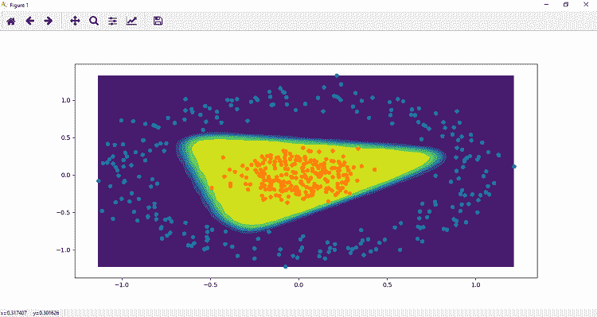

# 深度神经网络在 PyTorch 中的测试

> 原文：<https://www.javatpoint.com/pytorch-testing-of-deep-neural-network>

我们将用一个精确的决策边界来绘制数据集，这个边界将把我们的分类结果分开。在此，我们还将测试出模型。有以下步骤来训练我们的模型:

**第一步:**

在第一步中，我们定义了一个函数 **plot_decision_boundary()** ，它包含两个参数，即我们的训练数据 x 和输出标签 y。这个函数将返回一个决策边界的等高线图。

```

def plot_decision_boundary(x, y):

```

**第二步:**

在这一步中，我们定义了一个适当跨越数据的网格。这个过程从定义数据集内 x 和 y 坐标的跨度开始。x_span 和 y_span 将被定义为 50 个等距点，如下所示

```

x_span=np.linspace(min(x[:,0]),max(x[:,0]))
y_span=np.linspace(min(y[:,1]),max(y[:,1]))

```

**第三步:**

下一步，我们将定义 xx 和 yy 变量。xx 和 yy 变量都存储一个正方形的二维数组，该数组将从 numpy 的 **meshgrid()** 函数中获得。

```

xx,yy=np.meshgrid(x_span,y_span)

```

meshgrid()函数将向量 x_span 和 y_span 都作为参数。两个向量都包含 50 个元素，这个函数将返回一个 50 *50 的二维矩阵。新添加的行将是 x_span 向量中原始行的重复副本，并将返回 xx 变量。y_span 的过程相同；它将返回 50*50 的二维矩阵，其中新添加的列将是 y_span 向量中原始列的重复副本。这个矩阵将返回到 yy 变量。

**第四步:**

借助这些新创建的矩阵 xx 和 yy，我们将创建一个覆盖整个数据集的笛卡尔网格。为此，我们首先要使用 **ravel()** 方法将 xx 和 yy 矩阵一维转换。

```

print(xx.ravel(),yy.ravel())

```

**第五步:**

现在，我们将有 50 个 x 坐标，为了定义我们的网格，我们必须以 y 列排列连接这些数组。这将在 c_[]的帮助下完成。

```

grid=np.c_[xx.ravel(),yy.ravel()]

```

现在，我们将使用火炬把这些转换成张量。张量()。这将把 50*50 的网格转换成张量数据。

```

grid=torch.Tensor(np.c_[xx.ravel(),yy.ravel()])

```

**第五步:**

现在，最终，我们可以使用**模型。forward()** 以网格为唯一参数。通过将整个网格张量输入到 model.forward()函数中，训练好的模型将测试我们 50*50 网格内的所有点，这将返回一个预测张量。

```

model.forward(grid)

```

这个预测表明任何给定点被标记为 1 的概率，我们将把这个张量存储在变量 **pred_func** 中。

```

pred_func=model.forward(grid)

```

**第五步:**

现在，我们将把 pred_func 重塑为与我们最初的 xx 和 yy 维度相同的维度形状。

```

z=pred_func.view(xx.shape).numpy()

```

这将产生一个错误；我们将分离从梯度计算中排除任何子图的方法，它将与 pred_fun 中的值相关联。

```

z=pred_func.view(xx.shape).detach().numpy()

```

**第六步:**

现在，我们的下一步是将我们的预测结果与它们相应的坐标联系起来。为此，我们将使用 plt.contourf()来创建预测结果的等高线图，其中包含 xx、yy 和 z

```

plt.contourf(xx, yy,z)

```

**第七步:**

现在，我们将首先调用 plot_decision_boundary()方法，然后调用前面定义的散点图()方法。这将使我们的数据可视化为

```

plot_decision_boundary(x,y)
scatter_plot()

```




**第 8 步**

我们将重新绘制我们的拟合模型，为此，我们必须对我们将初始化的随机点进行预测。为了更好地理解，我们将采取两点

```

p1=torch.Tensor(0.25,0.25])

```

**第 9 步**

现在，下一步是为了可视化的目的绘制这个点，这样我们就可以确定这个点在哪个类中，是 1 还是 0。

```

plt.plot(p1[0],p1[1],marker='o',markersize=5,color='red')

```

点 p1 最初是张量的形式，所以我们通过类型转换把这个点变成 numpy。

```

plt.plot(p1.numpy()[0],p1.numpy()[1],marker='o',markersize=5,color='red')

```



**第 9 步**

我们可以预测这一点。我们将预测该点属于正区域 2 类 1 的概率。我们知道所有的橙色点都标为 1，所有的蓝色点都标为 0。所以概率确定为

```

print("Red point positive probability={}".format(model.forward(p1).item()))

```



**第 10 步**

现在，我们将返回到我们的类初始化，并创建一个名为 predict 的方法，它有一个参数。我们用 self.forward(x)来求概率。如果概率大于 0.5，那么我们将返回类 1，否则返回 0。

```

def predict(self,x):
	pred=self.forward(x)
		if pred>=0.5:
			return 1
		else:
			return 0 

```

**第 11 步**

最后，我们将添加 print 语句，该语句告诉我们使用 predict 方法的类

```

print("Red point in calss={}".format(model.predict(p1)))

```



很明显，我们的模型运行平稳，并且用随机数据给出了准确的结果。

## 完全码

```

import torch
import numpy as np
import matplotlib.pyplot as plt
import torch.nn as nn
from sklearn import datasets
no_of_points=500
x,y=datasets.make_circles(n_samples=no_of_points,random_state=123,noise=0.1,factor=0.2)
xdata=torch.Tensor(x)
ydata=torch.Tensor(y)
def scatter_plot():
    plt.scatter(x[y==0,0],x[y==0,1])
    plt.scatter(x[y==1,0],x[y==1,1])
    plt.show()

class Deep_neural_network(nn.Module):
    def __init__(self,input_size, h1, output_size):
        super().__init__()
        self.linear=nn.Linear(input_size, h1)   # input layer connect with hidden layer 
        self.linear1=nn.Linear(h1, output_size)   # hidden layer connect with output layer
    def forward(self,x):
        x=torch.sigmoid(self.linear(x))	# Return the prediction x 
        x=torch.sigmoid(self.linear1(x))	# Prediction will go through the next layer.
        return x        # Returning final outputs 
    def predict(self,z):
        pred=self.forward(z)
        if pred>=0.5:
            return 1
        else:
            return 0
torch.manual_seed(2)
model= Deep_neural_network(2,4,1)	# 2 input nodes, 4 hidden nodes and 1 output node
print(list(model.parameters()))
criterion=nn.BCELoss()
optimizer=torch.optim.Adam(model.parameters(),lr=0.1)
epochs=1000
losses=[]
for i in range(epochs):
    ypred=model.forward(xdata)
    loss=criterion(ypred,ydata)
    print("epoch:",i,"loss:",loss.item())
    losses.append(loss)
    optimizer.zero_grad()
    loss.backward()
    optimizer.step()
def plot_decision_boundary(x, y):
    x_span=np.linspace(min(x[:,0]),max(x[:,0]))
    y_span=np.linspace(min(x[:,1]),max(x[:,1]))
    xx,yy=np.meshgrid(x_span,y_span)
    grid=torch.Tensor(np.c_[xx.ravel(),yy.ravel()])
    pred_func=model.forward(grid)
    z=pred_func.view(xx.shape).detach().numpy()
    plt.contourf(xx,yy,z)
z1=0.25
z2=0.25
p1=torch.Tensor([z1,z2])
plt.plot(p1.numpy()[0],p1.numpy()[1],marker='o',markersize=5,color='red')
print("Red point positive probability={}".format(model.forward(p1).item()))
print("Red point in calss={}".format(model.predict(p1)))
plot_decision_boundary(x,y)
scatter_plot()

```

**输出:**




* * *