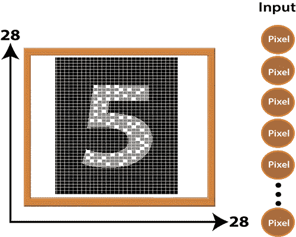

# PyTorch 中图像识别的 MNIST 数据集

> 原文：<https://www.javatpoint.com/pytorch-mnist-dataset-of-image-recognition>

在本主题中，我们将讨论一种新类型的数据集，它将用于**图像识别**。这个数据集被称为 **MNIST 数据集**。MNIST 数据集可以在网上找到，它本质上只是各种手写数字的数据库。MNIST 数据集拥有大量数据，通常用于展示深度神经网络的真正能力。

假设我们有下图:

当我们看图像时，我们的大脑和眼睛一起工作来识别这个图像为数字 8。我们的大脑是一个非常强大的工具，它能够很快将这张图片归类为 8。一个数字的形状有这么多，我们的大脑可以很容易地识别这些形状，并确定它是什么数字，但是这个任务并不是计算机能够完成的那么简单。只有一种方法可以做到这一点，那就是使用深度神经网络，它允许我们训练一台计算机来有效地对手写数字进行分类。

到目前为止，我们只处理了包含在**笛卡尔坐标系**上的简单数据点的数据。从开始到现在，我们一直在处理二进制类数据集。现在，我们将使用多类数据集，当我们使用多类数据集时，我们将在输出层使用 **Softmax** 激活函数，而不是 sigmoid 函数。sigmoid 激活函数对于二进制数据集的分类非常有用，并且在 0 和 1 之间排列概率值非常有效。sigmoid 函数对于多类数据集无效，为此，我们使用 **Softmax** 激活函数，该函数能够处理它。

MNIST 数据集是一个多类数据集，由 10 个类组成，我们可以将数字从 0 到 9 分类。我们之前使用的数据集和 MNIST 数据集之间的主要区别在于将 MNIST 数据输入神经网络的方法。

在感知器模型和线性回归模型中，每个数据点由简单的 X 和 Y 坐标定义。这意味着输入层需要两个节点来输入单个数据点。

在 MNIST 数据集中，单个数据点以图像的形式出现。包含在 MNIST 数据集中的这些图像通常是 28*28 像素，使得 28 个像素穿过水平轴，28 个像素穿过垂直轴。这意味着来自 MNIST 数据库的单个图像总共有 784 个像素需要分析。在我们的神经网络的输入层中有 784 个节点来分析这些图像中的一个。

由于额外的输入节点和增加的类别数量，这些数字可以分类为 0 到 9。很明显，我们的数据集比我们之前分析的任何数据集都要复杂。为了对该数据集进行分类，需要具有一些隐藏层的有效性的深度神经网络。

在我们的深度神经网络中，输入层中有 784 个节点，几个前馈输入值的隐藏层，最后输出层中有 10 个节点用于每个手写数字。这些值通过网络输入，输出层中输出最高激活值的节点标识字母或数字。

* * *