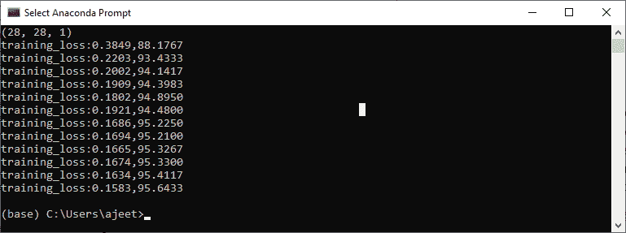
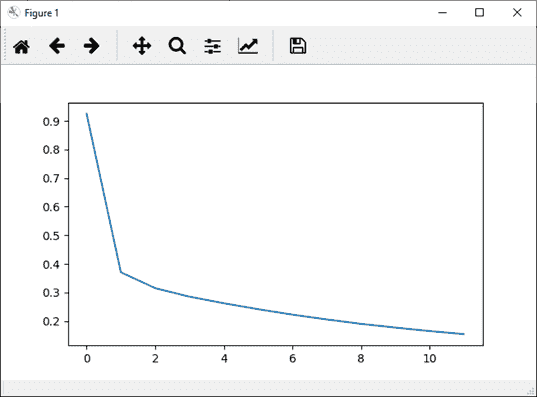
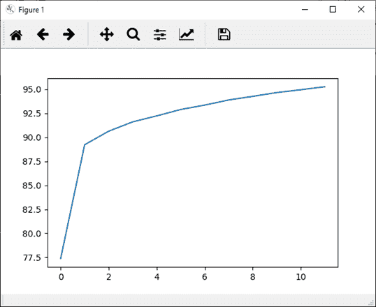

# 神经网络在图像识别中的实现

> 原文：<https://www.javatpoint.com/pytorch-implementation-of-neural-network-in-image-recognition>

我们的下一个任务是在先前标记图像的帮助下训练一个神经网络来分类新的测试图像。所以我们将使用神经网络模块来构建我们的神经网络。

实现用于图像识别的神经网络有以下步骤:

**第一步:**

在第一步中，我们将定义用于创建神经模型实例的类。这个类将从 nn 模块继承，所以我们首先要导入 nn 包。

```

from torch import nn 
class classifier (nn.Module):

```

我们的类后面将跟一个 init()方法。在 init()中，第一个参数将总是 self，第二个参数将是我们将调用的输入节点数，第三个参数将是隐藏层中的节点数，第四个参数将是第二个隐藏层中的节点数，最后一个参数将是输出层中的节点数。

```

def __init__(self,input_layer,hidden_layer1,hidden_layer2,output_layer):

```

**第二步:**

在第二步中，我们调用 init()方法来提供各种方法和属性，我们将初始化输入层，包括隐藏层和输出层。有一点要记住，我们将处理完全连接的神经网络。因此

```

super(),__init__()
self.linear1=nn.Linear(input_layer,hidden_layer1)
self.linear2=nn.Linear(hidden_layer1,hidden_layer2)
self.linear3=nn.Linear(hidden_layer2,output_layer) 
def __init__(self,input_layer,hidden_layer1,hidden_layer2,output_layer):

```

**第三步:**

现在，我们将进行预测，但在此之前，我们将导入 torch.nn.functional package，然后我们将使用 forward()函数，并将 self 作为第一个参数，将 x 作为我们尝试进行预测的任何输入。

```

import torch.nn.functional as func
def forward(self,x):

```

现在，无论什么输入将被传递到 forward()函数，都将传递到 linear1 的对象，我们将使用 **relu** 函数，而不是 **sigmoid** 。这个的输出将作为输入馈送到我们的第二个隐藏层，我们的第二个隐藏层的输出将馈送到输出层，并返回我们的最终层的输出。

#### 注意:如果是处理多类数据集，我们不会在输出层应用任何激活函数。

```

x=func.relu(self.linear1(x))
x=func.relu(self.linear2(x))
x=self.linear3(x)
return x

```

**第四步:**

下一步，我们将设置模型构造器。根据我们的初始化器，我们必须设置输入维度、隐藏层维度和输出维度。

图像的像素强度将被输入到我们的输入层。因为每幅图像都是 28*28 像素，总共有 784 个像素将被输入我们的神经网络。所以我们将通过 784 作为第一个参数，我们将在第一个和第二个隐藏层中取 125 和 60 个节点，在输出层中，我们将取 10 个节点。因此

```

model=classification1(784,125,65,10)

```

**第五步:**

现在，我们将定义我们的损失函数。神经网络。CrossEntropyLoss()用于多类分类。该函数是 log_softmax()函数和 NLLLoss()函数的组合，后者是负的对数似然损失。我们使用交叉熵对 n 个类进行训练和分类。因此，它利用了对数概率，所以我们传入行输出，而不是 softmax 激活函数的输出。

```

criteron=nn.CrossEntropyLoss()

```

之后，我们将使用熟悉的优化器，即 Adam 作为

```

optimizer=torch.optim.Adam(model.parameters(),lr=0.001) 

```

**第六步:**

在下一步中，我们将指定时代号。我们初始化了若干个时期，并用图分析了每个时期的损失。我们将初始化两个列表，即 loss _ history 和更正历史。

```

loss_history=[]
correct_history=[] 

```

**第七步:**

我们将从迭代每个时期开始，对于每个时期，我们必须迭代训练加载器提供给我们的每个训练批次。每个训练批次包含 100 个图像和 100 个标签

```

for e in range(epochs):
    for input, labels in training_loader: 

```

**第八步:**

当我们迭代我们的一批批图像时，我们必须展平它们，我们必须借助视图方法重塑它们。

Note: The shape of each image tensor is (1, 28, and 28) which means a total of 784 pixels.

根据神经网络的结构，我们的输入值将乘以连接输入层和第一个隐藏层的权重矩阵。为了进行乘法运算，我们必须使我们的图像是一维的。不是每个图像是 28 行两列，我们必须把它展平成一行 784 像素。

```

inputs=input.view(input.shape[0],-1)

```

现在，在这些输入的帮助下，我们得到如下输出

```

outputs=model(inputs) 

```

**第九步:**

借助输出，我们将计算总分类交叉熵损失，并最终将输出与实际标签进行比较。我们还将基于交叉熵标准确定误差。在执行训练过程的任何部分之前，我们必须像以前一样设置优化器。

```

loss1=criteron(outputs,labels)
optimizer.zero_grad()
loss1.backward()
optimizer.step() 

```

**第十步:**

为了跟踪每个时期的损失，我们将初始化一个可变损失，即 running_loss。对于每批计算的每一个损失，我们必须把每一批的所有损失加起来，然后计算每个时期的最终损失。

```

loss+=loss1.item()

```

现在，我们将把整个时期的累计损失添加到我们的损失列表中。为此，我们在循环语句之后使用 else 语句。所以一旦 for 循环结束，就会调用 else 语句。在此 else 语句中，我们将打印在特定时期为整个数据集计算的累计损失。

```

epoch_loss=loss/len(training_loader)
loss_history.append(epoch_loss)

```

**第 11 步:**

下一步，我们将发现我们网络的准确性。我们将初始化正确的变量，并将值赋为零。我们将把模型对每个训练图像的预测与图像的实际标签进行比较，以显示一个时期内有多少图像是正确的。

对于每个图像，我们将取最大得分值。在这种情况下，返回一个元组。它返回的第一个值是实际的最高值-最大分数，这是由模型为这批图像中的每一张图像得出的。因此，我们对第一个元组值不感兴趣，第二个元组值对应于我们称之为 preds 的模型所做的顶级预测。它将返回该图像最大值的索引。

```

_,preds=torch.max(outputs,1)

```

**第 12 步:**

每个图像输出将是一个值的集合，索引范围从 0 到 9，这样 MNIST 数据集包含从 0 到 9 的类。由此可见，出现最大值的预测对应于模型做出的预测。我们将把模型做出的所有这些预测与图像的实际标签进行比较，看看它们中有多少是正确的。

```

correct+=torch.sum(preds==labels.data)

```

这将给出每一批图像的正确预测数。我们将以与历元损失相同的方式定义历元精度，并将历元损失和精度打印为

```

epoch_acc=correct.float()/len(training_loader)  
print('training_loss:{:.4f},{:.4f}'.format(epoch_loss,epoch_acc.item()))

```

这将给出预期的结果



**第 13 步:**

现在，我们将把整个纪元的精度附加到我们的正确历史列表中，为了更好地可视化，我们将把纪元损失和精度绘制为

```

plt.plot(loss_history,label='Running Loss History')
plt.plot(correct_history,label='Running correct History')

```

**历元损失**



**历元精度**



* * *

## 完全码

```

import torch
import matplotlib.pyplot as plt
import numpy as np
import torch.nn.functional as func
from torch import nn
from torchvision import datasets, transforms

transform1=transforms.Compose([transforms.ToTensor(),transforms.Normalize((0.5,),(0.5,))])
training_dataset=datasets.MNIST(root='./data',train=True,download=True,transform=transform1)
training_loader=torch.utils.data.DataLoader(dataset=training_dataset,batch_size=100,shuffle=True)
def im_convert(tensor):
    image=tensor.clone().detach().numpy()
    image=image.transpose(1,2,0)
    print(image.shape)
    image=image*(np.array((0.5,0.5,0.5))+np.array((0.5,0.5,0.5)))
    image=image.clip(0,1)
    return image
dataiter=iter(training_loader)
images,labels=dataiter.next()
fig=plt.figure(figsize=(25,4))
for idx in np.arange(20):
    ax=fig.add_subplot(2,10,idx+1)
    plt.imshow(im_convert(images[idx]))
    ax.set_title([labels[idx].item()])
class classification1(nn.Module):
    def __init__(self,input_layer,hidden_layer1,hidden_layer2,output_layer):
        super().__init__()
        self.linear1=nn.Linear(input_layer,hidden_layer1)
        self.linear2=nn.Linear(hidden_layer1,hidden_layer2)
        self.linear3=nn.Linear(hidden_layer2,output_layer)
    def forward(self,x):
        x=func.relu(self.linear1(x))
        x=func.relu(self.linear2(x))
        x=self.linear3(x)
        return x
model=classification1(784,125,65,10)
criteron=nn.CrossEntropyLoss()
optimizer=torch.optim.Adam(model.parameters(),lr=0.0001)
epochs=12
loss_history=[]
correct_history=[]
for e in range(epochs):
    loss=0.0
    correct=0.0
    for input,labels in training_loader:
        inputs=input.view(input.shape[0],-1)
        outputs=model(inputs)
        loss1=criteron(outputs,labels)
        optimizer.zero_grad()
        loss1.backward()
        optimizer.step()
        _,preds=torch.max(outputs,1)
        loss+=loss1.item()
        correct+=torch.sum(preds==labels.data)
    else:
        epoch_loss=loss/len(training_loader)
        epoch_acc=correct.float()/len(training_loader)
        loss_history.append(epoch_loss)
        correct_history.append(epoch_acc)
        print('training_loss:{:.4f},{:.4f}'.format(epoch_loss,epoch_acc.item()))

```

* * *