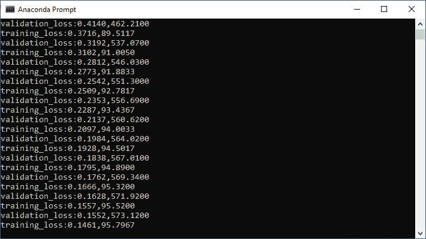
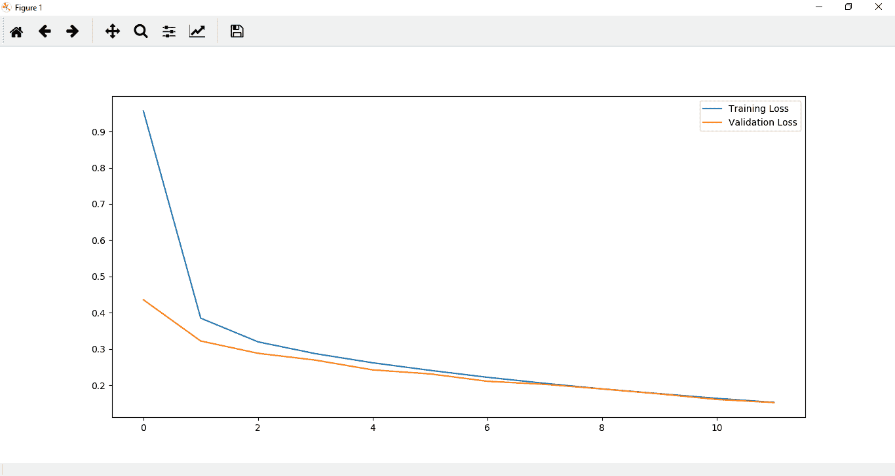
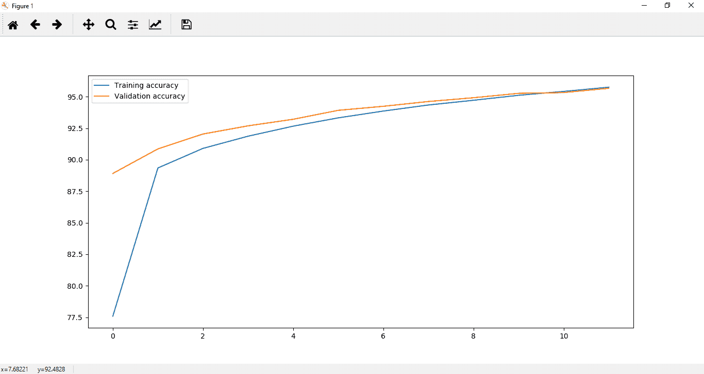

# 图像识别中神经网络的验证

> 原文：<https://www.javatpoint.com/pytorch-validation-of-neural-network-for-image-recognition>

在训练部分，我们在 MNIST 数据集(无尽数据集)上训练我们的模型，它似乎达到了合理的损失和精度。如果这个模型能够把它所学到的东西推广到新的数据中，那么这将是它性能的真实证明。这将在以下步骤的帮助下完成:

**第一步:**

我们将在训练部分创建的训练数据集的帮助下创建我们的验证集。在本例中，我们将 train 等于 false 设置为:

```

validation_dataset=datasets.MNIST(root='./data',train=False,download=True,transform=transform1)

```

**第二步:**

现在，我们已经在训练部分声明了一个训练加载器，同样，我们将在验证部分声明一个验证加载器。验证加载器也将以与我们创建训练加载器相同的方式创建，但是这次我们传递训练加载器而不是训练数据集，并且我们将 shuffle 等于设置为 false，因为我们不会被训练我们的验证数据。没有必要洗牌，因为它只是为了测试的目的。

```

validation_loader=torch.utils.data.DataLoader(dataset=validation_dataset,batch_size=100,shuffle=False)

```

**第三步:**

我们的下一步是分析每个时期的验证损失和准确性。为此，我们必须为“验证运行失败”和“验证运行失败更正”创建两个列表。

```

val_loss_history=[]
val_correct_history=[]

```

**第四步:**

下一步，我们将验证模型。该模型将验证同一时代。在我们完成迭代整个训练集来训练我们的数据之后，我们现在将迭代我们的验证集来测试我们的数据。

我们将首先衡量两件事。第一个是我们模型的性能，即有多少正确的分类。我们的模型在验证集上进行测试，以检查是否过度拟合。我们将验证的运行损失和运行修正设置为:

```

val_loss=0.0
val_correct=0.0

```

**第五步:**

我们现在可以循环测试数据。所以在 else 语句之后，我们将为标签和输入定义一个循环语句，如下所示:

```

for val_input,val_labels in validation_loader:

```

**第六步:**

当我们迭代我们的一批批图像时，我们必须展平它们，我们必须借助视图方法重塑它们。

#### 注意:每个图像张量的形状是(1，28，28)，这意味着总共有 784 个像素。

根据神经网络的结构，我们的输入值将乘以连接输入层和第一个隐藏层的权重矩阵。为了进行乘法运算，我们必须使我们的图像是一维的。不是每个图像是 28 行两列，我们必须把它展平成一行 784 像素。

```

val_inputs=val_input.view(val_input.shape[0],-1)

```

现在，在这些输入的帮助下，我们得到如下输出

```

val_outputs=model(val_inputs)

```

**第七步:**

借助输出，我们将计算总分类交叉熵损失，并最终将输出与实际标签进行比较。

```

val_loss1=criteron(val_outputs,val_labels)

```

我们没有训练我们的神经网络，所以没有必要调用 zero_grad()，backward()或任何类似的东西。也不再需要计算导数了。在操作范围内为了节省内存，我们在 For 循环前调用 no_grad()方法用火炬作为:

```

with torch.no_grad():

```

它会暂时将所有 require grad 标志设置为 false。

**第八步:**

现在，我们将以与计算训练损失和训练精度相同的方式计算验证损失和精度，如下所示:

```

_,val_preds=torch.max(val_outputs,1)
val_loss+=val_loss1.item()
val_correct+=torch.sum(val_preds==val_labels.data)

```

**第九步:**

现在，我们将计算验证历元损失，这与我们计算训练历元损失的方式相同，其中我们将总运行损失除以数据集的长度。所以它将被写成:

```

val_epoch_loss=val_loss/len(validation_loader)
val_epoch_acc=correct.float()/len(validation_loader)
val_loss_history.append(val_epoch_loss)
val_correct_history.append(epoch_acc)

```

**第十步:**

我们将验证损失和验证准确性打印为:

```

print('validation_loss:{:.4f},{:.4f}'.format(val_epoch_loss,val_epoch_acc.item()))

```



**第 11 步:**

为了更好地理解，我们也不会为了可视化的目的而绘制它。我们将把它标为:

```

plt.plot(loss_history,label='Training Loss')
plt.plot(val_loss_history,label='Validation Loss')
plt.legend()
plt.show()

```



```

plt.plot(correct_history,label='Training accuracy')
plt.plot(val_correct_history,label='Validation accuracy')
plt.legend()
plt.show()

```



* * *

## 完全码

```

import torch
import matplotlib.pyplot as plt
import numpy as np
import torch.nn.functional as func
from torch import nn
from torchvision import datasets,transforms 
transform1=transforms.Compose([transforms.Resize((28,28)),transforms.ToTensor(),transforms.Normalize((0.5,),(0.5,))])
training_dataset=datasets.MNIST(root='./data',train=True,download=True,transform=transform1)
validation_dataset=datasets.MNIST(root='./data',train=False,download=True,transform=transform1)
training_loader=torch.utils.data.DataLoader(dataset=training_dataset,batch_size=100,shuffle=True)
validation_loader=torch.utils.data.DataLoader(dataset=validation_dataset,batch_size=100,shuffle=False)
def im_convert(tensor):
    image=tensor.clone().detach().numpy()
    image=image.transpose(1,2,0)
    print(image.shape)
    image=image*(np.array((0.5,0.5,0.5))+np.array((0.5,0.5,0.5)))
    image=image.clip(0,1)
    return image
class classification1(nn.Module):
    def __init__(self,input_layer,hidden_layer1,hidden_layer2,output_layer):
        super().__init__()
        self.linear1=nn.Linear(input_layer,hidden_layer1)
        self.linear2=nn.Linear(hidden_layer1,hidden_layer2)
        self.linear3=nn.Linear(hidden_layer2,output_layer)
    def forward(self,x):
        x=func.relu(self.linear1(x))
        x=func.relu(self.linear2(x))
        x=self.linear3(x)
        return x
model=classification1(784,125,65,10)
criteron=nn.CrossEntropyLoss()
optimizer=torch.optim.Adam(model.parameters(),lr=0.0001)
epochs=12
loss_history=[]
correct_history=[]
val_loss_history=[]
val_correct_history=[]
for e in range(epochs):
    loss=0.0
    correct=0.0
    val_loss=0.0
    val_correct=0.0
    for input,labels in training_loader:
        inputs=input.view(input.shape[0],-1)
        outputs=model(inputs)
        loss1=criteron(outputs,labels)
        optimizer.zero_grad()
        loss1.backward()
        optimizer.step()
        _,preds=torch.max(outputs,1)
        loss+=loss1.item()
        correct+=torch.sum(preds==labels.data)
    else:
        with torch.no_grad():
            for val_input,val_labels in validation_loader:
                val_inputs=val_input.view(val_input.shape[0],-1)
                val_outputs=model(val_inputs)
                val_loss1=criteron(val_outputs,val_labels) 
                _,val_preds=torch.max(val_outputs,1)
                val_loss+=val_loss1.item()
                val_correct+=torch.sum(val_preds==val_labels.data)
        epoch_loss=loss/len(training_loader)
        epoch_acc=correct.float()/len(training_loader)
        loss_history.append(epoch_loss)
        correct_history.append(epoch_acc)
        val_epoch_loss=val_loss/len(validation_loader)
        val_epoch_acc=correct.float()/len(validation_loader)
        val_loss_history.append(val_epoch_loss)
        val_correct_history.append(epoch_acc)
        print('training_loss:{:.4f},{:.4f}'.format(epoch_loss,epoch_acc.item()))
        print('validation_loss:{:.4f},{:.4f}'.format(val_epoch_loss,val_epoch_acc.item()))
plt.plot(correct_history,label='Correct history ')
plt.plot(val_correct_history,label='Validation correct history')
plt.legend()
plt.show()
plt.plot(correct_history,label='Training accuracy')
plt.plot(val_correct_history,label='Validation accuracy')
plt.legend()
plt.show()

```

* * *