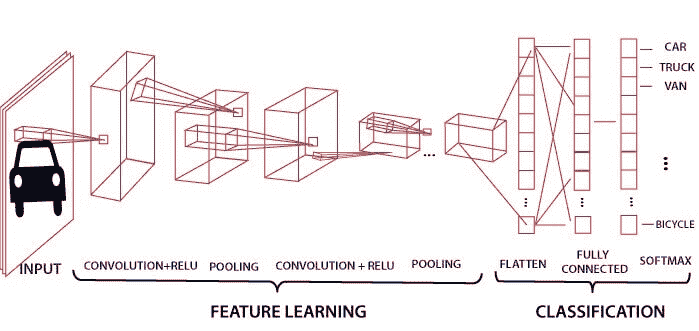
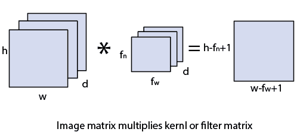
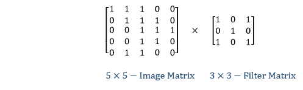
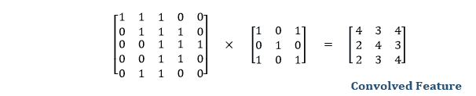
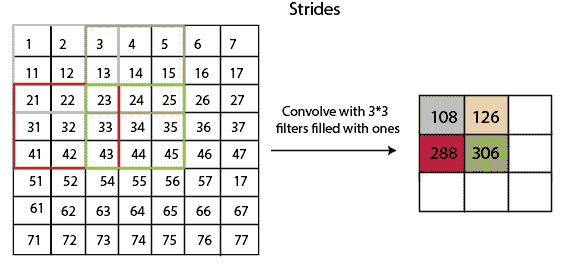
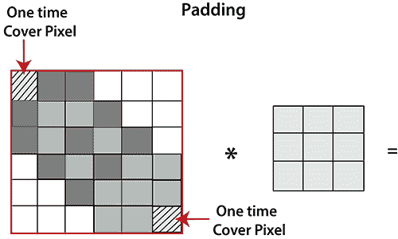
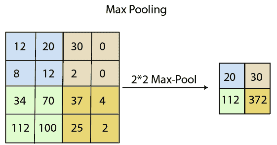
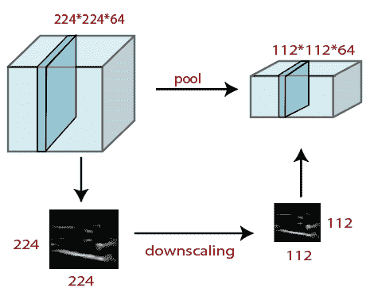
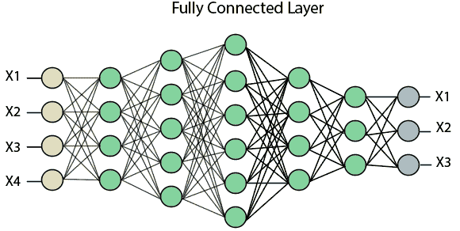
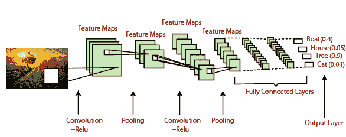

# PyTorch 中的卷积神经网络

> 原文：<https://www.javatpoint.com/pytorch-convolutional-neural-network>

**卷积神经网络**是神经网络中做图像分类和图像识别的主要类别之一。场景标注、物体检测、人脸识别等。，是卷积神经网络广泛应用的一些领域。

CNN 以一幅图像作为输入，在狗、猫、狮子、老虎等一定类别下进行分类处理。计算机将图像视为像素阵列，并取决于图像的分辨率。基于图像分辨率，会看到 **h * w * d** ，其中 h=高度 w=宽度，d=尺寸。例如，一幅 RGB 图像是矩阵的 **6 * 6 * 3** 阵列，灰度图像是矩阵的 **4 * 4 * 1** 阵列。

在美国有线电视新闻网中，每个输入图像将通过一系列卷积层以及池化、完全连接的层、过滤器(也称为核)。之后，我们将应用软-最大函数对概率值为 0 和 1 的对象进行分类。



## 卷积层

卷积层是从输入图像中提取特征的第一层。通过使用输入数据的小正方形来学习图像特征，卷积层保留了像素之间的关系。这是一种数学运算，需要两个输入，如图像矩阵和一个核或滤波器。

*   图像矩阵的维度为 **h×w×d** 。
*   过滤器的尺寸为 **f <sub>h</sub> ×f <sub>w</sub> ×d** 。
*   输出尺寸为**(h-f<sub>h</sub>+1)×(w-f<sub>w</sub>+1)×1**。



让我们首先考虑一个像素值为 0，1，滤波器矩阵为 3*3 的 5*5 图像，如下所示:



5*5 图像矩阵乘以 3*3 滤波矩阵的卷积称为“**特征图**”，并显示为输出。



图像与不同滤镜的卷积可以通过应用滤镜来执行模糊、锐化和边缘检测等操作。

## 大步

跨距是在输入矩阵上移动的像素数。当步幅等于 1 时，我们一次将滤波器移动到 1 个像素，同样，如果步幅等于 2，我们一次将滤波器移动到 2 个像素。下图显示卷积的步幅为 2。



## 填料

填充在构建卷积神经网络中起着至关重要的作用。如果图像会缩小，如果我们取一个有 100 层的神经网络，最后过滤后会得到一个小图像。

如果我们在灰度图像上使用一个三乘三的滤波器并进行卷积，会发生什么？



从上图可以明显看出，角落的像素只会被覆盖一次，而中间的像素会被覆盖不止一次。这意味着我们有更多关于中间像素的信息，所以有两个缺点:

*   缩小输出
*   丢失图像角落的信息。

为了克服这一点，我们在图像中引入了填充。**“填充是可以添加到图像边框的附加层。”**

## 汇集层

汇聚层在图像预处理中起着重要的作用。当图像太大时，池层减少了参数的数量。汇集是对从前几层获得的图像进行“**降尺度**”。这可以比作缩小图像以降低像素密度。空间池也称为下采样或二次采样，它降低了每个地图的维度，但保留了重要信息。有以下类型的空间池:

### 最大池

最大池化是一个**基于样本的离散化过程**。其主要目标是缩小输入表示，降低其维数，并允许对包含在分块子区域中的特征进行假设。

最大池化是通过对初始表示的非重叠子区域应用最大过滤器来完成的。





### 平均池

通过将输入划分为矩形池区域并计算每个区域的平均值，通过平均池进行缩小。

**语法**

```
layer = averagePooling2dLayer(poolSize)
layer = averagePooling2dLayer(poolSize,Name,Value)

```

### 总和池

**总和汇集**或**平均汇集**的子区域设置与**最大汇集**完全相同，但我们使用总和或平均值代替最大函数。

## 全连接层

完全连接层是一个层，其中来自其他层的输入将被展平为向量并发送。它将通过网络将输出转换为所需的类别数。



在上图中，特征图矩阵将转换为 **x1，x2，x3 等向量...xn** 借助全连接层。我们将结合特性创建模型，并应用激活功能，如 **softmax** 或 **sigmoid** 将输出分类为汽车、狗、卡车等。



* * *