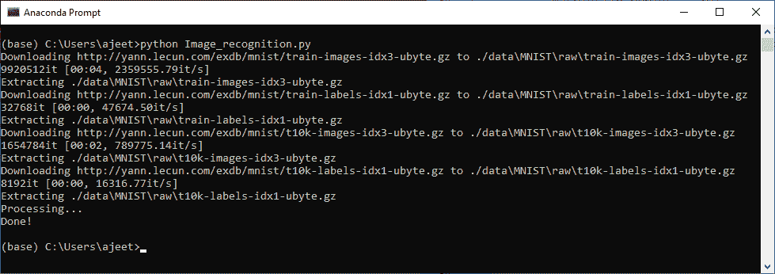
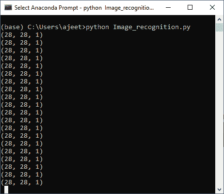
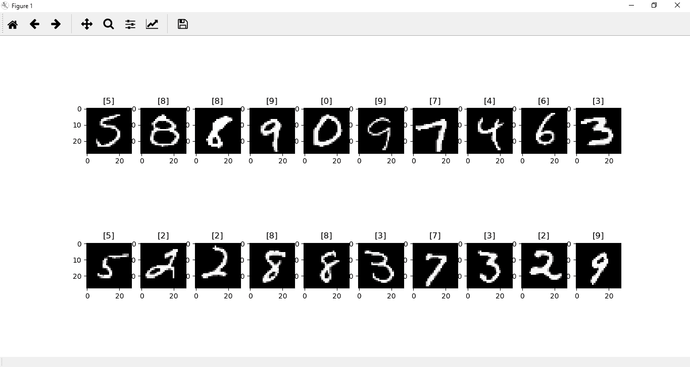

# 图像识别中的图像变换

> 原文：<https://www.javatpoint.com/pytorch-image-transforms-in-image-recognition>

加载和转换是 PyTorch 中图像识别的两个重要概念。图像的加载和转换是识别过程的开始步骤。

以下是加载和转换的分步过程:

**第一步:**

第一步，我们安装所有需要的库，如 pip、torchvision、numpy 等。如果所有需要的库已经满足，那么我们导入 torch，然后我们从 torchvision 导入数据集和转换。为了绘制数据集，我们将导入 matplotlib.pyplot 库，我们还将导入 numpy 来执行操作。这些库被导入为:

```

import torch
import matplotlib.pyplot as plt
import numpy as np
from torchvision import datasets, transforms

```

**第二步:**

在第二步中，我们使用数据集的 MNIST()方法加载 MNIST 数据集。在第一个参数中，我们将数据的根目录指定如下

```

training_dataset=datasets.MNIST(root='./data') 

```

在第二个参数中，我们设置 train = true。我们将这样做来初始化 MNIST 训练数据集。之后，我们设置 download ='true '，这将把一个列表下载到数据文件夹中，如果它还没有的话。

```

Training_dataset=datasets.MNIST(root='./data',train=True,download=True)  

```

最后一个参数是 transform，它等于在**训练数据集**之前初始化的 **transform1** 参数。这个参数规定了您希望应用于图像的任何图像处理。

```

training_dataset=datasets.MNIST(root='./data',train=True,download=True,transform=transform1)

```

#### 注意:我们的 MNIST 图像是 28*28 灰度图像，这意味着每幅图像都是一个由 28 像素宽和 28 像素长组成的二维数字阵列，每个像素的强度范围从 0 到 255。

我们必须将数组中的图像转换成张量。我们将使用 Compose()方法进行转换，这将允许我们将多个转换链接在一起。所以我们的第一个转换，作为 composed 的第一个参数传递，将会转换。ToTensor()。这将把 0 到 255 范围内的 numpy 数组转换成 0 到 1 范围内的 float 张量。

```

transform1=transforms.Compose([transforms.ToTensor()])

```

我们还将借助转换的 normalize()方法应用 normalize 转换，如下所示:

```

transform1=transforms.Compose([transforms.ToTensor(),transforms.Normalize((0.5,),(0.5,))])

```

在 normalize()方法中，我们指定了用于归一化张量图像所有通道的平均值，并且还指定了中心偏差。现在，我们将训练数据集称为:

```

training_dataset

```



**第三步:**

我们将通过绘制来进一步分析该数据集中的图像。要绘制张量图像，我们必须将其改回 numpy 数组。我们将在包含一个参数的函数 def im_convert()中完成这项工作，这个参数将是我们的张量图像。

```

def im_convert(tensor):

```

在将张量转换为 numpy 数组之前，首先，我们将克隆它。它将创建张量的新副本，然后我们使用分离()函数，然后我们将 numpy 用作:

```

image=tensor.clone().detach().numpy()

```

#### 注:将被转换成 numpy 数组的张量具有第一维、第二维和第三维的形状。第一维表示颜色通道，第二维和第三维表示图像和像素的宽度和高度。

我们知道 MNIST 数据集中的每幅图像都是灰度级，对应于宽度和高度为 28*28 像素的单一颜色通道。所以，形状应该是(1，28，28)。

**第四步:**

为了绘制我们的图像，要求图像具有(28，28，1)的形状。因此，我们将通过交换零轴、一轴和二轴来置换图像，如下所示:

```

image=image.transpose(1,2,0)  

```

该方法用轴 1 交换轴 0，用轴 2 交换轴 1。

**第五步:**

在下一步中，我们将图像去归一化，这是我们之前必须归一化的。标准化是通过减去平均值并除以标准偏差来完成的。我们将标准偏差乘以平均值，得出:

```

image=image*(np.array((0.5,0.5,0.5))+np.array((0.5,0.5,0.5))) 

```

为了确保 0 到 1 之间的范围，我们使用了 **clip()** 函数，并传递 0 和 1 作为参数。我们将对最小值 0 和最大值 1 应用裁剪函数，并返回图像。

```

image=image.clip(0,1)
return image

```

**第六步:**

现在，我们绘制我们的 MNIST 数据集，以便更好地可视化。我们将从 **training_loader()** 加载图像开始。训练加载器是我们以前在训练神经网络时用来指定训练批次的。对于每个时期，我们对整个数据集执行一次遍历。然而，一个有六万个训练图像的时代太大了，不能同时适合计算机。因此，我们将使用我们的火车装载机将其分成更小的批次，如下所示:

```

training_loader=torch.utils.data.DataLoader(dataset=training_dataset,batch_size=100,shuffle=True) 

```

第一个参数是数据集，它等于我们的 training_dataset。第二个参数是我们的批量，等于 100。第三个参数，我们设置 shuffle 等于 true。

#### 注意:100 的批量需要 600 次迭代才能完成一个历元，并且每次迭代都会更新神经网络的权重并最小化误差。

**第七步:**

下一步，我们包装我们的火车装载机。它将创建一个对象，允许我们一次一个元素地通过可变的训练加载器。我们通过调用 dataiter 上的 next 一次访问一个元素。下一个()函数将获取我们的第一批训练数据，该训练数据将被分成图像和标签，如下所示:

```

dataiter=iter(training_loader)
images,labels=dataiter.next()

```

**第八步:**

现在，我们将绘制批次中的图像及其相应的标签。这将借助 plt 的图形函数来完成，并将图形大小设置为等于整数 25*4 的元组，这将指定图形的宽度和高度。

```

fig=plt.figure(figsize=(25,4))

```

现在，我们从我们的批次中绘制出 20 幅 MNIST 图像。我们使用 add_subplot()方法向当前图形添加一个子图，并传递 2、10 和 idx 作为函数的参数。这里 2 是行数，10 是列数，idx 是索引。

```

ax=fig.add_subplot(2,10,idx+1)

```

现在，我们将在 im_show()函数的帮助下显示我们的图像，并为每个图像图给出一个标题，如下所示:

```

plt.imshow(im_convert(images[idx])) 
ax.set_title([labels[idx].item()])

```

最后调用 plt.show()，它会给出我们期望的结果。

* * *

## 完全码

```

import torch
import matplotlib.pyplot as plt
import numpy as np
from torchvision import datasets,transforms 
transform1=transforms.Compose([transforms.ToTensor(),transforms.Normalize((0.5,),(0.5,))])
training_dataset=datasets.MNIST(root='./data',train=True,download=True,transform=transform1)
training_loader=torch.utils.data.DataLoader(dataset=training_dataset,batch_size=100,shuffle=True)
def im_convert(tensor):
    image=tensor.clone().detach().numpy()
    image=image.transpose(1,2,0)
    print(image.shape)
    image=image*(np.array((0.5,0.5,0.5))+np.array((0.5,0.5,0.5)))
    image=image.clip(0,1)
    return image
dataiter=iter(training_loader)
images,labels=dataiter.next()
fig=plt.figure(figsize=(25,4))
for idx in np.arange(20):
    ax=fig.add_subplot(2,10,idx+1)
    plt.imshow(im_convert(images[idx]))
    ax.set_title([labels[idx].item()])
plt.show()

```





现在，在这些标签图像的帮助下，我们将实现一个神经网络，它将对新的测试图像进行分类。

* * *