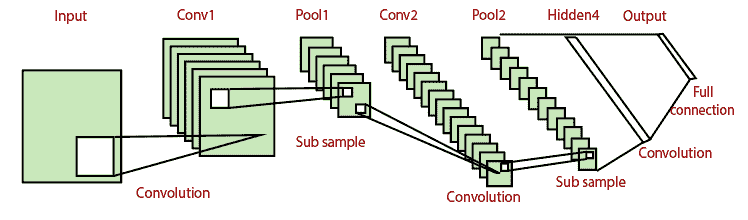

# 卷积神经网络在 PyTorch 中的实现

> 原文：<https://www.javatpoint.com/pytorch-convolutional-neural-network-model-implementation>

我们使用深度神经网络对无穷无尽的数据集进行分类，我们发现它不会对我们的数据进行最好的分类。当我们使用深度神经网络时，模型精度不够，模型可以改进。这种改进将在卷积神经网络的帮助下实现。让我们开始实现我们的**图像识别**的**卷积神经网络**。

**实现 CNN 进行图像识别有以下步骤:**

**第一步:**

在第一步中，我们将定义用于创建神经模型实例的类。CNN 模型包括 **LeNet 模型、AlexNet 模型、ZFNet 模型、**和 **GoogleNet 模型**。这些型号越来越复杂，性能越来越高，我们将使用 **LeNet 型号**。这个模型简单、有效，应该足以对无穷无尽的数据集进行精确分类。

**LeNet 模型**看起来像:



该类将从 nn 模块继承，因此我们首先必须导入 nn 包。

```

from torch import nn 
class LeNet (nn.Module):  

```

我们的类后面将有一个 init()方法。在 init()方法中，第一个参数将始终是 self。

```

def __init__(self):

```

**第二步:**

在第二步中，我们调用 init()方法来提供各种方法和属性。我们将用四个输入参数初始化卷积层，即输入通道的数量(它是一个输入层，因此我们将使用 1 个输入通道)、输出通道的数量(我们将使用 20 个输出通道进行有效的特征提取)、内核大小(我们将使用 5 个用于内核大小)和步长(我们使用 1 作为步长，因为如果我们选择更大的步长，它将导致更低的有效提取)。我们将把这个完整的命令解包成一个变量，并附加到类中的自身对象上。

同样，我们将定义下一个卷积层，并相应地调整其参数。

```

super().__init__()
self.conv1=nn.Con2d(1, 20, 5, 1)
self.conv2=nn.Con2d(20, 50, 5, 1)

```

**第三步:**

在下一步中，我们将使用 nn 定义我们的两个完全连接的层。带有适当参数的 Linear()。

第一次卷积将输入图像的尺寸从 28×28 减小到 24×24。然后，数据将通过一个 2 乘 2 的汇集层，该汇集层将图像的大小缩小，并将其转换为 12 乘 12。下一个卷积层将 12 乘 12 图像的大小减小到 8 乘 8 图像。另一个 5×5 汇集层将 8×8 图像的大小切割成 4×4 图像。因此，作为第二个参数，进入第一个全连接层的输入通道将是 4450 和 500 个输出通道。

同样，我们将通过相应地调整其参数来定义第二个完全连接的层。

```

self.fully1=nn.Linear(4*4*50,500)
self.fully2=nn.Linear(500,10)

```

**第四步:**

现在，我们将在 forward 函数中定义池层和每个层的激活函数，但在此之前，我们将导入 torch.nn.functional package，然后我们将使用 forward()函数，并将 self 作为第一个参数，将 x 作为我们尝试进行预测的任何输入。

```

import torch.nn.functional as func
def forward(self,x):

```

现在，我们将定义我们的 **relu** 函数，并连接到我们的第一个卷积层，然后我们将借助 max_pool2d()用适当的参数定义池层。

第一个参数将是前馈 x 值，接下来的两个参数将定义最大池内核的大小，并将被解包到 x 变量中。

同样，这个过程也适用于我们的第二个卷积和汇集层。

```

x=func.relu(self.conv1(x))
x=func.max_pool2d(x, 2,2)
x=func.relu(self.conv1(x))
x=func.max_pool2d(x, 2,2)
x=x.view(-1, 4*4*50)	#Reshaping the output into desired shape
x=func.relu(self.fully1(x))	#Applying relu activation function to our first fully connected layer
x=self.fully2(x)	#We will not apply activation function here because we are dealing with multiclass dataset
return x    

```

**第五步:**

下一步，我们将设置模型构造器。没有必要在初始化器中传递任何东西。因此

```

model=LeNet()    

```

我们的 CNN 模型已经实现，现在，我们将在 CNN 的实现中讨论它的实现

* * *

## 完整代码:

```

import torch
import matplotlib.pyplot as plt
import numpy as np
import torch.nn.functional as func
import PIL.ImageOps
from torch import nn
from torchvision import datasets,transforms 
transform1=transforms.Compose([transforms.Resize((28,28)),transforms.ToTensor(),transforms.Normalize((0.5,),(0.5,))])
training_dataset=datasets.MNIST(root='./data',train=True,download=True,transform=transform1)
training_loader=torch.utils.data.DataLoader(dataset=training_dataset,batch_size=100,shuffle=True)
def im_convert(tensor):
    image=tensor.clone().detach().numpy()
    image=image.transpose(1,2,0)
    print(image.shape)
    image=image*(np.array((0.5,0.5,0.5))+np.array((0.5,0.5,0.5)))
    image=image.clip(0,1)
    return image
dataiter=iter(training_loader)
images,labels=dataiter.next()
fig=plt.figure(figsize=(25,4))
for idx in np.arange(20):
    ax=fig.add_subplot(2,10,idx+1)
    plt.imshow(im_convert(images[idx]))
   ax.set_title([labels[idx].item()])
class LeNet(nn.Module):
        def __init__(self):
            super().__init__()
            self.conv1=nn.Conv2d(1,20,5,1)
            self.conv2=nn.Conv2d(20,50,5,1)
            self.fully1=nn.Linear(4*4*50,500)
            self.fully2=nn.Linear(500,10)
        def forward(self,x):
            x=func.relu(self.conv1(x))
            x=func.max_pool2d(x,2,2)
            x=func.relu(self.conv2(x))
            x=func.max_pool2d(x,2,2)
            x=x.view(-1,4*4*50)	#Reshaping the output into desired shape
            x=func.relu(self.fully1(x))	#Applying relu activation function to our first fully connected layer
            x=self.fully2(x)	#We will not apply activation function here because we are dealing with multiclass dataset
            return x    
model=LeNet()

```

* * *