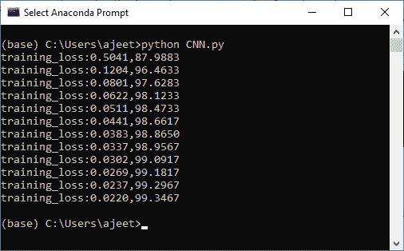
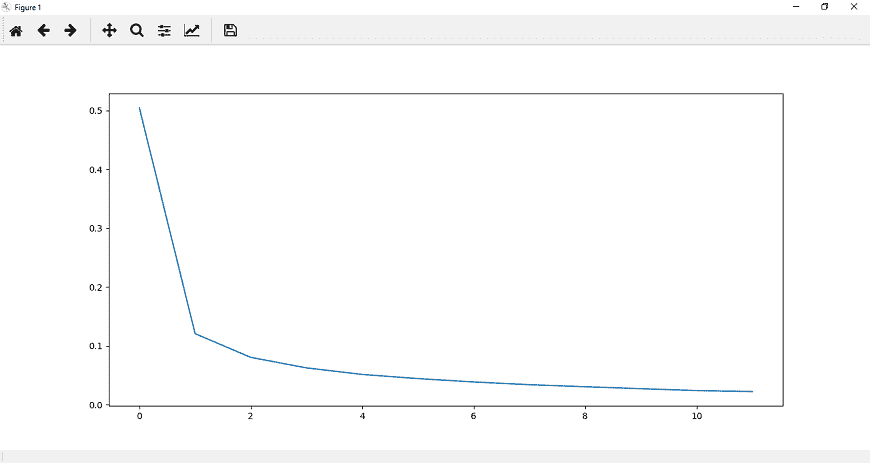
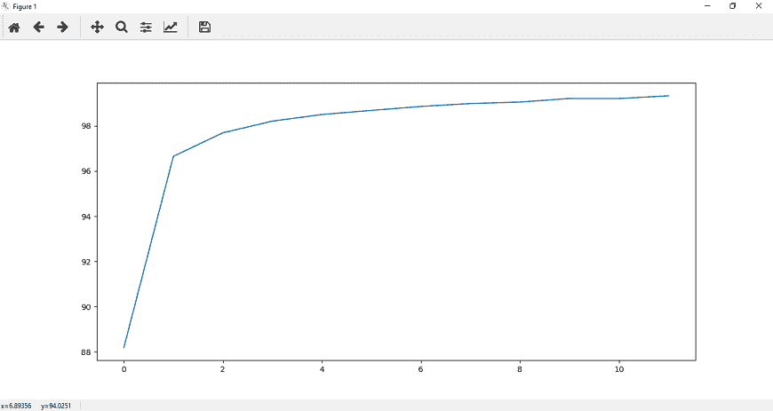

# 卷积神经网络模型的训练

> 原文：<https://www.javatpoint.com/pytorch-training-of-convolutional-neural-network-model>

在最后一个主题中，我们实现了我们的 CNN 模型。现在，我们的下一个任务是训练它。为了训练我们的 CNN 模型，我们将涉及 CUDA 张量类型，它将实现与 CPU 张量相同的功能，但是它们用于计算。

**训练我们的 CNN 模型有以下步骤:**

**第一步:**

在培训部分的第一步，我们将借助 **torch.device()** 指定设备。我们将检查 CUDA 如果 Cuda 将可用，那么我们使用了 CUDA，否则我们将使用 CPU。

```

device=torch.device("cuda:0" if torch.cuda.is_available() else "cpu")

```

**第二步:**

下一步，我们将为我们的设备分配型号，如下所示:

```

model=LeNet.to(device)

```

**第三步:**

现在，我们将定义我们的损失函数。损失函数的定义方式与我们在之前的模型中使用深度神经网络定义的方式相同。

```

criteron=nn.CrossEntropyLoss()

```

之后，我们将使用熟悉的优化器，即 Adam 作为

```

optimizer=torch.optim.Adam(model.parameters(),lr=0.00001) 

```

**第四步:**

在下一步中，我们将指定纪元的数量。我们初始化了几个时期，并用图分析了每个时期的损失。我们将初始化两个列表，即 loss _ history 和更正历史。

```

epoch=12
loss_history=[]
correct_history=[]

```

**第五步:**

我们将从迭代每个时期开始，对于每个时期，我们必须迭代训练加载器提供给我们的每个训练批次。每个训练批次在训练加载器中包含一百个图像和一百个标签，如下所示:

```

for e in range(epochs):
    for input, labels in training_loader: 

```

**第六步:**

我们正在处理卷积神经网络，其中输入首先被传递。我们将在四维空间中传递图像，因此没有必要将它们展平。

由于我们已经为我们的设备分配了型号，同样，我们也为我们的设备分配了输入和标签。

```

input=input.to(device)
labels=labels.to(device)

```

现在，在这些输入的帮助下，我们得到如下输出:

```

outputs=model(inputs) 

```

**第七步:**

在下一步中，我们将以与之前在图像识别中相同的方式执行优化算法。

```

loss1=criteron(outputs,labels)
optimizer.zero_grad()
loss1.backward()
optimizer.step()

```

**第八步:**

为了跟踪每个时期的损失，我们将初始化一个可变损失，即 running_loss。对于每批计算的每一个损失，我们必须把每一批的所有损失加起来，然后计算每个时期的最终损失。

```

loss+=loss1.item()

```

现在，我们将把整个时期的累计损失添加到我们的损失列表中。为此，我们在循环语句之后使用 else 语句。所以一旦 for 循环结束，就会调用 else 语句。在此 else 语句中，我们将打印在特定时期为整个数据集计算的累计损失。

```

epoch_loss=loss/len(training_loader)
loss_history.append(epoch_loss)  

```

**第 11 步:**

下一步，我们将发现我们网络的准确性。我们将初始化正确的变量，并将值赋为零。我们将把模型对每个训练图像的预测与图像的实际标签进行比较，以显示一个时期内有多少图像是正确的。

对于每个图像，我们将取最大得分值。在这种情况下，返回一个元组。它返回的第一个值是实际的最高值-最大分数，这是由模型为这批图像中的每一张图像得出的。因此，我们对第一个元组值不感兴趣，第二个元组值对应于我们称之为 preds 的模型所做的顶级预测。它将返回该图像最大值的索引。-

```

 _,preds=torch.max(outputs,1)

```

**第 12 步:**

每个图像输出将是一个值的集合，索引范围从 0 到 9，这样 MNIST 数据集包含从 0 到 9 的类。由此可见，出现最大值的预测对应于模型做出的预测。我们将把模型做出的所有这些预测与图像的实际标签进行比较，看看它们中有多少是正确的。

```

correct+=torch.sum(preds==labels.data)

```

这将给出每一批图像的正确预测数。我们将以与历元损失相同的方式定义历元精度，并将历元损失和精度打印为

```

epoch_acc=correct.float()/len(training_loader)  
print('training_loss:{:.4f},{:.4f}'.format(epoch_loss,epoch_acc.item()))

```

这将给出如下预期结果:



**第 13 步:**

现在，我们将把整个纪元的精度附加到我们的正确历史列表中，为了更好地可视化，我们将把纪元损失和精度绘制为

```

plt.plot(loss_history,label='Running Loss History')
plt.plot(correct_history,label='Running correct History')

```





* * *

## 完整代码:

```

import torch
import matplotlib.pyplot as plt
import numpy as np
import torch.nn.functional as func
import PIL.ImageOps
from torch import nn
from torchvision import datasets,transforms 
device=torch.device("cuda:0" if torch.cuda.is_available() else "cpu")
transform1=transforms.Compose([transforms.Resize((28,28)),transforms.ToTensor(),transforms.Normalize((0.5,),(0.5,))])
training_dataset=datasets.MNIST(root='./data',train=True,download=True,transform=transform1)
training_loader=torch.utils.data.DataLoader(dataset=training_dataset,batch_size=100,shuffle=True)
class LeNet(nn.Module):
        def __init__(self):
            super().__init__()
            self.conv1=nn.Conv2d(1,20,5,1)
            self.conv2=nn.Conv2d(20,50,5,1)
            self.fully1=nn.Linear(4*4*50,500)
            self.fully2=nn.Linear(500,10)
        def forward(self,x):
            x=func.relu(self.conv1(x))
            x=func.max_pool2d(x,2,2)
            x=func.relu(self.conv2(x))
            x=func.max_pool2d(x,2,2)
            x=x.view(-1,4*4*50)	#Reshaping the output into desired shape
            x=func.relu(self.fully1(x))	#Applying relu activation function to our first fully connected layer
            x=self.fully2(x)	#We will not apply activation function here because we are dealing with multiclass dataset
            return x    
model=LeNet().to(device)
criteron=nn.CrossEntropyLoss()
optimizer=torch.optim.Adam(model.parameters(),lr=0.00001) 
epochs=12
loss_history=[]
correct_history=[] 
for e in range(epochs):
    loss=0.0
    correct=0.0
for e in range(epochs):
    loss=0.0
    correct=0.0
    for inputs,labels in training_loader:
        inputs=inputs.to(device)
        labels=labels.to(device)
        outputs=model(inputs)
        loss1=criteron(outputs,labels)
        optimizer.zero_grad()
        loss1.backward()
        optimizer.step()
        _,preds=torch.max(outputs,1)
        loss+=loss1.item()
        correct+=torch.sum(preds==labels.data)
    else:
        epoch_loss=loss/len(training_loader)
        epoch_acc=correct.float()/len(training_loader)
        loss_history.append(epoch_loss)
        correct_history.append(epoch_acc)

    print('training_loss:{:.4f},{:.4f}'.format(epoch_loss,epoch_acc.item()))
plt.plot(loss_history,label='Running Loss History')
plt.plot(correct_history,label='Running correct History')
plt.show()

```

* * *