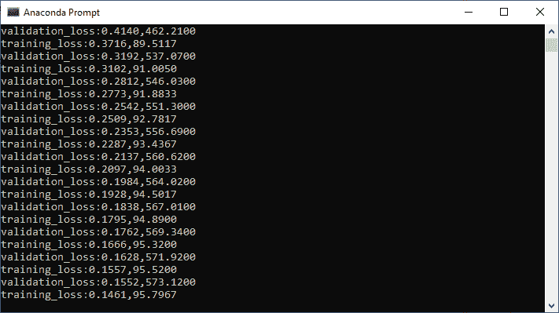

# 卷积神经网络模型的验证

> 原文：<https://www.javatpoint.com/pytorch-validation-of-convolutional-neural-network-model>

在训练部分，我们在 MNIST 数据集(无尽数据集)上训练了我们的 CNN 模型，它似乎达到了一个合理的损失和精度。如果这个模型能够把它所学到的东西推广到新的数据中，那么这将是它性能的真实证明。这将按照我们在上一个主题中所做的相同方式来完成。

**第一步:**

我们将在训练部分创建的训练数据集的帮助下创建我们的验证集。在本例中，我们将 train 等于 false 设置为:

```

validation_dataset=datasets.MNIST(root='./data',train=False,download=True,transform=transform1)

```

**第二步:**

现在，类似于为什么我们在训练部分声明了一个训练加载器，我们将定义一个验证加载器。验证加载器也将以与我们创建训练加载器相同的方式创建，但是这次我们传递训练加载器而不是训练数据集，并且我们将 shuffle 等于设置为 false，因为我们不会被训练我们的验证数据。没有必要洗牌，因为它只是为了测试的目的。

```

validation_loader=torch.utils.data.DataLoader(dataset=validation_dataset,batch_size=100,shuffle=False)

```

**第三步:**

我们的下一步是分析每个时期的验证损失和准确性。为此，我们必须为“验证运行失败”和“验证运行失败更正”创建两个列表。

```

val_loss_history=[]
val_correct_history=[]

```

**第四步:**

下一步，我们将验证模型。该模型将验证同一时代。在我们完成迭代整个训练集来训练我们的数据之后，我们现在将迭代我们的验证集来测试我们的数据。

我们将首先衡量两件事。第一个是我们模型的性能，即有多少正确的分类。我们的模型在验证集上进行测试，以检查是否过度拟合。我们将验证的运行损失和运行修正设置为:

```

val_loss=0.0
val_correct=0.0

```

**第五步:**

我们现在可以循环测试数据。所以在 else 语句之后，我们将为标签和输入定义一个循环语句，如下所示:

```

for val_input,val_labels in validation_loader:

```

**第六步:**

我们正在处理输入首先被传递到的卷积神经网络。我们将关注这些图像的四个维度。所以没必要把它们压平。

由于我们已经为我们的设备分配了型号，同样，我们也为我们的设备分配了输入和标签。

```

input=input.to(device)
labels=input.to(device)

```

现在，在这些输入的帮助下，我们得到如下输出

```

val_outputs=model(val_inputs)

```

**第七步:**

借助输出，我们将计算总分类交叉熵损失，并最终将输出与实际标签进行比较。

```

val_loss1=criteron(val_outputs,val_labels)

```

我们没有训练我们的神经网络，所以没有必要调用 zero_grad()，backward()或任何类似的东西。也不再需要计算导数了。在操作范围内为了节省内存，我们在 For 循环前调用 no_grad()方法用火炬作为:

```

with torch.no_grad():

```

它会暂时将所有 require grad 标志设置为 false。

**第八步:**

现在，我们将以与计算训练损失和训练精度相同的方式计算验证损失和精度，如下所示:

```

_,val_preds=torch.max(val_outputs,1)
val_loss+=val_loss1.item()
val_correct+=torch.sum(val_preds==val_labels.data)

```

**第九步:**

现在，我们将计算验证历元损失，这与我们计算训练历元损失的方式相同，其中我们将总运行损失除以数据集的长度。所以它将被写成:

```

val_epoch_loss=val_loss/len(validation_loader)
val_epoch_acc=val_correct.float()/len(validation_loader)
val_loss_history.append(val_epoch_loss)
val_correct_history.append(val_epoch_acc)

```

**第十步:**

我们将验证损失和验证准确性打印为:

```

print('validation_loss:{:.4f},{:.4f}'.format(val_epoch_loss,val_epoch_acc.item()))

```



**第 11 步:**

现在，我们将为可视化目的绘制它。我们将把它标为:

```

plt.plot(loss_history,label='Training Loss')
plt.plot(val_loss_history,label='Validation Loss')
plt.legend()
plt.show()

```


```

plt.plot(correct_history,label='Training accuracy')
plt.plot(val_correct_history,label='Validation accuracy')
plt.legend()
plt.show()

```


从上面的图表可以清楚地看出，在美国有线电视新闻网中会发生过度拟合。为了减少这种过拟合，我们将引入另一种快速技术，称为脱落层。

**第 12 步:**

在下一步中，我们将转到我们的 LeNet 类，并添加一个特定的图层类型，这将减少数据的过度拟合。这种图层类型称为脱落图层。该层的基本功能是将输入单位的分数率随机设置为 0，并在训练期间进行每次更新。


上图显示了一个标准神经网络，也显示了应用 dropout 后的相同神经网络。我们可以看到，一些节点已经关闭，不再与网络一起传递信息。

我们将在给定的网络中使用多个丢失层来获得所需的性能。我们将把这些脱落层放在卷积层之间和全连接层之间。丢弃层用在具有大量参数的层之间，因为这些高参数层更可能过度填充和记忆训练数据。因此，我们将在全连接层之间设置脱落层。

我们将在神经网络的帮助下初始化丢失层。辍学模块，并通过辍学率作为参数在我们的初始值设定项。给定节点被丢弃的概率将被设置为 0.5:

```

self.dropout1=nn.dropout(0.5) 

```

**第 13 步:**

在下一步中，我们将前向功能中完全连接层之间的第二个脱离层定义为:

```

x=self.dropout1(x)

```

现在，我们将运行我们的程序，它将为我们提供更准确的结果:


* * *

## 完全码

```

import torch
import matplotlib.pyplot as plt
import numpy as np
import torch.nn.functional as func
import PIL.ImageOps
from torch import nn
from torchvision import datasets,transforms 
device=torch.device("cuda:0" if torch.cuda.is_available() else "cpu")
transform1=transforms.Compose([transforms.Resize((28,28)),transforms.ToTensor(),transforms.Normalize((0.5,),(0.5,))])
training_dataset=datasets.MNIST(root='./data',train=True,download=True,transform=transform1)
validation_dataset=datasets.MNIST(root='./data',train=False,download=True,transform=transform1)
training_loader=torch.utils.data.DataLoader(dataset=training_dataset,batch_size=100,shuffle=True)
validation_loader=torch.utils.data.DataLoader(dataset=validation_dataset,batch_size=100,shuffle=False)
class LeNet(nn.Module):
        def __init__(self):
            super().__init__()
            self.conv1=nn.Conv2d(1,20,5,1)
            self.conv2=nn.Conv2d(20,50,5,1)
            self.fully1=nn.Linear(4*4*50,500)
            self.dropout1=nn.Dropout(0.5) 
            self.fully2=nn.Linear(500,10)
        def forward(self,x):
            x=func.relu(self.conv1(x))
            x=func.max_pool2d(x,2,2)
            x=func.relu(self.conv2(x))
            x=func.max_pool2d(x,2,2)
            x=x.view(-1,4*4*50)	#Reshaping the output into desired shape
            x=func.relu(self.fully1(x))	#Applying relu activation function to our first fully connected layer
            x=self.dropout1(x)
            x=self.fully2(x)	#We will not apply activation function here because we are dealing with multiclass dataset
            return x    
model=LeNet().to(device)
criteron=nn.CrossEntropyLoss()
optimizer=torch.optim.Adam(model.parameters(),lr=0.00001) 
epochs=12
loss_history=[]
correct_history=[]
val_loss_history=[]
val_correct_history=[]
for e in range(epochs):
    loss=0.0
    correct=0.0
    val_loss=0.0
    val_correct=0.0
    for input,labels in training_loader:
        input=input.to(device)
        labels=labels.to(device)
        outputs=model(input)
        loss1=criteron(outputs,labels)
        optimizer.zero_grad()
        loss1.backward()
        optimizer.step()
        _,preds=torch.max(outputs,1)
        loss+=loss1.item()
        correct+=torch.sum(preds==labels.data)
    else:
        with torch.no_grad():
            for val_input,val_labels in validation_loader:
                val_input=val_input.to(device)
                val_labels=val_labels.to(device)
                val_outputs=model(val_input)
                val_loss1=criteron(val_outputs,val_labels) 
                _,val_preds=torch.max(val_outputs,1)
                val_loss+=val_loss1.item()
                val_correct+=torch.sum(val_preds==val_labels.data)
        epoch_loss=loss/len(training_loader)
        epoch_acc=correct.float()/len(training_loader)
        loss_history.append(epoch_loss)
        correct_history.append(epoch_acc)
        val_epoch_loss=val_loss/len(validation_loader)
        val_epoch_acc=val_correct.float()/len(validation_loader)
        val_loss_history.append(val_epoch_loss)
        val_correct_history.append(val_epoch_acc)
        print('training_loss:{:.4f},{:.4f}'.format(epoch_loss,epoch_acc.item()))
        print('validation_loss:{:.4f},{:.4f}'.format(val_epoch_loss,val_epoch_acc.item()))

plt.plot(loss_history,label='Training Loss')
plt.plot(val_loss_history,label='Validation Loss')
plt.legend()
plt.show()
plt.plot(correct_history,label='Training accuracy')
plt.plot(val_correct_history,label='Validation accuracy')
plt.legend()
plt.show()

```

* * *