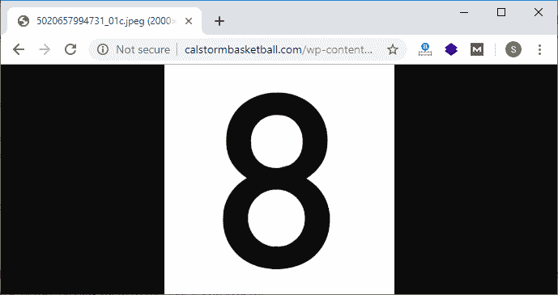
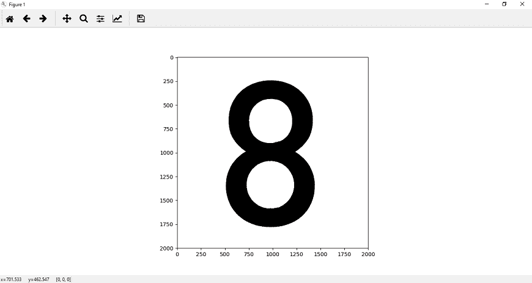
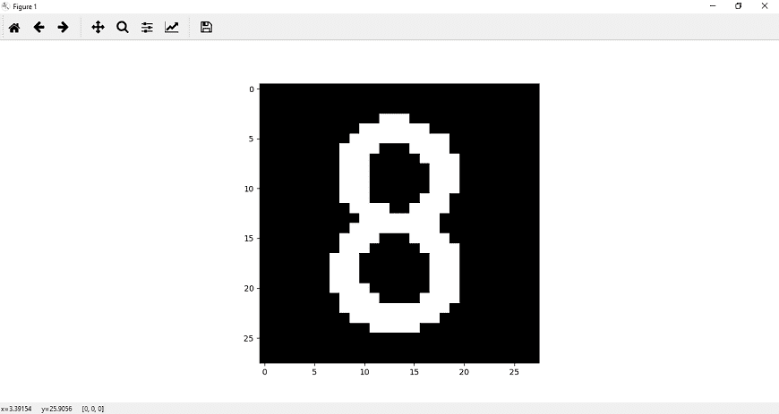
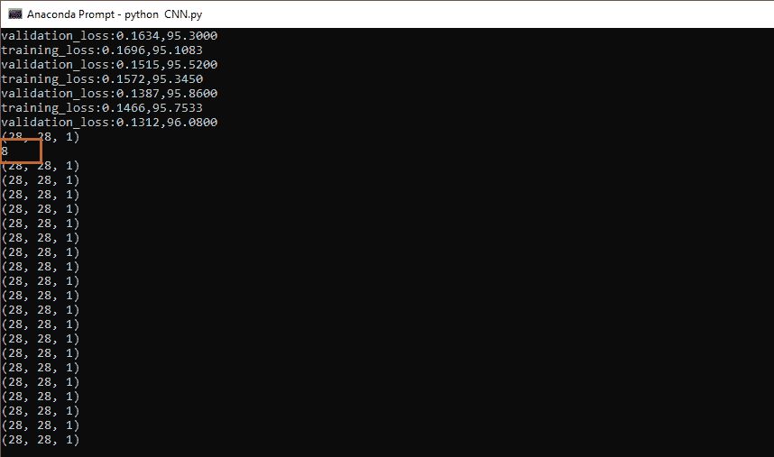
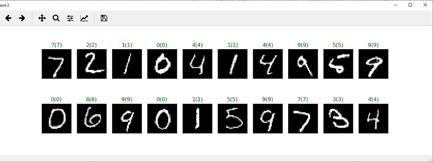
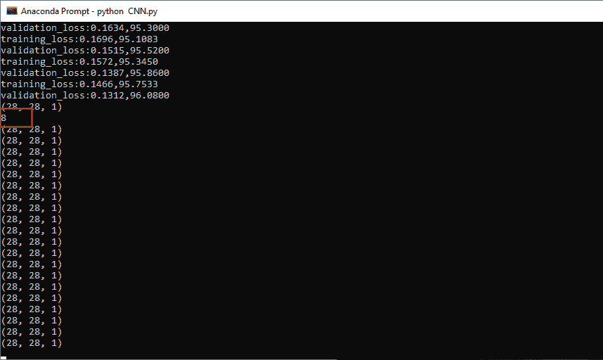

# 卷积神经网络模型的测试

> 原文：<https://www.javatpoint.com/pytorch-testing-of-convolutional-neural-network-model>

在最后一部分，我们实现了一个神经网络或创建了一个模型来分类手写数字。现在，我们通过从网络上抓取图像来测试我们的模型。我们使用了以下图像:

*http://calstormball . com/WP-content/uploads/2018/08/5020657994731 _ 01c . JPEG*

当您将此链接粘贴到浏览器上时，您会看到第五张图片如下:



看到这之后，我们就会意识到是数字 5。现在，我们将试图让我们的网络预测它。

**我们有以下步骤对数字图像进行预测:**

**第一步:**

在第一步中，我们将执行**获取**请求来检索图像数据。要发出**获取**请求，我们需要将请求导入为:

```

import requests

```

现在，我们设置一个可变的网址，并将链接指定为字符串。

```

url=' http://calstormbasketball.com/wp-content/uploads/2018/08/5020657994731_01c.jpeg '

```

**第二步:**

在下一步中，我们设置一个变量响应，其值将从请求的 **get()** 方法中获得。 **get()** 方法由两个参数组成，即 URL 和 stream，stream 等于 true。

```

response=requests.get(url,stream=True)

```

**第三步:**

我们将使用响应的原始内容来获取图像。为此，我们首先要从 **PIL (Python 图像库)**导入**图像**作为。

```

from PIL import Image

```

我们使用图像的 **open()** 方法，并传递响应的原始内容作为参数。从该方法返回的值将赋给名为 img 的变量，如下所示:

```

img=Image.open(response.raw)

```

现在，我们绘制图像以确保一切正常。

```

plt.imshow(img)
plt.show()

```

当我们运行它时，它会因为 PIL 而产生错误。我们必须先安装枕头才能运行这段代码。我们必须在蟒蛇命令提示符下运行 **conda install -c 蟒蛇枕头**命令来安装枕头。

当您运行代码时，它会给出预期的输出。



**第四步:**

我们需要确保图像对应于神经网络被训练学习的内容。我们的图像是 1000*1000 像素的，所以我们需要把它做成 28*28 的灰度图像，就像训练数据中的图像一样。在我们训练的图像数据集中，图像有黑色背景和白色前景，在上面的图像中，有白色背景和黑色前景。现在，我们的第一个任务是预处理这张图像。

我们将使用 **PIL 的**反转()**方法。ImageOps** 并传递我们的图像作为参数。这种方法将反转我们图像的颜色。

```

img=PIL.ImageOps.invert(img)

```

该图像是 RGB 格式，具有三个通道的像素强度值，由于多种原因，这将是有问题的。为此，我们必须将此图像转换为二进制黑白图像，并将此图像转换为:

```

img=img.convert('1') 

```

我们将像变换所有其他训练图像一样变换这个图像。我们必须变换 28*28 像素的图像，因此我们必须在变换后的链合成中添加参数**调整**的大小，如下所示:

```

transform1=transforms.Compose([transforms.Resize((28,28)),transforms.ToTensor(),transforms.Normalize((0.5,),(0.5,))])
img=transform1(img)

```

现在，我们的图像是张量的形式，所以我们必须把它变成 numpy 数组。在绘制我们的图像之前，我们必须导入 PIL。图像操作然后将图像绘制为:

```

import PIL.ImageOps
plt.imshow(im_convert(img))

```



**第五步:**

现在，我们将把这个图像输入我们的神经网络进行预测。我们将图像添加到设备中，并确保四维权重的四维输入。我们将取消压缩图像，并将其分配给新的可变图像，如下所示:

```

image=img.to(device)
image=image[0].unsqueeze().unsqueeze(0)

```

这将返回一个尺寸为 1 的新张量，它将被插入到指定的零位置。

```

output=model(image)
_,pred=torch.max(output,1)
print(pred.item())

```

它将给我们预期的预测:



**第六步:**

在下一步中，我们包装验证加载器。它将创建一个对象，允许我们一次一个元素地通过可变验证加载器。我们通过调用 dataiter 上的 next 一次访问一个元素。下一个()函数将获取我们的第一批验证数据，该验证数据将被分成图像和标签，如下所示

```

dataiter=iter(validation_loader)
images,labels=dataiter.next()   

```

没有必要重塑形象。我们将把图像和标签添加到我们的设备中，我们还需要所有图像和预测的输出。

```

images_=images.to(device)
labels=labels.to(device)
output=model(images_)
_,preds=torch.max(output,1)

```

**第七步:**

现在，我们将绘制批次中的图像及其相应的标签。它将借助 plt 的图形功能来完成，并将图形大小设置为等于整数 25*4 的元组，这将指定图形的宽度和高度。

```

fig=plt.figure(figsize=(25,4))

```

现在，我们从我们的批次中绘制出 20 幅 MNIST 图像。我们使用 add_subplot()方法向当前图形添加一个子图，并传递 2、10 和 idx 作为函数的参数。这里 2 是行数，10 是列数，idx 是索引。

```

ax=fig.add_subplot(2,10,idx+1)

```

现在，我们将在 im_show()函数的帮助下显示我们的图像，并为每个图像图给出一个标题，如下所示:

```

plt.imshow(im_convert(images[idx])) 
ax.set_title("{}({})".format(str(preds[idx].item()),str(labels[idx].item())),
color=("green" if preds[idx]==labels[idx] else "red"))

```

最后调用 plt.show()，它会给我们一个错误。该错误属于 **im_convert()** 函数，即不能将 CUDA 张量转换为 numpy。所以我们我们必须使用**张量 cpu()** 作为:

```

image=tensor.cpu().clone().detach().numpy()

```

现在，我们将重新调用我们的 plt.show()，它将给出如下预期输出:



* * *

## 完整代码:

```

import torch
import matplotlib.pyplot as plt
import numpy as np
import torch.nn.functional as func
import PIL.ImageOps
from torch import nn
from torchvision import datasets,transforms 
import requests
from PIL import Image
transform1=transforms.Compose([transforms.Resize((28,28)),transforms.ToTensor(),transforms.Normalize((0.5,),(0.5,))])
training_dataset=datasets.MNIST(root='./data',train=True,download=True,transform=transform1)
validation_dataset=datasets.MNIST(root='./data',train=False,download=True,transform=transform1)
training_loader=torch.utils.data.DataLoader(dataset=training_dataset,batch_size=100,shuffle=True)
validation_loader=torch.utils.data.DataLoader(dataset=validation_dataset,batch_size=100,shuffle=False)
def im_convert(tensor):
    image=tensor.cpu().clone().detach().numpy()
    image=image.transpose(1,2,0)
    print(image.shape)
    image=image*(np.array((0.5,0.5,0.5))+np.array((0.5,0.5,0.5)))
    image=image.clip(0,1)
    return image
dataiter=iter(training_loader)
images,labels=dataiter.next()
fig=plt.figure(figsize=(25,4))
for idx in np.arange(20):
    ax=fig.add_subplot(2,10,idx+1)
    plt.imshow(im_convert(images[idx]))
    ax.set_title([labels[idx].item()])class classification1(nn.Module):

    def __init__(self,input_layer,hidden_layer1,hidden_layer2,output_layer):
        super().__init__()
        self.linear1=nn.Linear(input_layer,hidden_layer1)
        self.linear2=nn.Linear(hidden_layer1,hidden_layer2)
        self.linear3=nn.Linear(hidden_layer2,output_layer)
    def forward(self,x):
        x=func.relu(self.linear1(x))
        x=func.relu(self.linear2(x))
        x=self.linear3(x)
        return x
model=classification1(784,125,65,10)
criteron=nn.CrossEntropyLoss()
optimizer=torch.optim.Adam(model.parameters(),lr=0.0001)
epochs=12
loss_history=[]
correct_history=[]
val_loss_history=[]
val_correct_history=[]
for e in range(epochs):
    loss=0.0
    correct=0.0
    val_loss=0.0
    val_correct=0.0
    for input,labels in training_loader:
        inputs=input.view(input.shape[0],-1)
        outputs=model(inputs)
        loss1=criteron(outputs,labels)
        optimizer.zero_grad()
        loss1.backward()
        optimizer.step()
        _,preds=torch.max(outputs,1)
        loss+=loss1.item()
        correct+=torch.sum(preds==labels.data)
    else:
        with torch.no_grad():
            for val_input,val_labels in validation_loader:
                val_inputs=val_input.view(val_input.shape[0],-1)
                val_outputs=model(val_inputs)
                val_loss1=criteron(val_outputs,val_labels) 
                _,val_preds=torch.max(val_outputs,1)
                val_loss+=val_loss1.item()
                val_correct+=torch.sum(val_preds==val_labels.data)
        epoch_loss=loss/len(training_loader.dataset)
        epoch_acc=correct.float()/len(training_dataset)
        loss_history.append(epoch_loss)
        correct_history.append(epoch_acc)

        val_epoch_loss=val_loss/len(validation_loader.dataset)
        val_epoch_acc=val_correct.float()/len(validation_dataset)
        val_loss_history.append(val_epoch_loss)
        val_correct_history.append(val_epoch_acc)
        print('training_loss:{:.4f},{:.4f}'.format(epoch_loss,epoch_acc.item()))
        print('validation_loss:{:.4f},{:.4f}'.format(val_epoch_loss,val_epoch_acc.item()))
url='http://calstormbasketball.com/wp-content/uploads/2018/08/5020657994731_01c.jpeg'
response=requests.get(url,stream=True)
img=Image.open(response.raw)
img=PIL.ImageOps.invert(img)
img=img.convert('1')
img=transform1(img) 
plt.imshow(im_convert(img))

images=img.to(device)
images=images[0].unsqueeze(0).unsqueeze(0)
output=model(images)
_,pred=torch.max(output,1)
print(pred.item())

dataiter=iter(validation_loader)
images,labels=dataiter.next()
images_=images.to(device)
labels=labels.to(device)
output=model(images_)
_,preds=torch.max(output,1)
fig=plt.figure(figsize=(25,4))
for idx in np.arange(20):
    ax=fig.add_subplot(2,10,idx+1,xticks=[],yticks=[])
    plt.imshow(im_convert(images[idx]))
    ax.set_title("{}({})".format(str(preds[idx].item()),str(labels[idx].item())),color=("green" if preds[idx]==labels[idx] else "red"))
plt.show()

```




因此，很明显，与深度神经网络相比，美国有线电视新闻网以最佳方式对图像进行分类。这就是为什么我们更喜欢**卷积神经网络**而不是**深度神经网络**。

* * *