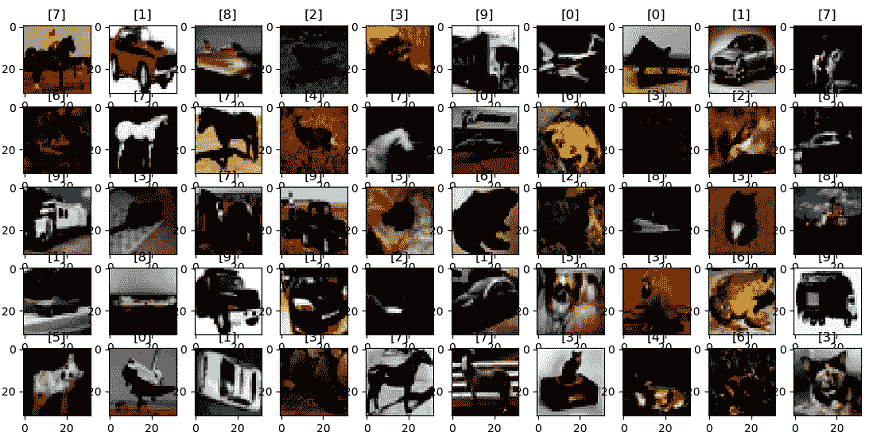

# PyTorch 中的 CIFAR-10 和 CIFAR-100 数据集

> 原文：<https://www.javatpoint.com/cifar-10-and-cifar-100-dataset-in-pytorch>

在前一个主题中，我们学习了如何使用无穷无尽的数据集来识别数字图像。无限数据集是深度学习的入门数据集，因为它简单。无尽的数据集是深度学习的 hello world。

第 10 届加拿大高级研究所(CIFAR 10)将更难分类，并将带来我们需要克服的新障碍。它是通常用于训练机器学习和计算机视觉算法的图像的集合。CIFAR 10 数据集包含 50000 个训练图像和 10000 个验证图像，因此这些图像可以在 10 个不同的类别之间进行分类。

CIFAR-10 数据集由 10 个类别中的 60000 个 30 乘 30 的彩色图像组成，这意味着每个类别有 6000 个图像。该数据集分为一个测试批次和五个训练批次。每批包含 10000 张图片。在测试批次中，有 1000 个图像，从每个类别中随机选择。训练批次包含随机顺序的剩余图像。一些训练批次可能包含一个类别的图像多于另一个类别的图像。

这些类将完全相互排斥。汽车和卡车之间不会有重叠。汽车包括类似于轿车和越野车的东西。卡车类只包括大卡车，不包括皮卡。与 MNIST 数据集相反，这些类中的对象在本质上要复杂得多，而且极其多样。如果我们仔细查看 CIFAR 数据集，我们会发现不仅仅只有一种鸟或猫。鸟类和猫类包含许多不同类型的鸟类和猫，它们的大小、颜色、放大倍数、角度和姿势各不相同。

有了无穷无尽的数据集，尽管我们可以有很多方法来写数字一和数字二。它只是没有那么多变化，最重要的是，无尽的数据集是一个灰色标量。CIFAR 数据集包含更大的 32×32 彩色图像，每个图像有三个不同的颜色通道。现在我们最大的问题是，在无尽数据集上表现如此出色的 LeNet 模型是否足以对 CIFAR 数据集进行分类？

## CIFAR-100 数据集

它就像 CIFAR-10 数据集一样。唯一不同的是，它有 100 个类，每个类包含 600 个图像。每堂课有 100 个测试图像和 500 个训练图像。这 100 个类被分成 20 个超类，每个图像都有一个“粗糙”标签(它所属的超类)和一个“精细”标签(它所属的类)。

CIFAR-100 数据集中有以下类别:

| 南不 | 超类 | 班级 |
| **1。** | 水生哺乳动物 | 海狸、海豚、水獭、海豹、鲸鱼 |
| **2。** | 花 | 兰花、罂粟花、玫瑰、向日葵、郁金香 |
| **3。** | 鱼 | 观赏鱼、比目鱼、鳐、鲨鱼、鳟鱼 |
| **4。** | 食品容器 | 瓶子、碗、罐、杯子、盘子 |
| **5。** | 家用电器 | 时钟、电脑键盘、灯、电话、电视 |
| **6。** | 水果和蔬菜 | 苹果、蘑菇、橘子、梨、甜椒 |
| **7。** | 家用家具 | 床、椅子、沙发、桌子、衣柜 |
| **8。** | 大型食肉动物 | 熊、豹、狮子、老虎、狼 |
| **9。** | 昆虫蜜蜂、甲虫、蝴蝶、毛虫、蟑螂 |
| **10。** | 大型人造户外用品 | 桥、城堡、房子、道路、摩天大楼 |
| **11 时。** | 大型自然户外场景 | 云、森林、山、平原、海 |
| **12 时。** | 中型哺乳动物 | 狐狸、豪猪、负鼠、浣熊、臭鼬 |
| **13。** | 大型杂食动物和食草动物 | 骆驼、牛、黑猩猩、大象、袋鼠 |
| **14。** | 非昆虫无脊椎动物 | 螃蟹、龙虾、蜗牛、蜘蛛、蠕虫 |
| **15。** | 爬行动物 | 鳄鱼、恐龙、蜥蜴、蛇、乌龟 |
| **16。** | 人 | 宝贝，男孩，女孩，男人，女人 |
| **17。** | 树 | 枫树、橡树、棕榈、松树、柳树 |
| **18。** | 小型哺乳动物 | 仓鼠、老鼠、兔子、鼩鼱、松鼠 |
| **19。** | 车辆 1 | 自行车、公共汽车、摩托车、皮卡车、火车 |
| **20。** | 车辆 2 | 割草机、火箭、电车、坦克、拖拉机 |

* * *