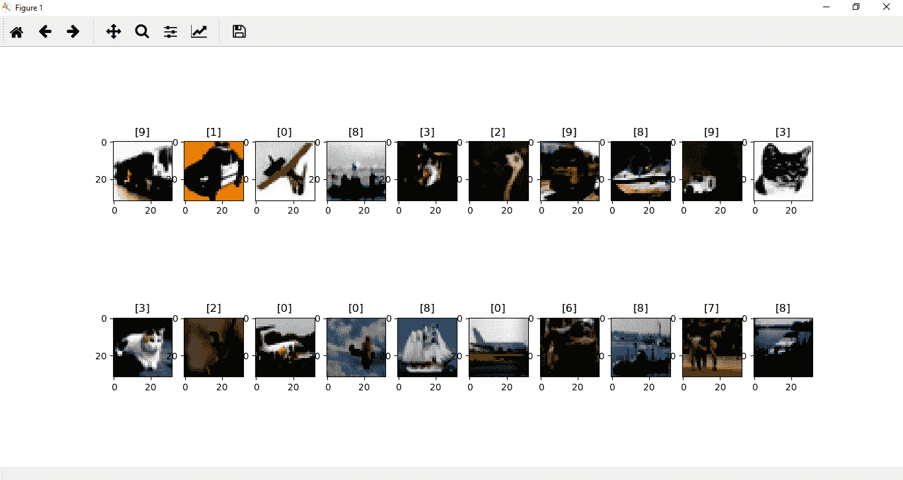
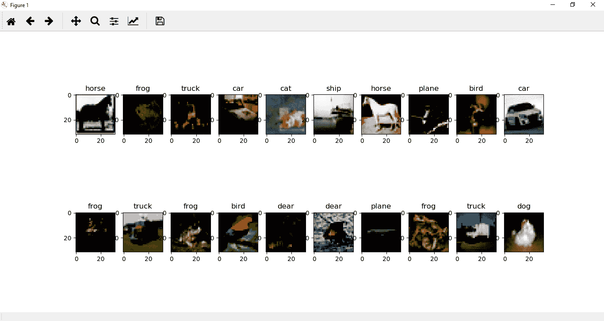
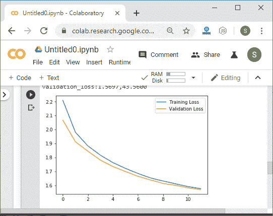
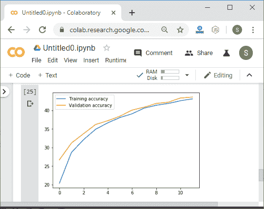
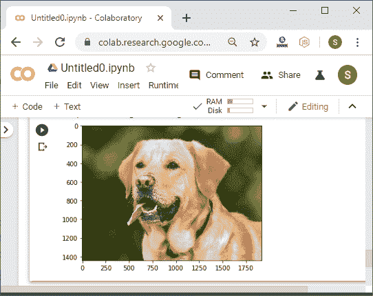
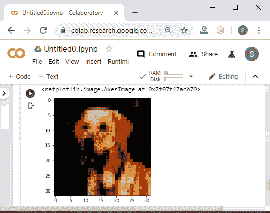
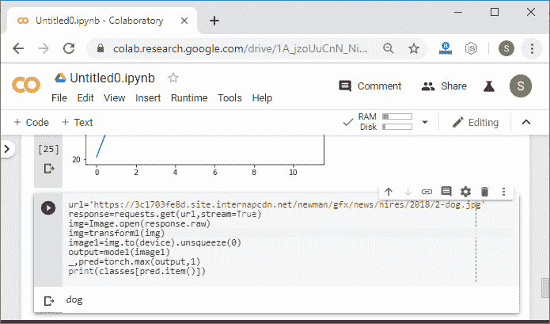
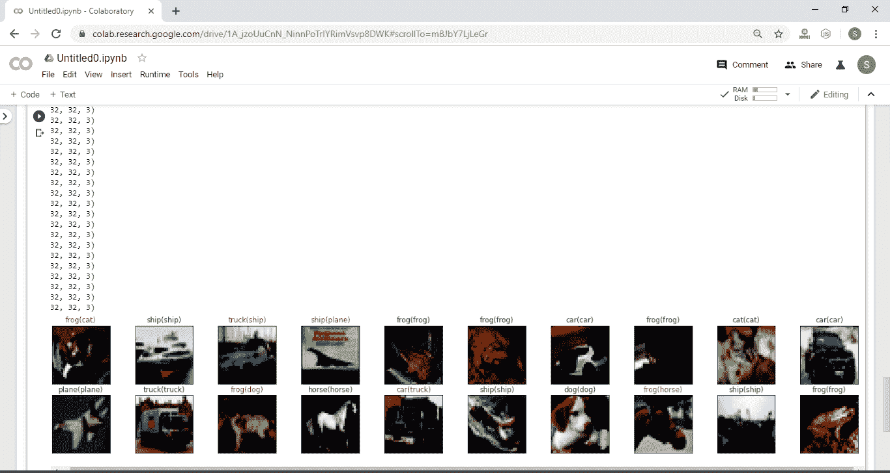

# CIFAR-10 数据集的 LeNet 模型测试

> 原文：<https://www.javatpoint.com/pytorch-testing-of-lenet-model-for-cifar-10-dataset>

在前一个主题中，我们发现我们的带有卷积神经网络的 LeNet 模型能够对 MNIST 数据集图像进行分类。MNIST 数据集包含许多灰度图像，但是在 CHIFAR-10 数据集中，这些图像是彩色的，并且是不同的。所以我们最大的问题是，我们的 LeNet 模型会对 CIFAR-10 数据集的图像进行分类吗？我们将复制上一个主题的代码，即 CNN 的测试，并在代码的图像转换、实现、训练、验证和测试部分进行以下更改:

#### 注意:如果你是新来的，那么你必须了解我们之前的主题才能高效地理解这一点。

## 图像变换部分的更改:

在图像变换部分，我们将进行以下更改:

**第一步:**

在本例中，我们使用的是 CIFAR-10 数据集，因此我们的第一步是加载 CIFAR-10 数据集，而不是 MNIST 数据集。我们通过以下方式更改训练数据集和验证数据集来加载 CIFAR-10 数据集:

```

training_dataset=datasets.CIFAR10(root='./data',train=True,download=True,transform=transform1)
validation_dataset=datasets.CIFAR10(root='./data',train=False,download=True,transform=transform1)

```

**第二步:**

在下一步中，我们将在转换语句中进行更改。我们知道 MNIST 图像的尺寸是 28×28 像素，但是 CIFAR10 图像的尺寸是 32×32 像素。因此，我们将对 transform.compose()方法的第一个参数进行如下更改:

```

transform1=transforms.Compose([transforms.Resize((32,32)),transforms.ToTensor(),transforms.Normalize((0.5,),(0.5,))])

```

现在，如果我们绘制 CIFAR-10 图像，它将给出以下输出:



**第三步:**

在 CIFAR10 图像中，我们知道图像被分类在类中。为了更好的理解和可视化，我们用类来指定每个图像。因此，我们声明了一个类列表，在该列表中，我们在 im_convert()方法之后按顺序将类指定为:

```

classes={'plane','car','bird','cat','dear','dog'.'frog','horse','ship','truck'}

```

**第四步:**

标签表示这些类的有序数字表示，因此我们将使用每个相应的标签来索引我们的类列表，输出将是适当的类。我们将 set_title()方法更改为:

```

ax.set_title(classes[labels[idx].item()])

```

它将给出以下输出:



## 实施、培训和验证部分的变更:

我们的 Lenet 模型是为 MNIST 图像实现的。MNIST 图像是灰度图像，但是我们必须为包含彩色图像的 CIFAR-10 数据集实现我们的模型。因此，我们必须对代码进行以下更改:

**第一步:**

以前，我们使用的是单通道灰度图像，现在我们使用的是三通道彩色图像，这些图像被输入到神经网络中。因此，在第一个卷积层中，我们将 3 而不是 1 设置为:

```

self.conv1=nn.Conv2d(3,20,5,1)

```

**第二步:**

现在，我们要训练大量的参数。在 5 乘 5 核的卷积之后，图像变成 28 乘 28，然后下一个池 14 乘 14 与相同大小的核执行另一个卷积。图像再次变小 4 乘 4 的减量，变成 10 乘 10。最后，通过另一个最大池，然后输入到完全连接的网络中的向量将是 5 乘 5 乘 50。

因此，我们必须将初始值设定项中的第一个完全连接的层更改为:

```

self.fully1=nn.Linear(5*5*50,500)

```

**第三步:**

现在，我们还必须改变输出的形状。为此，我们必须将 forward 函数中的 view 语句更改为:

```

x=x.view(-1,5*5*50)	#Reshaping the output into desired shape

```

现在，我们找到总损失和验证损失，以及准确度和验证准确度，并将其绘制出来，然后它将给出以下输出:




**第四步:**

现在，我们将使用它来预测来自网络的图像，以简单地获得模型准确性的视觉视角。我们将使用以下图片:[https://3c 1703 Fe 8d . site . internpcdn . net/Newman/gfx/news/hires/2018/2-dog . jpg](https://3c1703fe8d.site.internapcdn.net/newman/gfx/news/hires/2018/2-dog.jpg)

当我们绘制此图像时，它将显示为:



**第五步:**

在下一步中，我们将删除我们的反转和转换方法，因为这一次我们的图像将被极大地转换为生物级格式，并且我们的网络是在彩色图像上训练的。我们将转换图像并将图像绘制为:

```

url='https://ichef.bbci.co.uk/news/912/cpsprodpb/160B4/production/_103229209_horsea.png'
response=requests.get(url,stream=True)
img=Image.open(response.raw)
img=transform1(img) 
plt.imshow(im_convert(img))

```



在转换之后，我们获得了图像的更抽象的表示。它减少到更小的 32 乘 32 表示。

**第六步:**

现在，我们对该图像进行预测，因此我们将挤压该图像，并使用类作为找到预测:

```

image1=img.to(device).unsqueeze(0)	
output=model(image1)
_,pred=torch.max(output,1)
print(classes[pred.item()])

```



## 测试部分的更改:

测试部分将和以前一样。将遵循 CNN 测试的相同过程，但是在彩色图像中，我们将使用类来预测每个验证图像，如下所示:

```

dataiter=iter(validation_loader)  
images,labels=dataiter.next()  
images_=images.to(device)  
labels=labels.to(device)  
output=model(images_)  
_,preds=torch.max(output,1)  
fig=plt.figure(figsize=(25,4))  
for idx in np.arange(20):  
    ax=fig.add_subplot(2,10,idx+1,xticks=[],yticks=[])  
  plt.imshow(im_convert(images[idx]))    
  ax.set_title("{}({})".format(str(classes[preds[idx].item()]),str(classes[labels[idx].item())),color=("green" if preds[idx]==labels[idx] else "red"))  
plt.show()  

```



它似乎能准确预测大多数图像。总的来说，非常好的是，我们的模型能够基于其训练参数将自己推广到新数据。

## 完整代码:

```

import torch
import matplotlib.pyplot as plt
import numpy as np
import torch.nn.functional as func
import PIL.ImageOps
from torch import nn
from torchvision import datasets,transforms 
import requests
from PIL import Image

device=torch.device("cuda:0" if torch.cuda.is_available() else "cpu")
transform1=transforms.Compose([transforms.Resize((32,32)),transforms.ToTensor(),transforms.Normalize((0.5,),(0.5,))])
training_dataset=datasets.CIFAR10(root='./data',train=True,download=True,transform=transform1)
validation_dataset=datasets.CIFAR10(root='./data',train=False,download=True,transform=transform1)
training_loader=torch.utils.data.DataLoader(dataset=training_dataset,batch_size=100,shuffle=True)
validation_loader=torch.utils.data.DataLoader(dataset=validation_dataset,batch_size=100,shuffle=False)
def im_convert(tensor):
    image=tensor.cpu().clone().detach().numpy()
    image=image.transpose(1,2,0)
    print(image.shape)
    image=image*(np.array((0.5,0.5,0.5))+np.array((0.5,0.5,0.5)))
    image=image.clip(0,1)
    return image

classes=('plane','car','bird','cat','dear','dog','frog','horse','ship','truck')
dataiter=iter(training_loader)
images,labels=dataiter.next()
fig=plt.figure(figsize=(25,4))
for idx in np.arange(20):
    ax=fig.add_subplot(2,10,idx+1)
    plt.imshow(im_convert(images[idx]))
    ax.set_title(classes[labels[idx].item()])
class LeNet(nn.Module):
        def __init__(self):
            super().__init__()
            self.conv1=nn.Conv2d(3,20,5,1)
            self.conv2=nn.Conv2d(20,50,5,1)
            self.fully1=nn.Linear(5*5*50,500)
            self.dropout1=nn.Dropout(0.5) 
            self.fully2=nn.Linear(500,10)
        def forward(self,x):
            x=func.relu(self.conv1(x))
            x=func.max_pool2d(x,2,2)
            x=func.relu(self.conv2(x))
            x=func.max_pool2d(x,2,2)
            x=x.view(-1,5*5*50)	#Reshaping the output into desired shape
            x=func.relu(self.fully1(x))	#Applying relu activation function to our first fully connected layer
            x=self.dropout1(x)
            x=self.fully2(x)	#We will not apply activation function here because we are dealing with multiclass dataset
            return x    
model=LeNet().to(device)
criteron=nn.CrossEntropyLoss()
optimizer=torch.optim.Adam(model.parameters(),lr=0.00001) 
epochs=12
loss_history=[]
correct_history=[]
val_loss_history=[]
val_correct_history=[]
for e in range(epochs):
    loss=0.0
    correct=0.0
    val_loss=0.0
    val_correct=0.0
    for input,labels in training_loader:
        input=input.to(device)
        labels=labels.to(device)
        outputs=model(input)
        loss1=criteron(outputs,labels)
        optimizer.zero_grad()
        loss1.backward()
        optimizer.step()
        _,preds=torch.max(outputs,1)
        loss+=loss1.item()
        correct+=torch.sum(preds==labels.data)
    else:
        with torch.no_grad():
            for val_input,val_labels in validation_loader:
                val_input=val_input.to(device)
                val_labels=val_labels.to(device)
                val_outputs=model(val_input)
                val_loss1=criteron(val_outputs,val_labels) 
                _,val_preds=torch.max(val_outputs,1)
                val_loss+=val_loss1.item()
                val_correct+=torch.sum(val_preds==val_labels.data)
        epoch_loss=loss/len(training_loader)
        epoch_acc=correct.float()/len(training_loader)
        loss_history.append(epoch_loss)
        correct_history.append(epoch_acc)
        val_epoch_loss=val_loss/len(validation_loader)
        val_epoch_acc=val_correct.float()/len(validation_loader)
        val_loss_history.append(val_epoch_loss)
        val_correct_history.append(val_epoch_acc)
        print('training_loss:{:.4f},{:.4f}'.format(epoch_loss,epoch_acc.item()))
        print('validation_loss:{:.4f},{:.4f}'.format(val_epoch_loss,val_epoch_acc.item()))
plt.plot(loss_history,label='Training Loss')  
plt.plot(val_loss_history,label='Validation Loss')  
plt.legend()  
plt.show()
plt.plot(correct_history,label='Training accuracy')  
plt.plot(val_correct_history,label='Validation accuracy')  
plt.legend()  
plt.show()  
url='https://3c1703fe8d.site.internapcdn.net/newman/gfx/news/hires/2018/2-dog.jpg'
response=requests.get(url,stream=True)
img=Image.open(response.raw)
img=transform1(img)   
image1=img.to(device).unsqueeze(0)
output=model(image1)
_,pred=torch.max(output,1)
print(classes[pred.item()])
dataiter=iter(validation_loader)  
images,labels=dataiter.next()  
images_=images.to(device)  
labels=labels.to(device)  
output=model(images_)  
_,preds=torch.max(output,1)  
fig=plt.figure(figsize=(25,4))  
for idx in np.arange(20):  
    ax=fig.add_subplot(2,10,idx+1,xticks=[],yticks=[])  
    plt.imshow(im_convert(images[idx]))  
    ax.set_title("{}({})".format(str(classes[preds[idx].item()]),str(classes[labels[idx].item()]),color=("green" if preds[idx]==labels[idx] else "red"))  
plt.show()

```

* * *