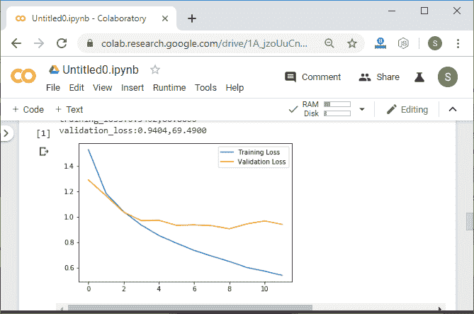
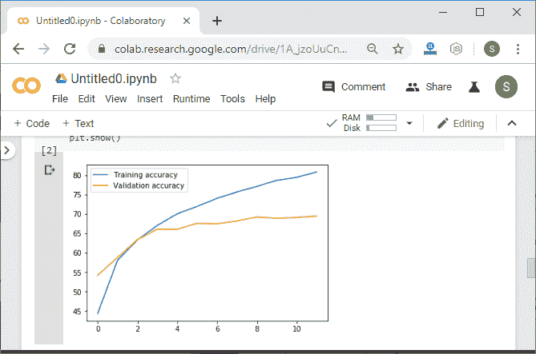
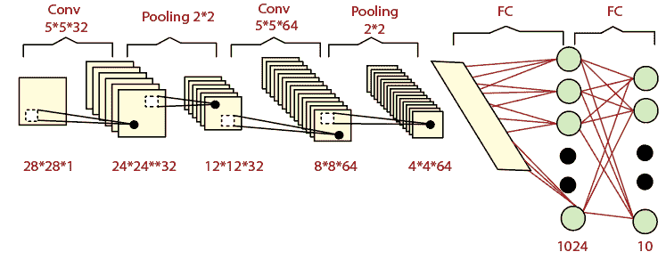
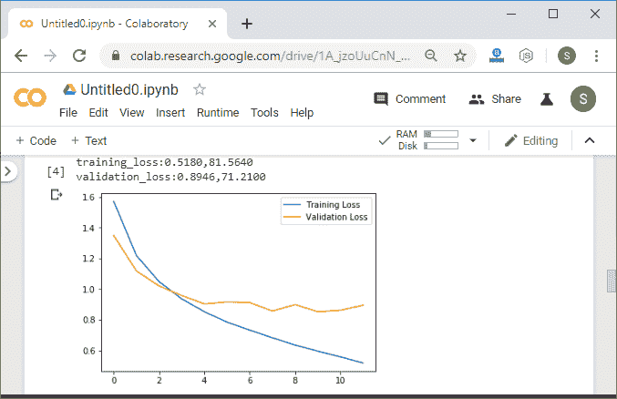
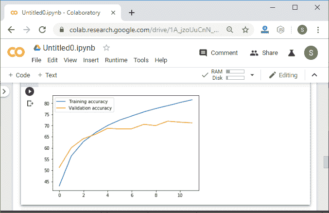

# Pytorch 超参数调谐技术

> 原文：<https://www.javatpoint.com/pytorch-hyperparameter-tuning-technique>

在最后一个主题中，我们训练了我们的 Lenet 模型和 CIFAR 数据集。我们发现，我们的 LeNet 模型对大多数图像都做出了正确的预测，并且我们还发现了精度上的过度拟合。虽然我们的模型没有经过很好的训练，但它仍然能够预测大多数的验证图像。

由于训练图像的深度变化和固有复杂性，CIFAR 数据集将更难分类。

我们在 MNIST 数据集上表现非常好的同一个 LeNet 模型现在在对我们的 CIFAR 数据集进行准确分类时遇到了问题。

我们目前正在处理两个主要问题。准确率不够高，网络似乎过度拟合了我们的训练数据。第一个问题可以通过对我们的 LeNet 模型代码进行各种修改来解决。我们将应用的修改非常依赖于案例，并对我们的模型容量进行微调。这通常是一个非常具体的过程，对于每个具体的深度学习任务来说都是独特的。

然而，模型的微调很重要，可以显著提高模型性能。我们必须始终尝试修改我们的模型，看看这些修改如何提高我们模型的有效性。我们将进行以下修改:

1)第一次修改将集中在学习率上。亚当优化器计算个体自适应学习率。指定最佳性能的合适学习速率仍然很重要。过高的学习率通常会导致较低的准确率。当涉及更复杂的数据集时，较低的学习速率可以帮助神经网络更有效地学习。

#### 注意:过小的学习速率会显著降低我们的训练成绩。

在分析和经验的帮助下，我们得出结论，训练过程相当缓慢，并且训练和验证精度从一个时期到下一个时期没有显著提高。

我们将学习率从 0.001 设置为 0.0001。

```

criteron=nn.CrossEntropyLoss()
optimizer=torch.optim.Adam(model.parameters(),lr=0.001)

```




2)第二次修改非常有效。我们将简单地添加更多的层卷积。通过增加更多的卷积，我们的网络可以更有效地提取特征，并导致准确性的提高。

#### 注意:定义卷积层的一种常见架构是每一层使前一层的输出深度加倍。

在我们的第一个卷积层中，将有 3 个输入通道，conv1 的深度对应于 16 个输出通道。这将是 32 的两倍，然后是 64:

```

self.conv1=nn.Conv2d(3,16,5,1)
self.conv2=nn.Conv2d(16,32,5,1)

```

当我们从一个卷积层前进到下一个卷积层时，卷积层的输出深度一直在增加。通过这样做，我们在内部增加了过滤器的数量，以提取与转发输入相关的高度复杂的信息。卷积层用于使网络更深，提取越来越复杂的特征。

因此，我们将另一个卷积层 conv3 设为:

```

self.conv3=nn.Conv2d(32,64,5,1)

```

被馈送到我们的全连接层的适当向量将是五乘五，这与之前相同，但是输出通道的数量将是 64。

```

self.fully1=nn.Linear(5*5*64,500)

```

为了确保一致性，我们还将在 forward 的 view 方法中更改输出通道的数量，如下所示:

```

x=x.view(-1,5*5*64)

```

初始化第三个卷积层后，我们将对其应用 relu 函数，如下所示:

```

x=func.relu(self.conv3(x))
x=func.max_pool2d(x,2,2)

```

更大的内核意味着更多的参数。我们将使用更小的内核来消除过拟合。我们将使用三个内核大小，这将适合我们的代码。以前在 MNIST 数据集中，我们没有在卷积层中使用任何填充，但现在我们正在处理一个更复杂的数据集。通过填充来保持图像的边缘像素以确保最大的特征提取是有意义的。我们将所有卷积层的填充设置为 1，如下所示:

```

self.conv1=nn.Conv2d(3,16,3,1, padding=1)
self.conv2=nn.Conv2d(16,32,3,1, padding=1)
self.conv3=nn.Conv2d(32,64,3,1, padding=1)   

```

馈入全连接层的最终矢量由图像大小决定，图像大小在每个最大汇集层将减半。图像大小将减小为:



所以我们要改变我们的神经网络。初始值设定项的线性方法如下:

```

self.fully1=nn.Linear(4*4*64,500)

```

同样，我们将把 forward 的视图方法更改为:

```

x=x.view(-1,4*4*64)

```

现在，我们将对它进行训练，它将给出以下预期输出:




* * *