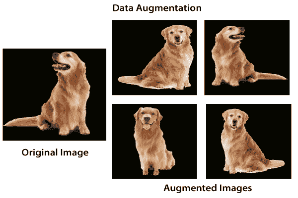
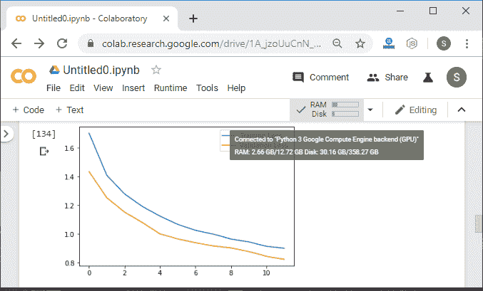
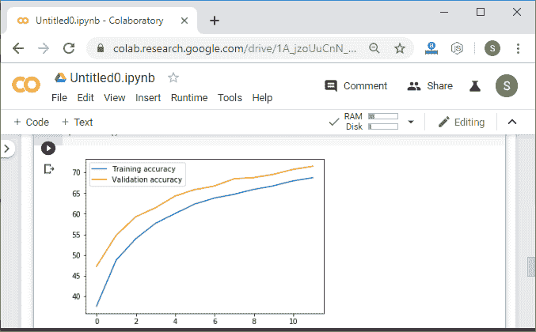
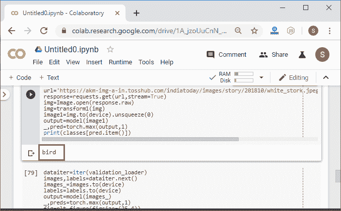
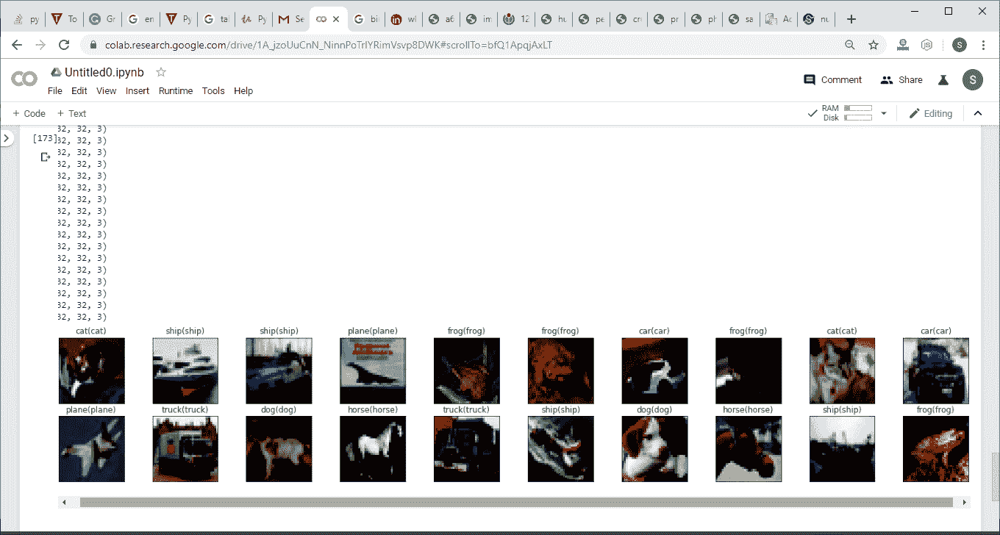

# 数据扩充过程

> 原文：<https://www.javatpoint.com/pytorch-data-augmentation-process>

之前，我们看到模型精度显著提高。我们的模型被有效地训练来对训练数据进行分类。验证数据不能很好地概括解决过度捕捞问题。现在，让我们再讨论一个改进模型训练过程的技巧。这种技术被称为数据扩充。这是我们为模型创建新数据以在训练过程中使用的过程。

这是通过获取我们现有的数据集，并以有用的方式转换或更改图像来创建新图像来实现的。



应用转换后，新创建的图像被称为增强图像，因为它们本质上允许我们通过向数据集添加新数据来增强数据集。数据增强技术非常有用，因为它允许我们的模型从各种不同的角度查看数据集中的每个图像。这使得我们的模型能够更准确地提取相关特征，并从每个训练图像中获得更多与特征相关的数据。

现在我们最大的问题是，我们将如何利用这种增加来减少过度拟合。当我们的模型与训练集过于接近时，就会出现过拟合。

没有必要开始收集新图像并将其添加到我们的数据集。我们可以使用数据扩充，它对我们现有的数据集引入了微小的改变，比如更暗的阴影、翻转、缩放、旋转或平移。我们的模型会将它们解释为独立的不同图像。它不仅可以减少过度拟合，还可以防止我们的网络学习不相关的模式，提高整体性能。我们有以下步骤来执行数据扩充:

**第一步:**

为了在训练数据集上执行数据扩充，我们必须进行单独的转换语句。对于验证数据集，转换将保持不变。因此，我们首先复制 transform1 语句，并将其视为 transform_train，如下所示:

```

transform_train=transforms.Compose([transforms.Resize((32,32)),transforms.ToTensor(),transforms.Normalize((0.5,),(0.5,))])

```

**第二步:**

现在，我们将在 transform_train 语句中添加交替。交替将是随机水平翻转，随机旋转用于将图像旋转某个角度，该角度将作为参数传递。

```

transform_train=transforms.Compose([transforms.Resize((32,32)),
		transform.RandomHorizontalFlip(),
		transform.RandomRotation(),
		transforms.ToTensor(),
		transforms.Normalize((0.5,),(0.5,))])

```

为了增加数据集的多样性，我们将使用精细的类型转换。精细变换表示简单的变换，它保持直线和平面与对象在一起。缩放、平移、剪切和缩放是适合这一类别的变换。

```

transform_train=transforms.Compose([transforms.Resize((32,32)),
		transform.RandomHorizontalFlip(),
		transform.RandomRotation(),
		transform.RandomAffine(0,shear=10,scale=(0.8,1.2)),
		transforms.ToTensor(),
		transforms.Normalize((0.5,),(0.5,))])

```

在 RandomAffine()中，第一个参数是减少，我们将它设置为零以停用旋转，第二个参数是剪切变换，最后一个参数是缩放变换，并使用倾倒来定义我们需要的缩放范围。我们定义了 0.8 和 1.2 的下限和上限，以将图像缩放到其大小的 80%或 120%。

**第三步:**

现在，我们继续下一步的增强，创建新的增强图像，具有随机变化的亮度、对比度和饱和度。我们将添加另一个转换，即颜色抖动，如下所示:

```

transform_train=transforms.Compose([transforms.Resize((32,32)),
		transform.RandomHorizontalFlip(),
		transform.RandomRotation(10),
		transform.RandomAffine(0,shear=10,scale=(0.8,1.2)),
		transform.ColorJitter(brightness=0.2,contrast=0.2,saturation=0.2)
		transforms.ToTensor(),
		transforms.Normalize((0.5,),(0.5,))])

```

**第四步:**

在执行代码之前，我们必须更改 training_dataset 语句，因为现在我们有了另一个针对训练数据集的转换。因此

```

training_dataset=datasets.CIFAR10(root='./data',train=True,download=True,transform=transform_train)

```

现在，我们将执行我们的代码，并且在执行之后，它会给我们正确预测的预期输出。





## 完整代码:

```

import torch
import matplotlib.pyplot as plt
import numpy as np
import torch.nn.functional as func
import PIL.ImageOps
from torch import nn
from torchvision import datasets,transforms 
import requests
from PIL import Image
device=torch.device("cuda:0" if torch.cuda.is_available() else "cpu")
transform_train=transforms.Compose([transforms.Resize((32,32)),
                               transforms.RandomHorizontalFlip(),
                               transforms.RandomRotation(10),
                               transforms.RandomAffine(0,shear=10,scale=(0.8,1.2)),
                               transforms.ColorJitter(brightness=0.2,contrast=0.2,saturation=0.2),
                               transforms.ToTensor(),
                               transforms.Normalize((0.5,),(0.5,))])
transform1=transforms.Compose([transforms.Resize((32,32)),transforms.ToTensor(),transforms.Normalize((0.5,),(0.5,))])
training_dataset=datasets.CIFAR10(root='./data',train=True,download=True,transform=transform_train)
validation_dataset=datasets.CIFAR10(root='./data',train=False,download=True,transform=transform1)
training_loader=torch.utils.data.DataLoader(dataset=training_dataset,batch_size=100,shuffle=True)
validation_loader=torch.utils.data.DataLoader(dataset=validation_dataset,batch_size=100,shuffle=False)
def im_convert(tensor):
    image=tensor.cpu().clone().detach().numpy()
    image=image.transpose(1,2,0)
    print(image.shape)
    image=image*(np.array((0.5,0.5,0.5))+np.array((0.5,0.5,0.5)))
    image=image.clip(0,1)
    return image
classes=('plane','car','bird','cat','dear','dog','frog','horse','ship','truck')
dataiter=iter(training_loader)
images,labels=dataiter.next()
fig=plt.figure(figsize=(25,4))
for idx in np.arange(20):

    ax=fig.add_subplot(2,10,idx+1)
    plt.imshow(im_convert(images[idx]))
    ax.set_title(classes[labels[idx].item()])
class LeNet(nn.Module):
        def __init__(self):
            super().__init__()
            self.conv1=nn.Conv2d(3,16,3,1, padding=1)
            self.conv2=nn.Conv2d(16,32,3,1, padding=1)
            self.conv3=nn.Conv2d(32,64,3,1, padding=1)   
            self.fully1=nn.Linear(4*4*64,500)
            self.dropout1=nn.Dropout(0.5) 
            self.fully2=nn.Linear(500,10)
        def forward(self,x):
            x=func.relu(self.conv1(x))
            x=func.max_pool2d(x,2,2)
            x=func.relu(self.conv2(x))
            x=func.max_pool2d(x,2,2)
            x=func.relu(self.conv3(x))
            x=func.max_pool2d(x,2,2)
            x=x.view(-1,4*4*64)	#Reshaping the output into desired shape
            x=func.relu(self.fully1(x))	#Applying relu activation function to our first fully connected layer
            x=self.dropout1(x)
            x=self.fully2(x)	#We will not apply activation function here because we are dealing with multiclass dataset
            return x    
model=LeNet().to(device)
criteron=nn.CrossEntropyLoss()
optimizer=torch.optim.Adam(model.parameters(),lr=0.001)
epochs=12
loss_history=[]
correct_history=[]
val_loss_history=[]
val_correct_history=[]
for e in range(epochs):
    loss=0.0
    correct=0.0
    val_loss=0.0
    val_correct=0.0
    for input,labels in training_loader:
        input=input.to(device)
        labels=labels.to(device)
        outputs=model(input)
        loss1=criteron(outputs,labels)
        optimizer.zero_grad()
        loss1.backward()
        optimizer.step()
        _,preds=torch.max(outputs,1)
        loss+=loss1.item()
        correct+=torch.sum(preds==labels.data)
    else:
        with torch.no_grad():
            for val_input,val_labels in validation_loader:
                val_input=val_input.to(device)
                val_labels=val_labels.to(device)
                val_outputs=model(val_input)
                val_loss1=criteron(val_outputs,val_labels) 
                _,val_preds=torch.max(val_outputs,1)
                val_loss+=val_loss1.item()
                val_correct+=torch.sum(val_preds==val_labels.data)
        epoch_loss=loss/len(training_loader)
        epoch_acc=correct.float()/len(training_loader)
        loss_history.append(epoch_loss)
        correct_history.append(epoch_acc)
        val_epoch_loss=val_loss/len(validation_loader)
        val_epoch_acc=val_correct.float()/len(validation_loader)
        val_loss_history.append(val_epoch_loss)
        val_correct_history.append(val_epoch_acc)
        print('training_loss:{:.4f},{:.4f}'.format(epoch_loss,epoch_acc.item()))
        print('validation_loss:{:.4f},{:.4f}'.format(val_epoch_loss,val_epoch_acc.item()))

url='https://akm-img-a-in.tosshub.com/indiatoday/images/story/201810/white_stork.jpeg?B2LINO47jclcIb3QCW.Bj9nto934Lox4'
response=requests.get(url,stream=True)
img=Image.open(response.raw)
img=transform1(img)   
image1=img.to(device).unsqueeze(0)
output=model(image1)
_,pred=torch.max(output,1)
print(classes[pred.item()])

dataiter=iter(validation_loader)  
images,labels=dataiter.next()  
images_=images.to(device)  
labels=labels.to(device)  
output=model(images_)  
_,preds=torch.max(output,1)  
fig=plt.figure(figsize=(25,4))  
for idx in np.arange(20):  
      ax=fig.add_subplot(2,10,idx+1,xticks=[],yticks=[])   
      plt.imshow(im_convert(images[idx]))    
ax.set_title("{}({})".format(str(classes[preds[idx].item()]),str(classes[labels[idx].item()]),color=("green" if classes[preds[idx]]==classes[labels[idx]] else "red")))
plt.show()

```





* * *