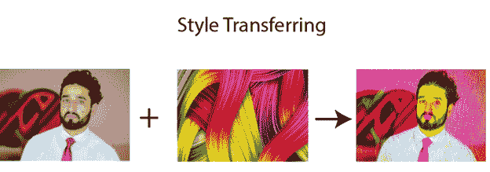
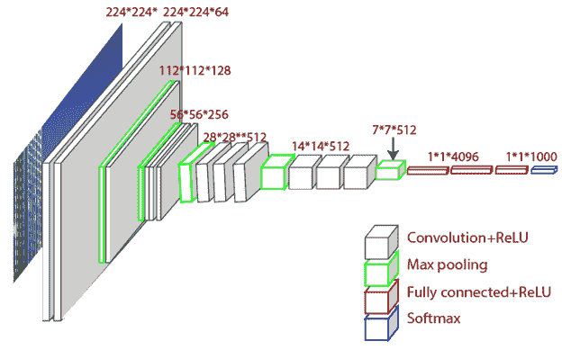
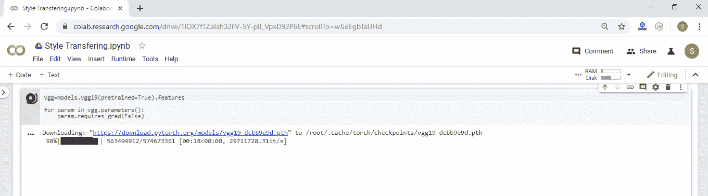
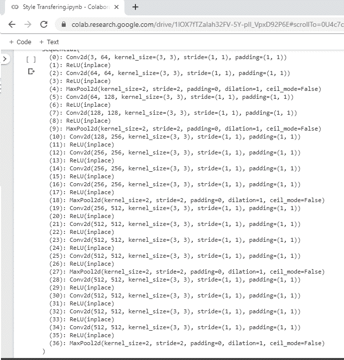

# PyTorch 中的风格转换

> 原文：<https://www.javatpoint.com/style-transferring-in-pytorch>

在本主题中，我们将实现一个基于深度神经网络的人工系统，该系统将创建高感知质量的艺术图像。该系统将利用神经表征对任意图像的内容和风格进行分离、重组，为艺术图像的创作提供神经算法。

神经风格转移是一种以另一种图像的风格生成图像的方法。神经样式算法将内容图像(样式图像)作为输入，并返回内容图像，就好像它是使用样式图像的艺术样式打印的一样。



## 神经风格转移算法是如何工作的？

当我们实现这个算法时，我们定义了两个距离；一个用于内容(Dc)，另一个用于样式(Ds)。Dc 衡量两个图像之间的内容差异，Ds 衡量两个图像之间的风格差异。我们将第三个图像作为输入，并对其进行变换，以便使其与内容图像的内容距离和与样式图像的样式距离最小化。

### 必需的库

```

import torch
import torch.optim as  optim
#we will import transforms and models because we will transform our images and we will use pre-trained model VGG-19 
from torchvision import transforms, models
from PIL import Image
import matplotlib.pyplot as plt
import numpy as np

```

### VGG-19 模型的初始化

VGG-19 型号与 VGG-16 型号相似。VGG 模型是由西蒙尼扬和齐泽曼提出的。VGG-19 是在来自 ImageNet 数据库的 100 多万张图像上训练的。该模型具有 19 层深度神经网络，可以将图像分为 1000 个对象类别。



在我们的初始化过程中，我们将只导入模型的特征。

```

#importing model features 
vgg=models.vgg19(pretrained=True).features	#we are using pre-trained model 
# Maintain parameter constant setting
for param in vgg.parameters():
    param.requires_grad_(False)

```

当我们运行此代码时，将开始下载，并且我们的模型特性将成功下载。



### 将模型添加到我们的设备中

当我们的模型特性被下载和导入时，我们必须将其添加到 CUDA 或 CPU 设备上。火炬装置是我们完成这个过程的方法。

```

#Implementing device 
device=torch.device("cuda" if torch.cuda.is_available() else "cpu")
#Attaching our vgg model to our device 
vgg.to(device) 

```

当我们运行该程序时，它会给出如下预期输出:



* * *