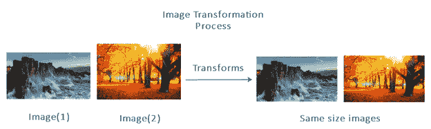
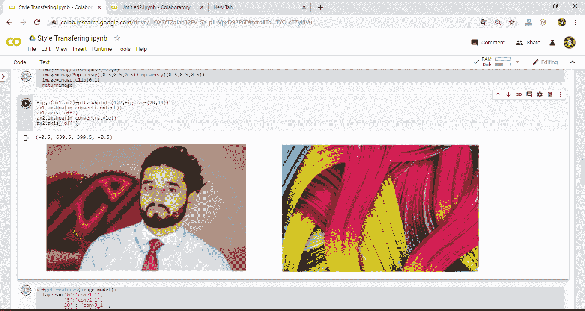

# PyTorch 中风格转换的图像加载与转换

> 原文：<https://www.javatpoint.com/image-loading-and-transformation-for-style-transferring-in-pytorch>

在导入所有必要的库并将 VGG-19 添加到我们的设备后，我们必须将图像加载到我们要申请风格转换的内存中。我们有一个内容图像，风格图像和目标图像将是这两个图像的组合。不是每个图像都需要有相同的大小或像素。为了使图像相等，我们还将应用图像变换过程。



## 图像加载

我们必须在内存中加载内容图像和样式图像，这样我们才能对其执行操作。加载过程在风格转换过程中起着至关重要的作用。我们需要内存中的图像和风格转移过程将不可能在加载过程之前。

**代码:**

```

#defining a method with three parameters i.e. image location, maximum size and shape 
def load_image(img_path,max_size=400,shape=None):
# Open the image, convert it into RGB and store in a variable 
    image=Image.open(img_path).convert('RGB')
    # comparing image size with the maximum size 
    if max(image.size)>max_size:
      size=max_size
    else:
      size=max(image.size)
    # checking for the image shape
    if shape is not None:
       size=shape
    #Applying appropriate transformation to our image such as Resize, ToTensor and Normalization
    in_transform=transforms.Compose([
        transforms.Resize(size),
        transforms.ToTensor(),
        transforms.Normalize((0.5,0.5,0.5), (0.5,0.5,0.5))])
    #Calling in_transform with our image 
    image=in_transform(image).unsqueeze(0) #unsqueeze(0) is used to add extra layer of dimensionality to the image
    #Returning image 
    return image
#Calling load_image() with our image and add it to our device
content=load_image('ab.jpg').to(device)
style=load_image('abc.jpg',shape=content.shape[-2:]).to(device)

```

## 图像转换

在导入我们的图像之前，我们需要将我们的图像从 tensor as 转换为 numpy 图像，以确保与绘图包的兼容性。我们之前已经使用熟悉的 image_converts 助手函数完成了这一点，该函数之前在图像识别中的 [*图像变换*](pytorch-image-transforms-in-image-recognition) 中使用过。

```

def im_convert(tensor):
  image=tensor.cpu().clone().detach().numpy()	
  image=image.transpose(1,2,0)
  image=image*np.array((0.5,0.5,0.5))+np.array((0.5,0.5,0.5))
  image=image.clip(0,1)
  return image

```

如果我们运行这个助手方法，那么它将产生错误。我们必须从图像的形状和数组的形状中删除一维条目。所以我们将在转置方法之前挤压我们的图像。

```

image=image.squeeze()

```

## 绘制图像

**代码:**

```

fig, (ax1,ax2)=plt.subplots(1,2,figsize=(20,10))
ax1.imshow(im_convert(content))
ax1.axis('off')
ax2.imshow(im_convert(style))
ax2.axis('off')

```

当我们在谷歌 Colab Notebook 上运行它时，它会给出如下预期输出:



* * *