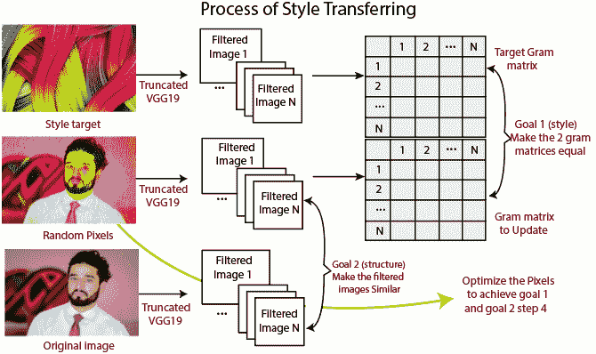

# 风格转换的特征提取

> 原文：<https://www.javatpoint.com/pytorch-feature-extraction-for-style-transferring>

将图像加载到内存后，我们将实现风格转换。需要将图像的风格与其内容分开，以实现风格的转移。此后，也可以将一个图像的样式元素转移到第二个图像的内容元素。这个过程主要是利用标准卷积神经网络的特征提取来完成的。

然后操纵这些特征来提取内容信息或风格信息。这个过程涉及三个图像一个样式图像，一个内容图像，最后是一个目标图像。**样式图像**的样式与内容图像中的内容相结合，以创建最终的目标图像。



这个过程开始于在我们的模型中选择几个层来提取特征。我们将通过选择几个层来提取特征，从而很好地了解我们的图像在整个神经网络中是如何处理的。我们还提取了样式图像和内容图像的模型特征。然后，我们从目标图像中提取特征，并将其与我们的风格图像特征和我们的内容图像特征进行比较。

## 从图像中获取特征

```

# Defining simple method with two arguments, i.e. our image and our model
def get_features(image,model):
#choosing specific layer within our VGG-19 model that we are going to extract features from 
# Defining layers dictionary object which contains the specific layers  
  layers={'0':'conv1_1', #Mapping 0 to conv1_1
          '5':'conv2_1', #Mapping 5 to conv2_1
          '10':'conv3_1', #Mapping 10 to conv3_1
          '19':'conv4_1', #Mapping 19 to conv4_1
          '21':'conv4_2', #Mapping 21 to conv4_2
          '28':'conv5_1',} #Mapping 28 to conv5_1

```

现在我们有六个特征提取层。在这六个特征提取层中，我们将使用其中的五个进行样式提取，仅使用其中的一个进行内容提取。我们将使用 conv4_2 进行内容提取。只有这一层足以提取内容。这一层更深入我们的神经网络，并提供高深度的图像特征。这就是预先训练的对象检测卷积神经网络在表示内容元素方面变得非常有效的原因。

从整个网络的各种功能中获取样式功能，从而实现最佳样式创建。从众多图层中提取样式特征将允许最有效的样式提取和重新创建。

```

#Defining an empty dictionary called features to store all the extracted features 
features={}
  #Running a loop which iterates over all of the layers in our model 
  for name, layer in model._modules.items(): 
    #Running our image through the specific layer and store into the new image
    image=layer(image)
    #checking the name of the current layer which we are iterating through is inside layers
    if name in layers:
      #If true then store the output from that specific layer 
      features[layers[name]]=image 
  #returning feature dictionary 
  return features

```

一旦我们初始化了我们的获取特征方法，我们就必须用我们的内容图像和我们的 VGG 模型来调用它。

```

content_features=get_features(content,vgg)

```

同样，我们将为我们的风格形象这样做:

```

style_features=get_features(style, vgg)

```

* * *