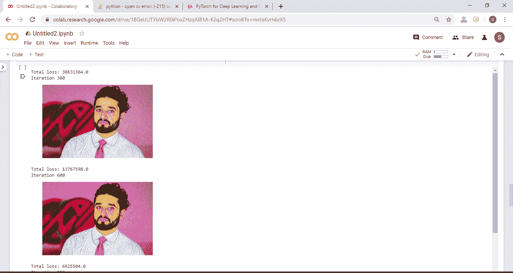
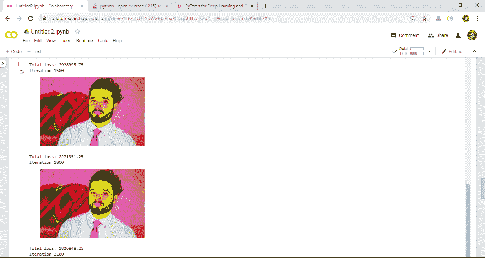
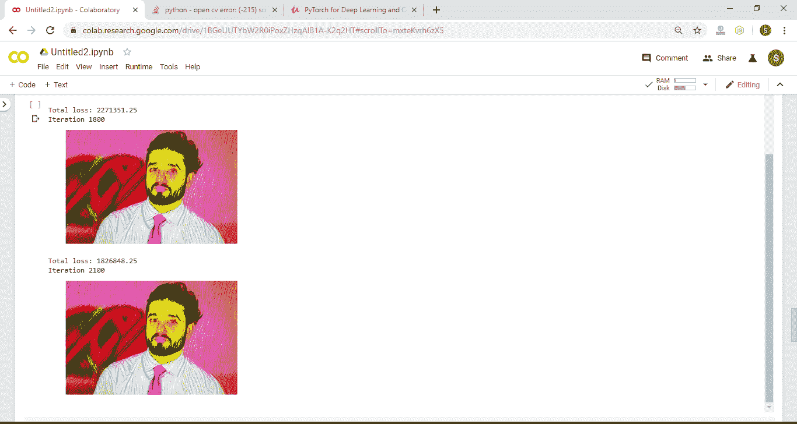
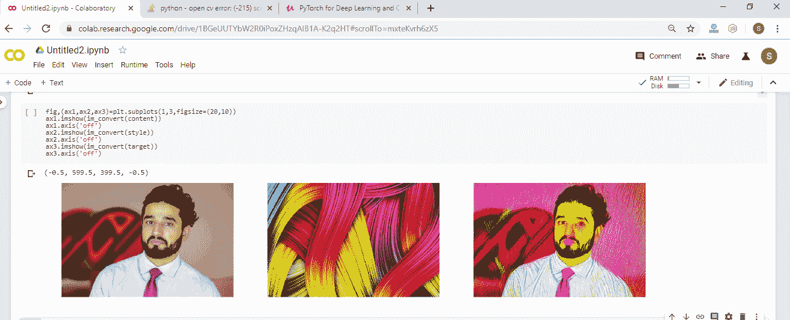

# 风格转换的优化过程

> 原文：<https://www.javatpoint.com/pytorch-optimization-process-for-style-transferring>

我们有所有三个图像，现在，我们可以执行我们的优化过程。要执行优化过程，我们必须执行以下步骤:

**第一步:**

在第一步中，我们定义了一些基本参数，这些参数有助于我们可视化培训过程，并帮助我们简化培训过程。第一个参数每次都向我们显示我们的目标图像，这样我们就可以检查优化过程。我们用我们的目标图像定义我们的 Adam 优化器，并用它设置学习速率。最后但同样重要的是，我们定义了我们的训练过程应该采取的优化步骤的数量。

我们需要在结果和时间效率之间取得平衡，因为培训过程可能需要很长时间才能完成。所以我们将定义我们的步骤，在我们的例子中，我们将我们的步骤限制在 2100。

```

show_every=300
optimizer=optim.Adam([target],lr=0.003)
steps=2100

```

**第二步:**

现在，我们为数据可视化实现一些代码行。我们定义了一个图像数组，它将在整个训练过程中存储目标图像。在训练过程之后，我们可以从这些图像中创建一个视频，以直观地了解图像的风格和内容如何结合来优化目标图像。我们将展开目标图像的形状。

```

height,width,channels=im_convert(target).shape
image_array=np.empty(shape=(300,height,width,channels))

```

我们将定义一个捕获帧，帮助我们每次捕获一个帧。最后，我们将定义一个计数器变量来跟踪数组索引。

```

capture_frame=steps/300
counter=0

```

## 优化迭代过程

```

#Defining a loop statement from 1 to steps+1
for ii in range(1,steps+1): #To ensure that our loop runs for the defined number of steps 
  # Extracting feature for our current target image 
  target_features=get_features(target,vgg)
  #Calculating the content loss for the iteration
  content_loss=torch.mean((target_features['conv4_2']content_features['conv4_2'])**2)
  #Initializing style loss 
  style_loss=0
 #The style loss is the result of a combine loss from five different layer within our model.
 #For this reason we iterate through the five style features to get the error at each layer. 
  for layer in style_weights:
    #Collecting the target feature for the specific layer from the target feature variable 
    target_feature=target_features[layer]
    #Applying gram matrix function to our target feature
    target_gram=gram_matrix(target_feature)
    #Getting style_gram value for our style image from the style grams variable
    style_gram=style_grams[layer]
    #Calculating the layer style loss as content loss
    layer_style_loss=style_weights[layer]*torch.mean((target_gram-style_gram)**2)
    #Obtaining feature dimensions  
    _,d,h,w=target_feature.shape	
    #Calculating total style loss
    style_loss += layer_style_loss/(d*h*w)
  #Calculating total loss
  total_loss=content_weight*content_loss+style_weight*style_loss
  #Using the optimizer to update parameters within our target image 
  optimizer.zero_grad()
  total_loss.backward()
  optimizer.step()
  #Process  for visualization throughout the training process
  #Comparing the iteration variable with our show every  
  if ii % show_every==0: 
    #Printing total loss
    print('Total loss:',total_loss.item())
    #Printing the iteration 
    print('Iteration',ii)
    #Printting the target images 
    plt.imshow(im_convert(target))
    #Removing the axis on the image 
    plt.axis('off')
    # Showing image 
    plt.show()
   #Comparing the iteration variable with our capture frame variable 
   if ii%capture_frame==0: # Capturing a frame at every 700 iteration
     #Storing the target image into the image_array
     image_array[counter]=im_convert(target)
     # Increment in the counter variable 
     counter=counter+1

```

当我们运行代码时，它会给出如下预期输出:






## 绘制内容、样式和最终目标图像

```

#Making a grid arrangement with a single row and three columns for our three images
fig,(ax1,ax2,ax3)=plt.subplots(1,3,figsize=(20,10))
#Plotting content image 
ax1.imshow(im_convert(content))
ax1.axis('off')
#Plotting style image
ax2.imshow(im_convert(style))
ax2.axis('off')
#Plotting target image
ax3.imshow(im_convert(target))
ax3.axis('off')

```



## 完全码

```

#Required Libraries
import torch
import torch.optim as optim
from torchvision import transforms, models
from PIL import Image
import matplotlib.pyplot as plt
import numpy as np

#Creating Model
vgg=models.vgg19(pretrained=True).features
for param in vgg.parameters():
    param.requires_grad_(False)

#Add model to device
device=torch.device("cuda" if torch.cuda.is_available() else "cpu")
vgg.to(device)

#Load Iamge
def load_image(img_path,max_size=400,shape=None):
    image=Image.open(img_path).convert('RGB')
    if max(image.size)>max_size:
      size=max_size
    else:
      size=max(image.size)

    if shape is not None:
       size=shape

    in_transform=transforms.Compose([
        transforms.Resize(size),
        transforms.ToTensor(),
        transforms.Normalize((0.5,0.5,0.5),
                            (0.5,0.5,0.5))
    ])
    image=in_transform(image).unsqueeze(0)
    return image

content=load_image('ab.jpg').to(device)
style=load_image('abc.jpg',shape=content.shape[-2:]).to(device)

#Image Conversion
def im_convert(tensor):
  image=tensor.cpu().clone().detach().numpy()
  image=image.squeeze()
  image=image.transpose(1,2,0)
  image=image*np.array((0.5,0.5,0.5))+np.array((0.5,0.5,0.5))
  image=image.clip(0,1)
  return image

#Plotting Images
fig, (ax1,ax2)=plt.subplots(1,2,figsize=(20,10))
ax1.imshow(im_convert(content))
ax1.axis('off')
ax2.imshow(im_convert(style))
ax2.axis('off')

#Getting Features
def get_features(image,model):
  layers={'0':'conv1_1',
          '5':'conv2_1',
         '10':'conv3_1',
         '19':'conv4_1',
         '21':'conv4_2',
         '28':'conv5_1',}
  features={}
  for name, layer in model._modules.items():
    image=layer(image)
    if name in layers:
      features[layers[name]]=image
  return features

#Making content and style features
content_features=get_features(content,vgg)
style_features=get_features(style, vgg)

#Creating gram matrix
def gram_matrix(tensor):
  _,d,h,w=tensor.size()
  tensor=tensor.view(d,h*w)
  gram=torch.mm(tensor,tensor.t())
  return gram

#Creating style grams
style_grams={layer:gram_matrix(style_features[layer]) for layer in style_features}

#Initializing style weights
style_weights={'conv1_1':1.,
               'conv2_1':0.75,
               'conv3_1':0.2,
               'conv4_1':0.2,
               'conv5_1':0.2}
content_weight=1
style_weight=1e6
target=content.clone().requires_grad_(True).to(device)

#Performing optimization
show_every=300
optimizer=optim.Adam([target],lr=0.003)
steps=2100
height,width,channels=im_convert(target).shape
image_array=np.empty(shape=(300,height,width,channels))
capture_frame=steps/300
counter=0
for ii in range(1,steps+1):
  target_features=get_features(target,vgg)
  content_loss=torch.mean((target_features['conv4_2']-content_features['conv4_2'])**2)
  style_loss=0
  for layer in style_weights:
    target_feature=target_features[layer]
    target_gram=gram_matrix(target_feature)
    style_gram=style_grams[layer]
    layer_style_loss=style_weights[layer]*torch.mean((target_gram-style_gram)**2)
    _,d,h,w=target_feature.shape
    style_loss += layer_style_loss/(d*h*w)
total_loss=content_weight*content_loss+style_weight*style_loss
optimizer.zero_grad()
total_loss.backward()
optimizer.step()

#Plotting output images
if ii % show_every==0:
  print('Total loss:',total_loss.item())
  print('Iteration',ii)
  plt.imshow(im_convert(target))
  plt.axis('off')
  plt.show()
if ii%capture_frame==0:
  image_array[counter]=im_convert(target)
  counter=counter+1

#Plotting content, style and target images
fig,(ax1,ax2,ax3)=plt.subplots(1,3,figsize=(20,10))
ax1.imshow(im_convert(content))
ax1.axis('off')
ax2.imshow(im_convert(style))
ax2.axis('off')
ax3.imshow(im_convert(target))
ax3.axis('off')	

```

**输出:**


* * *