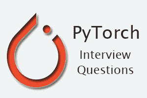

# PyTorch 面试问题

> 原文：<https://www.javatpoint.com/pytorch-interview-questions>



常见问题清单 **PyTorch 面试问答**如下。

### 1)什么是 PyTorch？

PyTorch 是基于 Torch 库的计算机软件的一部分，torch 库是 Python 的开源机器学习库。这是一个由脸书人工智能研究小组开发的深度学习框架。用于**自然语言处理****计算机视觉**等应用。

[点击这里了解更多信息](pytorch-introduction)

* * *

### PyTorch 的基本要素是什么？

PyTorch 中有以下基本要素:

*   PyTorch Tensors
*   皮托奇努比
*   数学运算
*   自动签名模块
*   光学模块
*   神经网络模块

* * *

### 3)什么是张量？

张量在 PyTorch 的深度学习中起着重要的作用。简单来说，我们可以说，这个框架完全基于张量。张量被视为广义矩阵。它可以是 1D 张量(矢量)、2D 张量(矩阵)、三维张量(立方体)或 4D 张量(立方体矢量)。

[点击这里了解更多信息](pytorch-tensors)

* * *

### 4)抽象的层次是什么？

抽象有三个层次，如下所示:

1.  **张量:**张量是一个在 GPU 上运行的命令式 n 维数组。
2.  **变量:**是计算图中的一个节点。这存储数据和梯度。
3.  **模块:**神经网络层将存储状态否则可学习的权重。

* * *

### 5)张量和矩阵是否相同？

我们不能说张量和矩阵是一样的。张量有一些性质，通过这些性质，我们可以说两者有一些相似之处，比如我们可以在张量中执行矩阵的所有数学运算。

张量是存在于结构中并与其他数学实体相互作用的数学实体。如果我们以规则的方式变换结构中的其他实体，那么张量将遵循相关的变换规则。张量的这种动力学性质使它不同于矩阵。

* * *

### torch.from _ numpy()有什么用？

**torch.from_numpy()** 是 torch 的重要性质之一，在张量编程中占有重要地位。它用于从数组创建张量。数组和返回张量共享相同的内存。如果我们对返回的张量做任何改变，那么它也将反映 ndaaray。

* * *

### 7)什么是变量和自签名变量？

**变量**是一个用来包装张量的包。**亲笔签名变量**是该包的中心类。torch.autograd 提供了实现任意标量值函数自动微分的类和函数。它只需要对现有代码进行最小的更改。我们只需要声明张量，梯度应该用 requires_grad=True 关键字来计算。

* * *

### 8)如何在 PyTorch 中找到函数的导数？

借助**梯度**计算函数的导数。我们可以通过四个简单的步骤轻松计算导数。

这些步骤如下:

*   我们将计算导数的函数的初始化。
*   设置函数中使用的变量值。
*   使用 backward()方法计算函数的导数。
*   使用 grad 打印导数的值。

* * *

### 9)线性回归是什么意思？

线性回归是一种通过最小化距离来寻找因变量和自变量之间线性关系的技术或方法。这是一种有监督的机器学习方法，用于对**阶离散类别**进行分类。

[点击这里了解更多信息](pytorch-tensors)

* * *

### 10)什么是损失函数？

损失函数是机器学习的基础。它很容易理解，并用于评估我们的算法对数据集建模的效果。如果我们的预测完全关闭，那么函数将输出一个更高的数字，否则它将输出一个更低的数字。

[点击这里了解更多信息](pytorch-loss-function)

* * *

### 11)ms loss、CTCLoss 和 BCELoss 功能有什么用？

MSE 代表均方误差，用于创建一个标准，该标准测量输入 x 和目标 y 中每个元素之间的均方误差。CTCLoss 代表连接主义时间分类损失，用于计算连续时间序列和目标序列之间的损失。二进制交叉熵用于创建一个标准来测量目标和输出之间的二进制交叉熵。

* * *

### 12)给出 torch.nn 和 torch.nn.functional 的区别？

torch.nn 为我们提供了更多的类和模块来实现和训练神经网络。 **torch.nn.functional** 包含一些有用的函数，比如激活函数和卷积运算，我们可以使用。然而，这些不是完整的层，所以如果我们想要定义任何类型的层，我们必须使用 **torch.nn** 。

* * *

### 13)均方误差是什么意思？

均方差告诉我们回归线离一组点有多近。均方误差通过取点到回归线的距离并对它们求平方来实现。需要平方来消除任何负号。

[点击这里了解更多信息](pytorch-mean-squared-error)

* * *

### 14)什么是感知器？

**感知器**是一个**单层神经网络**，或者我们可以说一个神经网络是一个多层感知器。感知器是一种二元分类器，用于监督学习。人工神经网络中生物神经元的简单模型被称为**感知器**。

[点击这里了解更多信息](pytorch-perceptron)

* * *

### 15)什么是激活功能？

一个神经元应不应该被激活，是由一个激活函数决定的。激活函数计算一个加权和，并进一步加上偏差以给出结果。**神经网络**是基于感知器的，所以如果我们想知道神经网络的工作原理，那么我们必须学习感知器是如何工作的。

* * *

### 16)神经网络与深度神经网络有何不同？

神经网络和深度神经网络都是相似的，做的是同样的事情。NN 和 DNN 的区别在于，神经网络中只能有一个隐藏层，但在深度神经网络中，隐藏层不止一个。隐藏层对于做出准确的预测起着重要的作用。

[点击这里了解更多信息](pytorch-architecture-of-deep-neural-network)

* * *

### 17)为什么网络很难显示问题？

人工神经网络处理数字信息，在引入人工神经网络之前，问题被转换成数值。这就是很难向网络显示问题的原因。

* * *

### 18)为什么我们在神经网络中使用激活函数

为了确定神经网络的输出，我们使用激活函数。它的主要任务是在 0 到 1 或-1 到 1 之间映射结果值。激活功能基本上分为两种:

1.  线性激活函数
2.  非线性激活函数

* * *

### 19)为什么我们更喜欢乙状结肠激活功能而不是其他功能？

**Sigmoid Function 曲线**看起来像 S 形，我们更喜欢 Sigmoid 而不是其他的原因是 Sigmoid Function 存在于 0 到 1 之间。这特别用于我们必须预测概率作为输出的模型。

* * *

### 20)前馈是什么意思？

**“前馈”**是一个过程，通过这个过程，我们接收一个输入，产生某种输出，进行某种预测。它是卷积神经网络和深度神经网络等许多其他重要神经网络的核心。/p >

在前馈神经网络中，网络中没有反馈回路或连接。这里只是一个输入层、一个隐藏层和一个输出层。

[点击这里了解更多信息](pytorch-feed-forward-process-in-deep-neural-network)

* * *

### 21)Conv1d、Conv2d 和 Conv3d 有什么区别？

他们三个没有太大的区别。Conv1d 和 Conv2D 用于应用 1d 和 2D 卷积。Conv3D 用于对由多个输入平面组成的输入信号进行 3D 卷积。

* * *

### 22)从“反向传播”这个词你能理解什么？

**“反向传播”**是一套用于计算误差函数梯度的算法。这个算法可以写成神经网络的函数。这些算法是一组方法，用于按照利用链式规则的梯度下降方法有效地训练人工神经网络。

[点击这里了解更多信息](pytorch-backpropagation-process-in-deep-neural-network)

* * *

### 23)什么是卷积神经网络？

**卷积神经网络**是神经网络中做图像分类和图像识别的范畴。人脸识别、场景标注、物体检测等。，是卷积神经网络广泛应用的领域。CNN 以一幅图像作为输入，在狗、猫、狮子、老虎等一定类别下进行分类处理。

[点击这里了解更多信息](pytorch-convolutional-neural-network)

* * *

### 24)DNN 和 CNN 有什么区别？

深度神经网络是一种多层次的神经网络。“深”是指神经网络有很多层，看起来像是网络中的深层。卷积神经网络是另一种深度神经网络。卷积神经网络有一个卷积层，使用滤波器将输入数据中的一个区域卷积到一个较小的区域，检测该区域内的重要或特定部分。卷积可用于图像和文本。

* * *

### 25)py torch 有哪些优势？

Pytorch 有以下优点:

*   PyTorch 非常容易调试。
*   这是一种动态的图形计算方法。
*   它是比 TensorFlow 非常快的深度学习训练。
*   它提高了开发人员的工作效率。
*   它非常容易学习，编码也更简单。

* * *

### PyTorch 和 TensorFlow 有什么区别？

| S.No | PyTorch | TensorFlow |
| 1. | 它提供了较低级别的应用编程接口 | 它提供了高级和低级别的 API |
| 2. | 它的速度很快 | 它的速度较慢 |
| 3. | PyTorch 中的图形构造非常简单 | 图形构造没有 PyTorch 那么简单 |
| 4. | 它包括一切必要的和动态的东西。 | 它有静态和动态图形作为组合。 |
| 5. | 它包括移动和嵌入式框架的部署亮点。 | 它更适合嵌入式框架。 |

[点击这里了解更多信息](pytorch-vs-tensorflow)

* * *

### 27)给出批梯度下降、随机梯度下降和小批梯度下降之间的任何一个区别？

*   **随机梯度下降:**在 SGD 中，我们只使用单个训练示例来计算梯度和参数。
*   **批量梯度下降:**在 BGD，我们计算整个数据集的梯度，并在每次迭代时执行上升。
*   **小批量梯度下降:**小批量梯度下降是随机梯度下降的变种。在这个梯度下降中，我们使用了小批量的样本，而不是单一的训练例子。

* * *

### 28)什么是自动编码器？

这是一种使用反向传播原理的自治机器学习算法，其中目标值等于所提供的输入。在内部，它有一个隐藏层，管理用于表示输入的代码。

* * *

### 29)py torch 中的 Autograd 模块是什么？

Autograd 模块是 PyTorch 中使用的自动区分技术。当我们构建神经网络时，它更强大。有一个记录器，它记录我们执行的每一个操作，然后回放它来计算我们的梯度。

* * *

### 30)py torch 中的 optim 模块是什么？

Torch.optim 是一个实现各种优化算法的模块，用于构建神经网络。下面是亚当优化器的代码

```

Optimizer = torch.optim.Adam(mode1, parameters( ), lr=learning rate

```

* * *

### 31)py torch 中的 nn 模块是什么？

PyTorch 提供 torch.nn 模块来帮助我们创建和训练神经网络。我们将首先在 MNIST 数据集上训练基本神经网络，而不使用这些模型中的任何特征。***torch . nn 为我们提供了更多的类和模块来实现和训练神经网络*** 。

* * *

### 32)使用 Conda 和 pip 在 windows 中安装 PyTorch 的命令是什么？

**使用 Conda:** conda 每晚安装 py torch cudatoolkit = 10.0-c py torch

**使用 pip:** pip 安装火炬-f[https://download.pytorch.org/whl/nightly/cpu/torch.html](https://download.pytorch.org/whl/nightly/cpu/torch.html)

* * *

### 33)什么是火把. cuda？

torch.cuda 是一个增加了对 cuda 张量类型支持的包。CUDA 张量类型实现了与 CPU 张量相同的功能，但利用 GPU 进行计算。

* * *

### 34)类型 1 和类型 2 错误有什么区别？

类型 1 错误是假正值，类型 2 错误是假负值。第一类错误代表事情发生的时间。第二类错误是描述哪里不对，哪里就没有错。

* * *

### 35)为什么要使用 PyTorch 进行深度学习？

在深度学习工具中，PyTorch 扮演着重要的角色，它是机器学习的一个子集，其算法在人脑上工作。我们更喜欢 PyTorch 的原因如下:

1.  PyTorch 允许我们动态定义我们的图形。
2.  PyTorch 非常适合深度盈利研究，并提供了最大的灵活性和速度。

* * *

### 36)张量的属性是什么？

每个火炬。Tensor 有一个 torch.device、torch.layout 和 torch . dtype . torch . dtype 定义了数据类型，torch.device 表示火炬所在的设备。张量被分配，火炬布局代表火炬的内存布局

* * *

### 37)水蟒和小巨蟒有什么区别？

Anaconda 是一个包含 conda、numpy、scipy、ipython 笔记本等数百个包的集合。迷你蟒蛇是蟒蛇的较小替代品。

* * *

### 38)我们如何检查 GPU 的使用情况？

检查图形处理器使用情况有以下步骤:

1.  使用窗口键+ R 打开运行命令。
2.  键入 dxdiag.exe 命令，然后按回车键打开 DirectX 诊断工具。
3.  单击显示选项卡。
4.  在驾驶员下方的右侧，检查驾驶员车型信息。

* * *

### 39)什么是 MNIST 数据集？

MNIST 数据集用于图像识别。它是各种手写数字的数据库。MNIST 数据集拥有大量数据，这些数据通常用于证明深度神经网络的真正能力。

[点击这里了解更多信息](pytorch-mnist-dataset-of-image-recognition)

* * *

### 40)什么是 CIFAR-10 数据集？

它是通常用于训练机器学习和计算机视觉算法的彩色图像的集合。CIFAR 10 数据集包含 50000 个训练图像和 10000 个验证图像，因此这些图像可以在 10 个不同的类别之间进行分类。

* * *

### 41)CIFAR-10 和 CIFAR-100 数据集有什么区别？

CIFAR 10 数据集包含 50000 个训练图像和 10000 个验证图像，因此这些图像可以在 10 个不同的类别之间进行分类。另一方面，CIFAR-100 有 100 个类，每个类包含 600 个映像。每堂课有 100 个测试图像和 500 个训练图像。

* * *

### 42)卷积层是什么意思？

卷积层是卷积神经网络的第一层。它是从输入图像中提取特征的图层。这是一种数学运算，需要两个输入，如图像矩阵和一个核或滤波器。

* * *

### 43)你说的 Stride 是什么意思？

跨距是在输入矩阵上移动的像素数。当步幅等于 1 时，我们将滤镜移动到 1 像素。

* * *

### 44)你说的填充是什么意思？

**“填充是可以添加到图像边框的附加层。”**用于克服

1.  缩小输出
2.  丢失图像角落的信息。

* * *

### 45)什么是汇聚层。

汇聚层在图像预处理中起着至关重要的作用。当图像太大时，池层减少了参数的数量。汇集是从先前图层获得的图像的**“缩小”**。

* * *

### 46)什么是 Max Pooling？

最大池化是一个基于样本的离散过程，其主要目标是降低输入表示的维数。并且允许对包含在分仓的子区域中的特征进行假设。

* * *

### 47)什么是平均池？

通过将输入划分为矩形池区域，通过平均池进行缩小，并计算每个区域的平均值。

* * *

### 48)什么是总和池？

**总和汇集**或**均值汇集**的子区域将设置为与**最大汇集**相同，但我们使用总和或均值代替最大函数。

* * *

### 49)全连接层是什么意思？

完全连接层是一个层，其中来自其他层的输入将被展平为向量并发送。它将通过网络将输出转换为所需的类别数。

* * *

### 50)什么是 Softmax 激活功能？

Softmax 函数是一个奇妙的激活函数，它将数字(也称为逻辑)转化为总和为 1 的概率。Softmax 函数输出一个表示潜在结果列表概率分布的向量。

* * *

| [面试提示](interview-tips) | [工作/人力资源面试问题](job-interview-questions) |
| [公司面试问题&程序](company-interview-questions-and-recruitment-process) | [JavaScript 面试问题](javascript-interview-questions) |
| [Java 基础面试题](corejava-interview-questions#corebasicsinterview) | [Java OOPs 面试问题](corejava-interview-questions#oopsinterview) |
| [Servlet 面试问题](servletinterview) | [JSP 面试问题](jspinterview) |
| [春季面试题](spring-interview-questions) | [冬眠面试问题](hibernate-interview-questions) |
| [PL/SQL 面试问题](pl-sql-interview-questions) | [SQL 面试问题](sql-interview-questions) |
| [甲骨文面试题](oracle-interview-questions) | [安卓面试问题](android-interview-questions) |
| [jQuery 面试问题](jquery-interview-questions) | [MySQL 面试问题](mysql-interview-questions) |