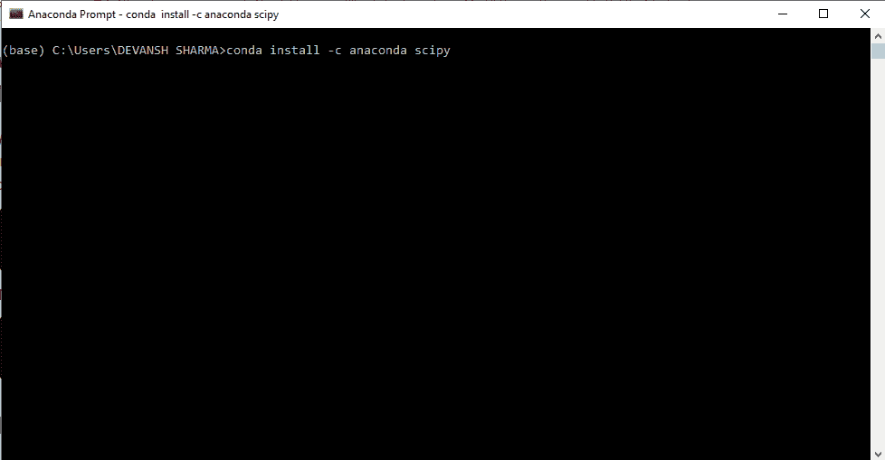
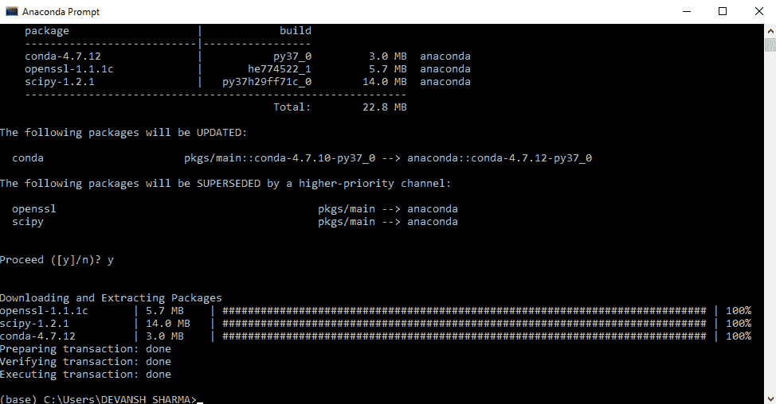

# SciPy 安装

> 原文：<https://www.javatpoint.com/scipy-installation>

我们将了解 SciPy 的核心功能。在使用 SciPy 之前，应该将其安装在系统中。

*   **使用 pip** 安装 SciPy

我们可以使用 **pip** 命令安装 SciPy 库；在终端中运行以下命令:

```

pip install scipy

```

*   **使用蟒蛇**安装 SciPy

我们也可以通过使用 Anaconda 安装 SciPy 包。首先，我们需要下载 anaconda 导航器，然后打开 Anaconda 提示符，键入以下命令:

```

conda install -c anaconda scipy

```



以下是下载的 SciPy 包。



*   **在 Mac 中安装 SciPy**

mac 没有预安装软件包管理器，但是你可以安装各种流行的软件包管理器。在终端运行以下命令，它将下载 SciPy 以及 matplotlib、pandas、numpy。

```

sudo port install py35-numpy py35-scipy py35-matplotlib py35-ipython +notebook py35-pandas py35-sympy py35-nose

```

*   **在 Ubuntu 中安装 SciPy**

我们需要创建一个虚拟环境，在其中安装 SciPy。让我们开始安装 Python virtualenv 和 pip3 包管理器，它们可以用来安装各种库。运行以下命令:

```

sudo apt install python3-venv python3-pip

```

上面的命令将下载旧版本的 Python。我们可以使用以下命令安装最新版本的 Python。

```

sudo apt install python3.7 python3.7-dev python3.7-venv

```

它会下载最新版本的 Python，并且会单独安装，不会和你默认的 Python 版本冲突。创建虚拟环境是一种很好的做法。

```

python3.7 -m venv work 3.7

```

work 3.7 是一个文件夹名。为了解决这个问题，我们需要激活它:

```

source work3.7/bin/activate

```

现在在上面的环境中安装 SciPy。

```

pip install scipy

```

上述命令将在您较新的环境中安装 SciPy。

### 正在导入 SciPy

成功安装后，我们可以通过以下命令导入 SciPy:

```

import scipy

```

* * *