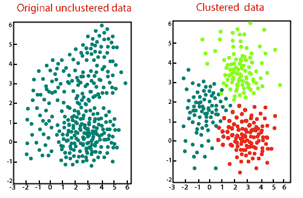

# SciPy 集群

> 原文：<https://www.javatpoint.com/scipy-cluster>

聚类是将数据集分成由相似数据点组成的组的过程。例如，项目排列在购物中心。同一组中的数据点必须尽可能相同，并且应该不同于其他组。集群有两种类型，它们是:

*   中心的
*   等级制度

k- means 聚类算法是一种简单的无监督算法，用于从未标记的数据集中预测分组。预测基于存在的聚类中心数量(k)和最近的平均值(以观测值之间的欧几里德距离测量)。



**K 均值算法**

步骤如下，假设我们有一个输入 x <sub>1</sub> ，x <sub>2</sub> ，x <sub>3</sub> ，....x <sub>n</sub> ，数据和值 k。

**第一步:**

选择 K 个随机点作为称为质心的聚类中心。假设这些是 c <sub>1</sub> ，c <sub>2</sub> ，...c <sub>k</sub> ，可以写成:

```
c1,c2,...ck

```

c 是所有形心的集合。

**第 2 步:**

通过计算 xi 点到每个质心之间的欧几里德(L2)距离，将每个输入值分配给最近的中心。

**第三步:**

在这一步中，我们通过计算分配给聚类的所有点的平均值来获得新的质心。

**第 4 步:**

我们重复步骤 2 和 3，直到没有一个集群保持不稳定。

### k-均值聚类和矢量量化(scipy.cluster.vq)

SciPy 提供了 k-means 聚类、从 K-means 模型生成码本以及通过与码本中的质心进行比较来量化向量的功能。

| 功能 | 描述 |
| 白化(obs，check _ 有限=真) | 它规范了一组对特征的观察。 |
| scipy.cluster.vq.vq(obs，code_book，check _ limited = True) | 它将码本中的代码分配给观测。 |
| scipy.cluster.vq.kmeans(obs，k_or_guess，iter=20，thresh=1e-05，check _ limited = True) | 它对一组观察向量执行 k 均值运算，形成 k 个聚类。 |
| scipy.cluster.vq.kmeans2(数据，k，iter=10，thresh=1e-05，minit='random '，missing='warn '，check _ limited = True) | 它使用 k-means 算法将一组观测值分类为 k 个聚类。 |

### 科学引文索引中的 K-Means 实现

在这里，我们将了解 K- means 在 SciPy 中的实现

**导入 K-表示**

以下语句用于实现 K 均值算法:

```

from SciPy.cluster.vq import kmeans,vq,white

```

**用三个聚类计算 K 均值**

K-means 算法一次又一次地迭代，并调整质心，直到在失真方面无法取得必要的进展，因为最后一次迭代小于某个阈值。考虑以下示例:

```

from numpy import vstack,array
from numpy.random import rand
from scipy.cluster.vq import kmeans,vq,whiten
# data generation with three features
data1 = vstack((rand(100,3) + array([.5,.5,.5]),rand(100,3)))
# whitening of data
data1 = whiten(data)
# computing K-Means with clusters 
centroids,_ = kmeans(data1,3)
print(centroids)

```

**输出:**

```
[[1.97955982 1.78985952 1.51775359]
 [2.6926236  2.70116313 2.75279787]
 [0.84636826 0.93081751 1.0708057 ]]

```

* * *