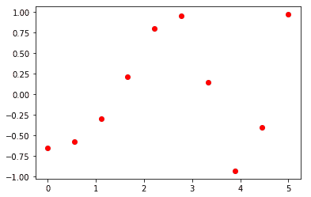
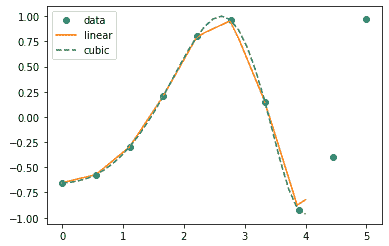
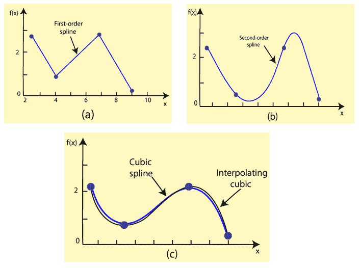
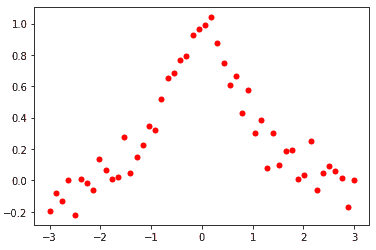

# 科学插值

> 原文：<https://www.javatpoint.com/scipy-interpolation>

插值定义为在线或曲线上的两点之间寻找一个值。这个词的第一部分是“inter”，意思是“输入”，它指示我们查看数据内部。换句话说，“**精确数据点之间中间值的估计称为插值**”。插值在统计、科学和商业中非常有用，或者当需要预测存在于两个现有数据点内的值时非常有用。

让我们看看如何使用 **scipy.interpolation** 包进行插值。

```

import numpy as np
from scipy import interpolate
import matplotlib.pyplot as plt
x = np.linspace(0, 5, 10) 
y = np.cos(x**2/3+4)
print(x,y)

```

它将以数组的形式给出以下输出。 **np.linspace()** 函数返回给定数字之间的间隔。

**输出:**

```
[0\.        0.55555556 1.11111111 1.66666667 2.22222222 2.77777778
 3.33333333 3.88888889 4.44444444 5.] 
[-0.65364362 -0.57246439 -0.29634775  0.21191783  0.80382736  0.95857746
  0.14971294 -0.92731369 -0.39972072  0.97296947]

```

我们可以将这些数组绘制为空间中点的二维，让我们考虑以下示例:

```

import numpy as np
from scipy import interpolate
import matplotlib.pyplot as plt
x = np.linspace(0, 5, 10)
y = np.cos(x**2/3+4)
plt.plot(x,y,'r')
plt.show()

```

**输出:**



### 一维插值

<pthe>scipy.interpolation provides interp1d class which is an useful method to create a function based on fixed data points.

通过使用上述数据，创建一个插值函数，并绘制一个新的插值图。

```

import numpy as np
from scipy.interpolate import interp1d
import matplotlib.pyplot as plt
fun1 = interp1d(x, y,kind = 'linear')
fun2 = interp1d(x, y, kind = 'cubic')
xnew = np.linspace(0, 4,30)
plt.plot(x, y, 'o', xnew, fun1(xnew), '-', xnew, fun2(xnew), '--')
plt.legend(['data', 'linear', 'cubic','nearest'], loc = 'best')
plt.show()

```

**输出:**



在上面的程序中，我们创建了两个函数 fun1 和 fun2。变量 x 包含样本点，变量 y 包含相应的值。第三个变量**种类**代表插值技术的类型。有各种各样的插值方法。这些方法如下:

*   线性的
*   最近的
*   零
*   s-线性
*   二次的
*   立方体的

### 样条函数

样条曲线是一种柔性带，用于通过指定的一组点生成平滑曲线。样条插值需要两个基本步骤。在第一步中，计算曲线的样条表示，并且在第二步中，在期望的点评估样条。



有两种方法来表示曲线。首先，使用直接样条方法，使用函数 **splrep()** 找到二维平面中曲线的样条表示。默认的样条顺序是三次的，但是可以用输入关键字 k 来更改。

**splprep()** 允许我们在 N 维空间中参数化地定义曲线**。关键字参数用于指定样条拟合期间要执行的平滑量。**

 **标准输出是一个三元组，(t，c，k)，其中，t 表示结点，c 表示系数，k 表示样条的阶数。

### 单变量样条

**scipy . interpole**提供了**单叶插值**类，一种基于固定数据点创建函数的合适方法。语法如下:

```

scipy.interpolate.UnivariateSpline(x, y, w = None, bbox = [None, None], k = 3, s = None, ext = 0, check_finite = False).

```

**参数-**

**w-** 指定样条拟合的权重。肯定是正面的。

**s-** 它通过指定平滑条件来指定结(点)的数量。

**k-** 表示平滑样条的度数。必须是 k < = 5。默认情况下，k = 3，三次样条。

*   **Ext** -它控制不在结序列定义的区间内的元素的外推模式。
    *   如果 ext = 0 或“外推”，则返回外推值。
    *   如果 ext = 1 或“零”，则返回 0
    *   如果 ext = 2 或“提升”，将引发值错误
    *   如果 ext = 3，则返回边界值。
*   **check _ limited**-检查输入数组是否只包含有限个数字。

让我们考虑以下示例:

```

import matplotlib.pyplot as plt
import numpy as np
from scipy.interpolate import UnivariateSpline
x = np.linspace(-3, 3,50)
y = np.exp(-x**2) + 0.1 * np.random.randn(50)
plt.plot(x, y, 'ro', ms = 5)
plt.show()

```

**输出:**



* * ***</pthe>