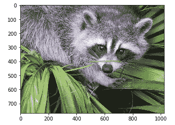
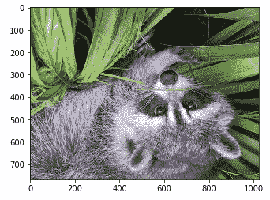
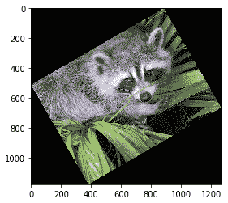
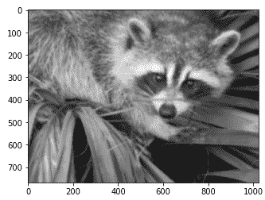
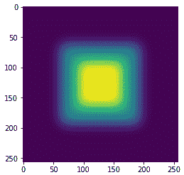
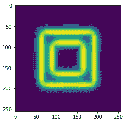

# SciPy Ndimage(消歧义)

> 哎哎哎:# t0]https://www . javatppoint . com/scipy-nd image

**SciPy** 提供了**ndi image**(n 维图像)包，其中包含了一些通用的图像处理和分析功能。它专门用于图像处理。在图像处理中，我们可以完成输入输出图像、分类、特征提取、配准等多项任务。

打开和写入图像文件

**scipy . ndi image**提供了 **misc** 包，附带了一些图片。我们将使用这些图像并执行图像处理。考虑以下示例:

```

from scipy import misc
f = misc.face()
misc.imsave('face.jpg', f)
import matplotlib.pyplot as plt
plt.imshow(f)
plt.show()

```

**输出:**



矩阵格式的数字代表任何图像及其颜色组合。机器使用这些数字进行操作。有两种方式来表示图像，灰度和 RGB。RGB 是最流行的表示方式。

我们可以执行一些基本的操作，如图像旋转，图像上下颠倒。考虑以下颠倒图像的示例:

```

from scipy import misc
face = misc.face()
flip_ud_face = np.flipud(face)
import matplotlib.pyplot as plt
plt.imshow(flip_ud_face)
plt.show()

```

**输出:**



SciPy 提供**旋转()**功能，将图像旋转到指定的角度。

```

from scipy import misc,ndimage
face = misc.face()
rotate_face = ndimage.rotate(face, 30) #rotating the image 30 degree
import matplotlib.pyplot as plt
plt.imshow(rotate_face)
plt.show()

```

**输出:**



## 过滤

过滤是我们修改和增强图像的过程。例如，可以将过滤器应用于图像，以突出显示某个特征或消除其他特征。通过滤波实现的图像处理操作包括**平滑和边缘增强**。使用 SciPy ndimage 考虑以下操作。

*   **模糊**

模糊是用来减少图像中噪声的技术。我们可以执行过滤操作并观察图像的变化。示例如下:

```

from scipy import misc
from scipy import ndimage
face = misc.face()
blurred_image = ndimage.gaussian_filter(face, sigma=4)
import matplotlib.pyplot as plt
plt.imshow(blurred_face)
plt.show()

```

**输出:**



西格玛值表示五级模糊程度。你可以改变西格玛值，看看有什么不同。

*   **边缘检测**

边缘检测是一个图像处理术语，用于寻找图像中对象的边界。它用于图像处理、计算机视觉和机器视觉等领域的图像分割和数据提取。要更具体地了解边缘检测，请访问我们的教程- [点击此处](https://www.javatpoint.com/opencv#Edge-detection)。

考虑以下示例:

```

import scipy.ndimage as nd
import numpy as np
im = np.zeros((256, 256))
im[64:-64, 64:-64] = 1
im[90:-90,90:-90] = 2
im = ndimage.gaussian_filter(im, 10)
import matplotlib.pyplot as plt
plt.imshow(im)
plt.show()

```

**输出:**



输出图像看起来像一个方形色块。现在，我们将找到这些彩色块的边缘。**ndi image**提供 **sobel()** 功能来执行该操作。而 NumPy 提供了**海波()**函数，用于将两个结果矩阵合并为一个。考虑以下示例:

```

import scipy.ndimage as nd
import matplotlib.pyplot as plt
im = np.zeros((256, 256))
im[64:-64, 64:-64] = 1
im[90:-90,90:-90] = 2
im = ndimage.gaussian_filter(im, 8)
zx = ndimage.sobel(im, axis = 0, mode = 'constant')
zy = ndimage.sobel(im, axis = 1, mode = 'constant')
sobl = np.hypot(zx, zy)
plt.imshow(sobl)
plt.show()

```

**输出:**



* * *