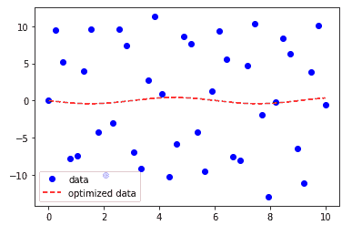

# 科学优化

> 原文：<https://www.javatpoint.com/scipy-optimize>

优化包提供了各种常用的优化算法。本模块包含以下方面:

*   全局优化例程(强力、退火()、basinhopping())
*   使用各种算法(BFGS、内尔德斯-米德单纯形、牛顿共轭梯度、COBLYA)对多变量标量函数进行无约束和有约束的最小化。
*   最小二乘最小化算法(最小二乘()和曲线拟合())
*   标量单变量函数最小化器(minimizer_scalar()和 root finders newton())

### 内尔德-米德单纯形算法

内尔德-米德单纯形算法提供了**最小化()**函数，该函数用于一个或多个变量的标量函数的最小化。

```

import numpy as np
import scipy
from scipy.optimize import minimize
#define function f(x)
def f(x):   
    return .2*(1 - x[0])**2
scipy.optimize.minimize(f, [2, -1], method="Nelder-Mead")

```

**输出:**

```
final_simplex: (array([[ 1\.        , -1.27109375],
       [ 1\.        , -1.27118835],
       [ 1\.        , -1.27113762]]), array([0., 0., 0.]))
           fun: 0.0
       message: 'Optimization terminated successfully.'
          nfev: 147
           nit: 69
        status: 0
       success: True
             x: array([ 1\.        , -1.27109375])

```

### 最小二乘最小化

它用于求解变量有界的非线性最小二乘问题。给定残差(**数据的观测值和预测值之间的差值**)f(x)(n 个实变量的 n 维实函数)和损失函数ρ(s)(标量函数)，**最小二乘**找到成本函数 f(x)的局部最小值:让我们考虑以下示例:

```

from scipy.optimize import least_squares
import numpy as np
input = np.array([2, 2])
def rosenbrock(x):
   return np.array([10 * (x[1] - x[0]**3), (1 - x[0])])
res = least_squares(rosenbrock, input)
print(res)

```

**输出:**

```
active_mask: array([0., 0.])
        cost: 0.0
         fun: array([0., 0.])
        grad: array([0., 0.])
         jac: array([[-30.00000045,  10\.        ],
       [ -1\.        ,   0\.        ]])
     message: '`gtol` termination condition is satisfied.'
        nfev: 4
        njev: 4
  optimality: 0.0
      status: 1
     success: True
           x: array([1., 1.])

```

### 寻根

*   **标量函数**

单值方程有四种不同的求根算法。每种算法都需要一个区间的端点，在该区间中期望有一个根(因为函数改变了符号)。

*   **方程组**

**根()**函数用来求非线性方程的根。有各种方法，如 MINPACK 中的 **hybr** (默认)和 **Levenberg-Marquardt 方法**。

让我们考虑下面的等式

x <sup>2</sup> + 3cos(x)=0

```

import numpy as np
from scipy.optimize import root
def func(x):
   return x*2 +  3* np.cos(x)
a = root(func, 0.3)
print(a)

```

**输出:**

```
fjac: array([[-1.]])
  fun: array([2.22044605e-16])
 message: 'The solution converged.'
    nfev: 10
     qtf: array([-1.19788401e-10])
       r: array([-4.37742564])
  status: 1
 success: True
       x: array([-0.91485648])

```

### 优化曲线拟合

曲线拟合是创建曲线的技术。这是一个最适合一系列数据点的数学函数，可能会受到约束。示例如下:

```

import numpy as np 
from scipy.optimize import curve_fit 
from matplotlib import pyplot as plt 
x = np.linspace(0, 10, num = 40) 
# The coefficients are much bigger. 
y = 10.35 * np.sin(5.330 * x) + np.random.normal(size = 40) 
def test(x, a, b): 
	return a * np.sin(b * x) 
param, param_cov = curve_fit(test, x, y) 
print("Sine funcion coefficients:") 
print(param) 
print("Covariance of coefficients:") 
print(param_cov) 
ans = (param[0]*(np.sin(param[1]*x))) 
plt.plot(x, y, 'o', color ='red', label ="data") 
plt.plot(x, ans, '--', color ='blue', label ="optimized data") 
plt.legend() 
plt.show()

```

**输出:**

```
Sine funcion coefficients:
[-0.42111847  1.03945217]
Covariance of coefficients:
[[3.03920718 0.05918002]
 [0.05918002 0.43566354]]

```



### SciPy fsolve

**scipy.optimize** 库提供了 **fsolve()** 函数，用于查找函数的根。给定一个起始估计，它返回由 fun(x) = 0 定义的方程的根。

考虑以下示例:

```

import numpy as np
from scipy.optimize import fsolve
sqrt = np.emath.sqrt
a = 132712000000
T = 365.35 * 86337 * 2 / 3
e = 580.2392124070273
def f(x):
    return np.abs((T * a ** 2 / (2 * np.pi)) ** (1 / 3) * sqrt(1 - x ** 2)
        - sqrt(.5 * a ** 2 / e * (1 - x ** 2)))
x = fsolve(f, 0.01)
x, f(x)

```

**输出:**

```
(array([1.]), array([82.17252895]))

```

* * *