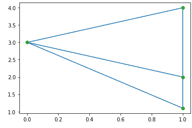
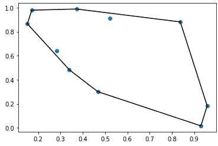

# SciPy 空间

> 原文：<https://www.javatpoint.com/scipy-spatial>

通过利用 **Qhull** 库， **scipy.spatial** 包可以计算一组点的三角剖分、Voronoi 图和凸包。同样，它包含最近邻点查询的 **KDTree** 实现和各种度量中距离计算的实用程序。

*   **德劳奈三角测量**

在数学和计算几何中，德劳奈三角测量定义当三角形的三个点接触圆的路径时，这三个点创建一个顶点。

圆心由三点或三角形的半径决定。让我们考虑下面的例子:

```

from scipy.spatial import Delaunay
import numpy as np
import matplotlib.pyplot as plt
points = np.array([[0, 3], [1, 1.1], [1, 4], [1, 2]])
triang = Delaunay(points)
plt.triplot(points[:,0], points[:,1], triang.simplices.copy())
plt.plot(points[:,0], points[:,1], 'o')
plt.show()

```

**输出:**



### 共面点

共面点是同一平面上存在的三个或更多的点。平面是一个平面，可以向各个方向展开，没有端点。让我们考虑下面的例子:

```

from scipy.spatial import Delaunay
points = np.array([[0, 0], [0, 1], [1, 0], [1, 1],[1,1]])
tri = Delaunay(points)
print(tri.coplanar)

```

**输出:**

```
[[4 0 3]]

```

在上面的输出中，点 4 不包括在三角测量中；它存在于三角形 0 和顶点 3 附近。

### 凸包

在数学中，**欧氏平面**或**欧氏空间**中一组点 X 的凸包或凸包络。它是包含 x 的最小凸集。让我们考虑下面的例子:

```

from scipy.spatial import ConvexHull
import matplotlib.pyplot as plt
points = np.random.rand(10, 2) # 30 random points in 2-D
hull = ConvexHull(points)
plt.plot(points[:,0], points[:,1], 'o')
for simplex in hull.simplices:
    plt.plot(points[simplex,0], points[simplex,1], 'k-')
plt.show()	

```

**输出:**



### Scipy cdist

SciPy 提供了**空间距离表**，用于计算两个输入集合中每对之间的距离。以下是调用约定:

**1 .Y = cdist(XA、XB、euclidean)**

它使用欧几里德距离(2-范数)作为点之间的距离度量来计算 m 个点之间的距离。这些点被组织成矩阵 x 中的 m 个 n 维行向量。

**2 .Y = cdist(XA、XB、" minkowski "，p=2)。)**

它使用闵可夫斯基距离计算距离||u？v | | p(p-范数)其中 p？1.

**3 .Y = cdist(XA、XB、city block)**

它计算城市街区或点之间的曼哈顿距离。

* * *