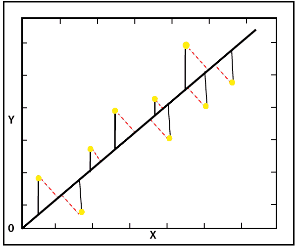

# SciPy ODR

> 哎哎哎:# t0]https://www . javatppoint . com/scipy-ODR

ODR 是**正交距离回归**的缩写形式。它用于回归研究。基本线性回归用于通过在图中画出最佳拟合线来估计两个变量 y 和 x 之间的关系。那么问题来了，为什么正交距离回归(ODR)需要？有时测量误差出现在自变量(x)中，而不是因变量(y)中。

标准线性回归侧重于从 X 值预测 Y 值，因此要做的有用的事情是计算 Y 值中的误差(如下图中的黑色虚线所示)。但是，最好同时考虑 X 和 Y 方向的误差(如下图中红色虚线所示)。



正交距离回归(ODR)是一种用于计算垂直于直线而不是垂直的误差的方法。

正交距离回归提供了利用非线性函数执行 ODR 的 ODRPACK。它基本上是一个 FORTRAN-77 库。它可以做显性或隐性的 ODR 拟合。它也可以用来解决普通的最小二乘问题(OLS)。

**单变量回归的 scipy.odr 的实现**

单变量回归可以定义为确定一个自变量和一个因变量之间的关系。考虑以下示例:

```

import numpy as np
import matplotlib.pyplot as plt
from scipy.odr import *
import random
# Initiate some data, and generate the random number using random.random().
a = np.array([0, 1, 2, 3, 4, 5, 6, 7])
b = np.array([i**2 + random.random() for i in x])
# Define a quadratic function ( in this case) to fit the data with.
def linear_func(z, a):
   m, p = z
   return m*a + p
# Creating a model for fitting.
linear_model_fit = Model(linear_func)
# Creating a RealData object using our initiated data from above.
data = RealData(x, y)
# Fixed up ODR with the model and data.
odr = ODR(data, linear_model_fit, beta0=[0., 1.])
# Here we run the regression using the run().
out = odr.run()
# Use the in-built pprint method to give us results.
out.pprint()

```

**输出:**

```
Beta: [ 7.62787497 -8.53630181]
Beta Std Error: [0.89306061 3.69444539]
Beta Covariance: [[ 1.52116591 -5.32408057]
 [-5.32408057 26.0323407 ]]
Residual Variance: 0.5243065494144553
Inverse Condition #: 0.18510252155770376
Reason(s) for Halting:
  Sum of squares convergence

```

* * *