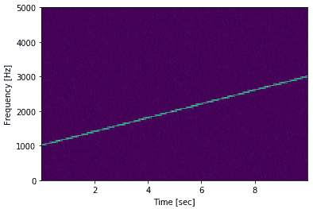

# SciPy 频谱图

> 原文：<https://www.javatpoint.com/scipy-spectrogram>

信号处理工具箱包含很少的滤波功能，一套有限的滤波器设计工具。它还包含很少的 B 样条插值算法的一维和二维数据。

频谱图**利用连续的傅立叶变换计算频谱图。频谱图可以作为反映非信号信号频率含量随时间变化的一种方式。**

```

from scipy import signal	
import matplotlib.pyplot as plt
import numpy as np
#Generate a test signal, a 2 Vrms sine wave whose frequency linearly changes with time from 1kHz to 2kHz, corrupted by 0.001 V**2/Hz of white noise sampled at 10 kHz.
fs = 10e3 # Sampling Frequency
N = 1e5
amp = 2 * np.sqrt(2)
noise_power = 0.001 * fs / 2
time = np.arange(N) / fs
freq = np.linspace(1e3, 2e3, N)	
x = amp * np.sin(2*np.pi*freq*time)
x += np.random.normal(scale=np.sqrt(noise_power), size=time.shape)
# Compute and plot the spectrogram.
f, t, Sxx = signal.spectrogram(x, fs)
plt.pcolormesh(t, f, Sxx)
plt.ylabel('Frequency [Hz]')
plt.xlabel('Time [sec]')
plt.show()

```

**输出:**



scipy . signal . SPECT gram()返回以下数组:

**f:ndaarray**

采样频率阵列。

**t:ndaarray**

分段时间数组。

**sxx:ndaberry**

x 的频谱图。默认情况下， **Sxx** 的最后一个轴对应于分段时间

* * *