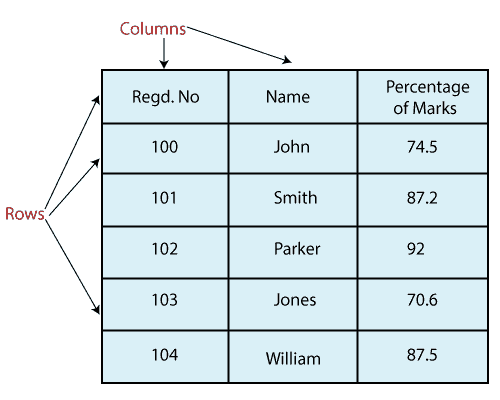

# Python Pandas DataFrame

> 原文：<https://www.javatpoint.com/python-pandas-dataframe>

Pandas数据框架是一种广泛使用的数据结构，它使用带有标记轴(行和列)的二维数组。DataFrame 被定义为存储具有两个不同索引的数据的标准方式，即**行索引**和**列索引**。它由以下属性组成:

*   列可以是异构类型，如 int、bool 等。
*   它可以看作是一个系列结构的字典，其中行和列都被索引。在列的情况下表示为“列”，在行的情况下表示为“索引”。

## 参数和描述:

**数据:**由数组、数列、映射、常数、列表、数组等不同形式组成。

**索引:**如果没有通过索引，默认的 NP . array(n)索引用于行标签。

**列:**列标签的默认语法是 NP . array(n)。只有在没有传递索引的情况下才显示为真。

**dtype:** 指每一列的数据类型。

**copy():** 用于复制数据。



## 创建数据框

我们可以使用以下方法创建数据框:

*   **格言**
*   **列表**
*   num py ndarrrays
*   **系列**

**创建一个空的数据框**

下面的代码展示了如何在 Pandas 中创建一个空的数据帧:

```

# importing the pandas library
import pandas as pd
df = pd.DataFrame()
print (df)

```

**输出**

```
Empty DataFrame
Columns: []
Index: []

```

**说明:**在上面的代码中，首先我们导入了别名为 **pd** 的 pandas 库，然后定义了一个名为 **df** 的变量，该变量由一个空的 DataFrame 组成。最后，我们通过将 **df** 传入**打印**进行了打印。

### 使用列表创建数据框:

我们可以很容易地使用列表在Pandas中创建一个数据框架。

```

# importing the pandas library
import pandas as pd
# a list of strings
x = ['Python', 'Pandas']

# Calling DataFrame constructor on list
df = pd.DataFrame(x)
print(df)

```

**输出**

```
      0
0   Python
1   Pandas

```

**说明:**在上面的代码中，我们定义了一个名为“x”的变量，它由字符串值组成。正在为打印值的列表调用数据框构造函数。

### 从数据库/列表中创建数据框

```

# importing the pandas library
import pandas as pd
info = {'ID' :[101, 102, 103],'Department' :['B.Sc','B.Tech','M.Tech',]}
df = pd.DataFrame(info)
print (df)

```

**输出**

```
       ID      Department
0      101        B.Sc
1      102        B.Tech
2      103        M.Tech

```

**说明:**在上面的代码中，我们定义了一个名为“info”的字典，它由 **ID** 的**列表**和**部门**组成。为了打印值，我们必须通过名为 **df** 的变量调用信息字典，并在 **print()** 中将其作为参数传递。

### 从系列字典创建数据框:

```

# importing the pandas library
import pandas as pd

info = {'one' : pd.Series([1, 2, 3, 4, 5, 6], index=['a', 'b', 'c', 'd', 'e', 'f']),
   'two' : pd.Series([1, 2, 3, 4, 5, 6, 7, 8], index=['a', 'b', 'c', 'd', 'e', 'f', 'g', 'h'])}

d1 = pd.DataFrame(info)
print (d1)

```

**输出**

```
        one         two
a       1.0          1
b       2.0          2
c       3.0          3
d       4.0          4
e       5.0          5
f       6.0          6
g       NaN          7
h       NaN          8

```

**说明:**在上面的代码中，一个名为“ **info** 的字典由两个**系列**及其各自的索引组成。为了打印值，我们必须通过名为 **d1** 的变量调用 **info** 字典，并在 **print()** 中将其作为参数传递。

## 列选择

我们可以从数据框中选择任何列。下面是演示如何从数据框中选择一列的代码。

```

# importing the pandas library
import pandas as pd

info = {'one' : pd.Series([1, 2, 3, 4, 5, 6], index=['a', 'b', 'c', 'd', 'e', 'f']),
   'two' : pd.Series([1, 2, 3, 4, 5, 6, 7, 8], index=['a', 'b', 'c', 'd', 'e', 'f', 'g', 'h'])}

d1 = pd.DataFrame(info)
print (d1 ['one'])

```

**输出**

```
a      1.0
b      2.0
c      3.0
d      4.0
e      5.0
f      6.0
g      NaN
h      NaN
Name: one, dtype: float64

```

**说明:**在上面的代码中，名为“ **info** 的字典由两个**系列**及其各自的**索引**组成。稍后，我们通过变量 **d1** 调用**信息**字典，并通过将其传递到 **print()** 从数据框中选择“**一个**系列。

## 列加法

我们还可以向现有的数据框中添加任何新列。下面的代码演示了如何向现有数据框添加任何新列:

```

# importing the pandas library
import pandas as pd

info = {'one' : pd.Series([1, 2, 3, 4, 5], index=['a', 'b', 'c', 'd', 'e']),
   'two' : pd.Series([1, 2, 3, 4, 5, 6], index=['a', 'b', 'c', 'd', 'e', 'f'])}

df = pd.DataFrame(info)

# Add a new column to an existing DataFrame object 

print ("Add new column by passing series")
df['three']=pd.Series([20,40,60],index=['a','b','c'])
print (df)

print ("Add new column using existing DataFrame columns")
df['four']=df['one']+df['three']

print (df)

```

**输出**

```
Add new column by passing series
      one     two      three
a     1.0      1        20.0
b     2.0      2        40.0
c     3.0      3        60.0
d     4.0      4        NaN
e     5.0      5        NaN
f     NaN      6        NaN

Add new column using existing DataFrame columns
       one      two       three      four
a      1.0       1         20.0      21.0
b      2.0       2         40.0      42.0
c      3.0       3         60.0      63.0
d      4.0       4         NaN      NaN
e      5.0       5         NaN      NaN
f      NaN       6         NaN      NaN

```

**说明:**在上面的代码中，名为 **f** 的字典由两个**系列**及其各自的**索引**组成。后来，我们通过变量 **df** 调用了 **info** 字典。

为了给现有的 DataFrame 对象添加一个新的列，我们传递了一个新的系列，该系列包含一些关于其索引的值，并使用 **print()** 打印了它的结果。

我们可以使用现有的数据框添加新的列。添加了“**四**列，存储两列相加的结果，即**一**和**三**。

## 列删除:

我们还可以从现有的数据框中删除任何列。这段代码有助于演示如何从现有数据框中删除该列:

```

# importing the pandas library
import pandas as pd

info = {'one' : pd.Series([1, 2], index= ['a', 'b']), 
   'two' : pd.Series([1, 2, 3], index=['a', 'b', 'c'])}

df = pd.DataFrame(info)
print ("The DataFrame:")
print (df)

# using del function
print ("Delete the first column:")
del df['one']
print (df)
# using pop function
print ("Delete the another column:")
df.pop('two')
print (df)

```

**输出**

```
The DataFrame:
      one    two
a     1.0     1
b     2.0     2
c     NaN     3

Delete the first column:
     two
a     1
b     2
c     3

Delete the another column:
Empty DataFrame
Columns: []
Index: [a, b, c]

```

**说明:**

在上面的代码中， **df** 变量负责调用 **info** 字典并打印字典的全部值。我们可以使用**删除**或**弹出**功能从数据框中删除列。

在第一种情况下，我们使用**删除**功能从数据框中删除“**一**列，而在第二种情况下，我们使用**弹出**功能从数据框中删除“**两**列。

* * *

## 行选择、添加和删除

### 行选择:

我们可以随时轻松地选择、添加或删除任何行。首先，我们将了解行选择。让我们看看如何使用以下不同方式选择行:

**标签选择:**

我们可以通过将行标签传递给 **loc** 函数来选择任意行。

```

# importing the pandas library
import pandas as pd

info = {'one' : pd.Series([1, 2, 3, 4, 5], index=['a', 'b', 'c', 'd', 'e']), 
   'two' : pd.Series([1, 2, 3, 4, 5, 6], index=['a', 'b', 'c', 'd', 'e', 'f'])}

df = pd.DataFrame(info)
print (df.loc['b'])

```

**输出**

```
one    2.0
two    2.0
Name: b, dtype: float64

```

**说明:**在上面的代码中，一个名为**信息**的字典由两个**系列**及其各自的**索引**组成。

为了选择一行，我们已经将行标签传递给了 **loc** 函数。

**按整数位置选择:**

也可以通过将整数位置传递给 **iloc** 函数来选择行。

```

# importing the pandas library
import pandas as pd
info = {'one' : pd.Series([1, 2, 3, 4, 5], index=['a', 'b', 'c', 'd', 'e']),
   'two' : pd.Series([1, 2, 3, 4, 5, 6], index=['a', 'b', 'c', 'd', 'e', 'f'])}
df = pd.DataFrame(info)
print (df.iloc[3])

```

**输出**

```
one    4.0
two    4.0
Name: d, dtype: float64

```

**解释:**解释:在上面的代码中，我们定义了一个名为**信息**的字典，它由两个**系列**及其各自的**索引**组成。

为了选择一行，我们将整数位置传递给一个 **iloc** 函数。

**切片行**

使用**:'**运算符选择多行是另一种方法。

```

# importing the pandas library
import pandas as pd
info = {'one' : pd.Series([1, 2, 3, 4, 5], index=['a', 'b', 'c', 'd', 'e']), 
   'two' : pd.Series([1, 2, 3, 4, 5, 6], index=['a', 'b', 'c', 'd', 'e', 'f'])}
df = pd.DataFrame(info)
print (df[2:5])

```

**输出**

```
      one    two
c     3.0     3
d     4.0     4
e     5.0     5

```

**说明:**在上面的代码中，我们为行的选择定义了从 2:5 的范围，然后将其值打印在控制台上。

**增加行:**

我们可以使用**追加**功能轻松地向数据框中添加新行。它在末尾添加新行。

```

# importing the pandas library
import pandas as pd
d = pd.DataFrame([[7, 8], [9, 10]], columns = ['x','y'])
d2 = pd.DataFrame([[11, 12], [13, 14]], columns = ['x','y'])
d = d.append(d2)
print (d)

```

**输出**

```
      x      y
0     7      8
1     9      10
0     11     12
1     13     14

```

**说明:**在上面的代码中，我们定义了两个单独的列表，其中包含一些行和列。这些列是使用**追加**功能添加的，然后结果显示在控制台上。

**删除行:**

我们可以使用**索引**标签从数据框中删除任何行。如果标签重复，则多行将被删除。

```

# importing the pandas library
import pandas as pd

a_info = pd.DataFrame([[4, 5], [6, 7]], columns = ['x','y'])
b_info = pd.DataFrame([[8, 9], [10, 11]], columns = ['x','y'])

a_info = a_info.append(b_info)

# Drop rows with label 0
a_info = a_info.drop(0)

```

**输出**

```
x      y
1     6      7
1     10    11

```

**说明:**在上面的代码中，我们定义了两个单独的列表，其中包含一些行和列。

这里，我们已经定义了需要从列表中删除的行的索引标签。

## 数据框函数

数据框中使用了许多函数，如下所示:

| 功能 | 描述 |
| Pandas DataFrame.append() | 将其他数据框的行添加到给定数据框的末尾。 |
| [Pandas数据框. apply()](https://www.javatpoint.com/pandas-apply) | 允许用户传递一个函数，并将其应用于Pandas系列的每个值。 |
| [Pandas数据框分配()](https://www.javatpoint.com/pandas-dataframe-assign) | 将新列添加到数据框中。 |
| Pandas data frame . asttype() | 将Pandas对象转换为指定的 dtype.astype()函数。 |
| Pandas DataFrame.concat() | 沿数据框中的轴执行串联操作。 |
| [Pandas数据帧计数()](https://www.javatpoint.com/pandas-count) | 计算每一列或每一行的非 NA 单元格的数量。 |
| [Pandas数据框描述()](https://www.javatpoint.com/pandas-dataframe-describe) | 计算一些统计数据，如数列或数据框数值的百分位数、平均值和标准值。 |
| [Pandas DataFrame.drop_duplicates()](https://www.javatpoint.com/pandas-dataframe-drop_duplicates) | 从数据框中删除重复值。 |
| Pandas DataFrame.groupby() | 将数据分成不同的组。 |
| [Pandas DataFrame.head()](https://www.javatpoint.com/pandas-dataframe-head) | 根据位置返回对象的前 n 行。 |
| Pandas DataFrame.hist() | 将数值变量中的值划分为“箱”。 |
| [Pandas data frame . ETR rows()](https://www.javatpoint.com/pandas-dataframe-iterrows) | 以(索引、序列)对的形式遍历行。 |
| [Pandas数据框均值()](https://www.javatpoint.com/pandas-dataframe-mean) | 返回请求轴的平均值。 |
| [Pandas DataFrame.melt()](https://www.javatpoint.com/pandas-melt) | 将数据帧从宽格式取消固定为长格式。 |
| [Pandas DataFrame.merge()](https://www.javatpoint.com/pandas-merge) | 将两个数据集合并成一个。 |
| [Pandas DataFrame.pivot_table()](https://www.javatpoint.com/pandas-pivot-table) | 使用诸如总和、计数、平均值、最大值和最小值等计算来聚合数据。 |
| [Pandas DataFrame.query()](https://www.javatpoint.com/pandas-dataframe-query) | 过滤数据帧。 |
| [Pandas数据框.样本()](https://www.javatpoint.com/pandas-dataframe-sample) | 从数据框中随机选择行和列。 |
| [Pandas DataFrame.shift()](https://www.javatpoint.com/pandas-shift) | 移位列或从数据框中减去具有前一行值的列值。 |
| Pandas DataFrame.sort() | 对数据帧进行排序。 |
| [Pandas DataFrame.sum()](https://www.javatpoint.com/pandas-sum) | 返回用户请求的坐标轴的值的总和。 |
| [Pandas DataFrame.to_excel()](https://www.javatpoint.com/pandas-dataframe-to_excel) | 将数据框导出到 excel 文件。 |
| [Pandas数据框.转置()](https://www.javatpoint.com/pandas-dataframe-transpose) | 转置数据帧的索引和列。 |
| [Pandas数据框. where()](https://www.javatpoint.com/pandas-dataframe-where) | 检查数据框的一个或多个条件。 |

* * *