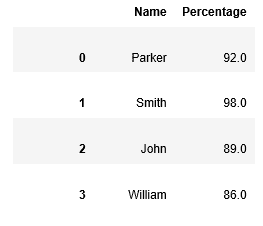

# Pandas DataFrame.groupby()

> 原文：<https://www.javatpoint.com/pandas-groupby>

在Pandas中， **groupby()** 函数允许我们在真实数据集上利用数据来重新排列数据。它的主要任务是将数据分成不同的组。这些组根据一些标准进行分类。这些物体可以从它们的任何一个轴上分开。

## 语法:

```

DataFrame.groupby(by=None, axis=0, level=None, as_index=True, sort=True, group_keys=True, squeeze=False, **kwargs)

```

该操作包括以下聚合/分组数据的步骤:

*   **分割数据集**
*   **分析数据**
*   **聚合或组合数据**

#### 注意:group by 操作的结果不是数据帧，而是数据帧对象的字典。

## 将数据分组

有多种方法可以将任何对象拆分到组中，如下所示:

*   groupby 对象(“关键点”)
*   obj.groupby(['key1 '，' key2'])
*   obj.groupby(键，轴=1)

我们还可以为每个子集添加一些功能。可以对应用的功能执行以下操作:

*   **汇总:**计算汇总统计。
*   **转换:**执行一些特定组的操作。
*   **过滤:**它通过在一定条件下丢弃数据来过滤数据。

### 聚集

它被定义为为每个组返回一个聚合值的函数。创建 **groupby** 对象时，我们可以对分组后的数据进行多次聚合操作。

**例**

```

# import the pandas library
import pandas as pd
import numpy as np
data = {'Name': ['Parker', 'Smith', 'John', 'William'],
   'Percentage': [82, 98, 91, 87],
   'Course': ['B.Sc','B.Ed','M.Phill','BA']}
df = pd.DataFrame(data)

grouped = df.groupby('Course')
print(grouped['Percentage'].agg(np.mean))

```

**输出**

```
Course
B.Ed        98
B.Sc        82
BA          87
M.Phill     91
Name: Percentage, dtype: int64

```

### 转换

它是对组或列的一种操作，用于执行某些特定于组的计算，并返回一个与组大小相同的索引对象。

**例**

```

# import the pandas library
import pandas as pd
import numpy as np

data = {'Name': ['Parker', 'Smith', 'John', 'William'],
   'Percentage': [82, 98, 91, 87],
   'Course': ['B.Sc','B.Ed','M.Phill','BA']}
df = pd.DataFrame(data)

grouped = df.groupby('Course')
Percentage = lambda x: (x - x.mean()) / x.std()*10
print(grouped.transform(Percentage))

```

**输出**

```
    Percentage
0       NaN
1       NaN
2       NaN
3       NaN

```

### 过滤

**filter()** 函数通过定义一些标准来过滤数据，并返回数据子集。

**例**

```

# import the pandas library
import pandas as pd
import numpy as np

data = {'Name': ['Parker', 'Smith', 'John', 'William'],
   'Percentage': [82, 98, 91, 87],
   'Course': ['B.Sc','B.Ed','M.Phill','BA']}
df = pd.DataFrame(data)

grouped = df.groupby('Course')
print (df.groupby('Course').filter(lambda x: len(x) >= 1))

```

**输出**

```
     Name      Percentage    Course
0   Parker      82            B.Sc
1   Smith       98            B.Ed
2   John        91            M.Phill
3   William     87            BA

```

## Groupby 的参数:

*   **通过:** *映射、函数、字符串或可迭代*

它的主要任务是确定 groupby 中的组。如果我们使用**乘以**作为一个函数，它将在对象索引的每个值上被调用。如果一个数列或字典被通过，那么数列或字典值将被用来确定组。

如果通过了一个**数组**，那么这些值将按原样用于确定组。

我们也可以将标签或标签列表通过**自身**中的列进行分组。

*   **轴:** *{0 或‘索引’，1 或‘列’}，默认值 0*
*   **等级:** *int，等级名称，或此类的序列，默认值 None。*

当轴是多索引(分层)时使用，因此，它将按一个或多个特定级别分组。

*   **as_index:** *bool，默认值 True* 它返回带有组标签的对象作为聚合输出的索引。
*   **排序:** *bool，默认 True* 用于对组合键进行排序。关闭此功能可以获得更好的性能。

#### 注:它不影响各组内的观察顺序。Groupby 保留每个组中的行顺序。

*   **组 _ 键:bool，默认值 True**

当我们调用它时，它会将组键添加到索引中以识别片段。

*   **观察到:** *bool，默认值 False* 仅当任何石斑鱼属于该类别时才会使用。如果该值为真，那么它将只显示**分类**石斑鱼的观察值。否则，它将显示其所有的值。
*   ****kwargs**
    它是一个可选参数，只接受传递给 groupby 的关键字参数“突变”。

## 返回

它返回**数据框组 By** 或**系列组 By** 。返回值取决于由组信息组成的调用对象。

**例**

```

import pandas as pd
info = pd.DataFrame({'Name': ['Parker', 'Smith','John', 'William'],'Percentage': [92., 98., 89., 86.]})
info

```

**输出**



**例**

```

# import the pandas library
import pandas as pd

data = {'Name': ['Parker', 'Smith', 'John', 'William'],
   'Percentage': [82, 98, 91, 87],}
info = pd.DataFrame(data)

print (info)

```

**输出**

```
    Name     Percentage
0   Parker     82
1   Smith      98
2   John       91
3   William    87

```

* * *