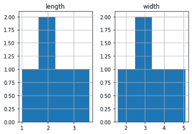

# 熊猫 DataFrame.hist()

> 噻:[https://www . javatppoint . com/pandas-data frame-hist](https://www.javatpoint.com/pandas-dataframe-hist)

hist()函数被定义为一种快速了解数据集中某些数值变量分布的方法。它将一个数值变量内的值划分到“**箱**”中。它计算每个箱子中的检查数量。这些面元负责通过可视化面元快速直观地了解变量内的值分布。

我们可以使用 **DataFrame.hist()** 方法创建直方图，这是 matplotlib pyplot API 的包装器。

它也是快速获取概率分布的有用工具。

### 句法

```

DataFrame.hist(data, column=None, by=None, grid=True, xlabelsize=None, xrot=None, ylabelsize=None, yrot=None, ax=None, sharex=False, sharey=False, figsize=None, layout=None, bins=10, **kwds)

```

### 因素

*   **数据:**一个数据帧。
    这是一个熊猫数据框对象，保存数据。
*   **列:**指字符串或序列。
    如果通过，将用于将数据限制为列的子集。
*   **by:** 为可选参数。如果通过，那么它将用于形成独立组的直方图。
*   **网格:**也是可选参数。用于显示轴网格线。默认值为真。
*   **xlabelsize:** 指整数值。默认值无。用于指定 x 轴标签尺寸的变化。
*   **xrot:** 指浮点值。用于旋转 x 轴标签。默认值无。
*   **ylabelsize:** 指整数值。用于指定 y 轴标签尺寸的变化。
*   **yrot:** 指浮点值。用于旋转 y 轴标签。默认值无。
*   **ax:** Matplotlib axes 对象。
    它定义了我们需要绘制直方图的轴。默认值无。
*   **sharex:** 指布尔值。默认值为真，如果 ax 为无，则为假。在子情节的情况下，如果值为 True，它将共享 x 轴，并将某些 x 轴标签设置为不可见。其默认值为真。
    如果斧头没有，传入斧头则返回假。

#### 注意:在 ax 和 sharex 中传递 true，会改变所有子剧情的所有 x 轴标签。

*   **sharey:** 默认值 False。在子情节为真的情况下，它共享 y 轴，并将一些 y 轴标签设置为不可见。
*   **图形尺寸:**指图形创建的尺寸，单位为英寸。默认情况下，它使用**中的值。**
*   **布局:**为可选参数。它返回直方图布局的元组(行、列)。
*   **箱:**默认值 10。它指的是要使用的直方图仓的数量。如果给定一个整数值，那么它将返回面元+1 个面元边的计算值。
*   ****kwds:** 指所有其他要传递给 matplotlib.pyplot.hist()的绘图关键字参数。

### 返回

它返回 matplotlib。AxesSubplot 或 numpy.ndarray。

### 示例 1

```

import pandas as pd
info = pd.DataFrame({
'length': [2, 1.7, 3.6, 2.4, 1],
'width': [4.2, 2.6, 1.6, 5.1, 2.9]
})
hist = info.hist(bins=4)

```

**输出**



* * *