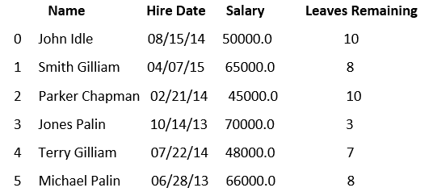

# Pandas数据框.示例()

> 原文：<https://www.javatpoint.com/pandas-dataframe-sample>

Pandas 示例()用于从数据框中随机选择行和列。如果我们想从一个广泛的数据集建立一个模型，我们必须随机选择一个较小的数据样本，这是通过一个函数**样本**完成的。

### 句法

```

DataFrame.sample(n=None, frac=None, replace=False, weights=None, random_state=None, axis=None)

```

### 因素

*   **n:** 是一个可选参数，由一个整数值组成，定义生成的随机行数。
*   **frac:** 也是一个可选参数，由浮点值组成，返回**浮点值*数据帧值长度**。它不能与参数 n 一起使用。
*   **替换:**由布尔值组成。如果为真，则返回一个替换样本。替换的默认值为 false。
*   **权重:**它也是一个**可选的**参数，由字符串或数组组成。默认值“**无**”导致相等的概率权重。
    如果正在通过一个系列；它将与索引上的目标对象对齐。采样对象中未找到的权重中的索引值将被忽略，采样对象中不在权重中的索引值将被指定零权重。
    如果当**轴=0 时数据帧正在通过；**它会接受一个列的名称。
    如果重量为系列；然后，权重必须与被采样的轴具有相同的长度。
    如果权重不等于 1；它将被归一化为 1 的和。
    权重列中缺少的值被认为是零。
    权重栏不允许无限值。
*   **random_state:** 它也是一个**可选的**参数，由一个整数或 numpy.random.RandomState 组成。如果值是 int，它为随机数生成器或 numpy RandomState 对象播种。
*   **轴:**也是可选参数，由整数值或字符串值组成。0 或“**行**和 1 或“列”。

### 返回

它返回一个与调用者相同类型的新对象，该对象包含从调用者对象中随机采样的 n 个项。

### 示例 1

```

import pandas as pd
info = pd.DataFrame({'data1': [2, 4, 8, 0],
'data2': [2, 0, 0, 0],
'data3': [10, 2, 1, 8]},
index=['John', 'Parker', 'Smith', 'William'])
info
info['data1'].sample(n=3, random_state=1)
info.sample(frac=0.5, replace=True, random_state=1)
info.sample(n=2, weights='data3', random_state=1)

```

**输出**

```
       data1    data2    data3
John     2	     2	     10
William	 0	     0	     8

```

### 示例 2

在本例中，我们获取一个 csv 文件，并使用一个示例从 DataFrame 中提取随机行。

名为 **aa** 的 csv 文件，包含以下数据集:



**让我们编写一个从上面的数据集中提取随机行的代码:**

```

# importing pandas package 
import pandas as pd 
# define data frame from csv file  
data = pd.read_csv("aa.csv") 
 # randomly select one row  
row1 = data.sample(n = 1)   
# display row
row1
# randomly select another row 
row2 = data.sample(n = 2) 
# display  row
row2

```

**输出**

```
          Name         Hire Date    Salary      Leaves Remaining
2     Parker Chapman    02/21/14     45000.0      10
5     Michael Palin     06/28/13     66000.0      8

```

* * *