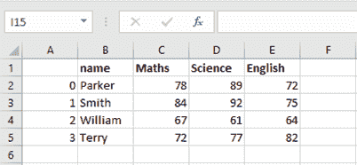

# Pandas DataFrame.to_excel()

> 原文：<https://www.javatpoint.com/pandas-dataframe-to_excel>

我们可以使用 to_excel()函数将 DataFrame 导出到 excel 文件中。

要将单个对象写入 excel 文件，我们必须指定目标文件名。如果我们想写入多张纸，我们需要用目标文件名创建一个 **ExcelWriter** 对象，并且还需要在我们必须写入的文件中指定纸。

也可以通过指定唯一的**工作表名称**来写入多个工作表。有必要保存写入文件的所有数据的更改。

#### 注意:如果我们用一个已经存在的文件名创建一个 ExcelWriter 对象，它会擦除现有文件的内容。

### 句法

```

DataFrame.to_excel(excel_writer, sheet_name='Sheet1', na_rep='', float_format=None, columns=None, header=True, index=True, index_label=None, startrow=0, startcol=0, engine=None, merge_cells=True, encoding=None, inf_rep='inf', verbose=True, freeze_panes=None)

```

### 因素

*   **excel_writer:** 文件路径或现有的 ExcelWriter。
*   **工作表名称:**是指包含数据框的工作表的名称。
*   **na_repr:** 缺失数据表示。
*   **float_format:** 是一个可选参数，用于格式化浮点数的字符串。
*   **列:**指要写的列。
*   **表头:**写出列名。如果给出了字符串列表，则假定它是列名的别名。
*   **索引:**写索引。
*   **index_label:** 指索引列的列标签。如果未指定，并且标头和索引为真，则使用索引名称。如果数据帧使用多索引，应该给出一个序列。
*   **开始行:**默认值 0。它引用左上角的单元格行来转储数据帧。
*   **startcol:** 默认值 0。它引用左上角的单元格列来转储数据帧。
*   **引擎:**它是一个可选参数，用于编写要使用的引擎、openpyxl 或 xlsxwriter。
*   **merge_cells:** 返回布尔值，默认值为真。它将多索引行和分层行作为合并单元格写入。
*   **编码:**是对生成的 excel 文件进行编码的可选参数。它只对 xlwt 是必要的。
*   **inf_rep:** 也是可选参数，默认值为 inf。它通常代表无限。
*   **verbose:** 返回布尔值。它的默认值是真。
    用于在错误日志中显示更多信息。
*   **冻结 _panes:** 这也是一个可选参数，用于指定要冻结的基于最底部的行和最右侧的列。

### 例子

```

import pandas as pd
# create dataframe
info_marks = pd.DataFrame({'name': ['Parker', 'Smith', 'William', 'Terry'],
     'Maths': [78, 84, 67, 72],
     'Science': [89, 92, 61, 77],
     'English': [72, 75, 64, 82]})

# render dataframe as html
writer = pd.ExcelWriter('output.xlsx')
info_marks.to_excel(writer)
writer.save()
print('DataFrame is written successfully to the Excel File.')

```

**输出**

数据框已成功写入 Excel 文件



* * *