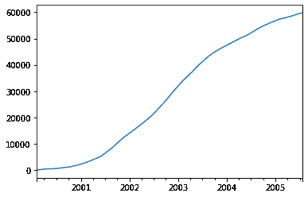

# Pandas阴谋

> 原文：<https://www.javatpoint.com/pandas-plot>

它用于使用 matplotlib / pylab 制作数据框的图。每种绘图类型在 DataFrame.plot 访问器:df.plot(kind='line ')上都有相应的方法，这些方法通常相当于 df.plot.line()。

### 语法:

```

DataFrame.plot(x=None, y=None, kind='line', ax=None, subplots=False, sharex=None, sharey=False, layout=None, figsize=None, use_index=True, title=None, grid=None, legend=True, style=None, logx=False, logy=False, loglog=False, xticks=None, yticks=None, xlim=None, ylim=None, rot=None, fontsize=None, colormap=None, table=False, yerr=None, xerr=None, secondary_y=False, sort_columns=False, **kwds) 

```

### 参数:

**数据:**数据帧

**x:** 指标签或位置，默认值无

**y:** 指标签、位置或标签、位置列表，默认值无

它允许绘制一列与另一列的对比图。

**种类:** str

*   “线条”:线条图(默认)
*   “条形图”:垂直条形图
*   “条形图”:水平条形图
*   “hist”:直方图
*   方块:boxplot
*   核密度估计图
*   “密度”:与“kde”相同
*   “面积”:面积图
*   "馅饼"：在情节
*   “散点图”:散点图
*   河西:河西绘图

**ax:** matplotlib 定线物件，预设无

**支线剧情:**布尔值，默认为 False

为每一列制作单独的子情节

**sharex:** 如果 ax 为“无”，则返回布尔值和默认值“真”，否则返回“假”。

如果子情节=True，则共享 x 轴，并将一些 x 轴标签设置为不可见；

如果 ax 为“无”，则其默认值为“真”；否则，如果传递了 ax，它将返回 false。如果在 ax 和 shareax 上同时传递 True，将会改变所有 x 轴标签。

**sharey:** 它还返回一个布尔值，默认值为 False。

如果子情节=真，它共享 y 轴，并将标签的某些 y 轴设置为不可见。

**布局:**是可选参数，指子剧情布局的元组。

**figsize:** 指以英寸为单位的元组(宽度、高度)。

**use_index:** 返回布尔值；默认值为真。

它使用索引作为 x 轴的刻度。

**标题:**是指定义绘图标题的字符串或列表。如果我们传递一个字符串，它会在图的顶部打印字符串。如果我们传递一个列表和子图为真，它会在相应的子图中打印列表中的每个项目。

**网格:**返回布尔值，默认值为无。它定义了轴网格线。

**图例:**返回假/真/‘反转’并将图例放置在轴支线剧情上。

**样式:**返回列表或字典。它定义了每列的 matplotlib 线条样式。

**logx:** 返回布尔值；默认值为假。

它通常在 x 轴上使用对数刻度。

**逻辑:**返回布尔值；默认值为假。

它通常在 y 轴上使用对数缩放。

**日志:**返回布尔值；默认值为假。

它在 x 轴和 y 轴上都使用对数缩放

**XT picks:**指由 XT picks 使用的值组成的序列。

**yticks:** 指由用于 yticks 的值组成的序列。

**xlim:** 由 2 元组/列表组成。

**ylim:** 由二元组/列表组成

**rot:** 指整数值；默认值无

它通常为刻度旋转(垂直图为 x 刻度，水平图为 y 刻度)

**fontsize:** 指整数值；默认值为“无”。

它的主要任务是为 xticks 和 yticks 指定字体大小。

**colormap:** 指 str 或 matplotlib colormap 对象，默认值为 None。

它提供颜色映射来选择颜色。如果一个值是一个字符串，它将从 matplotlib 加载具有该名称的 colormap。

**colorbar:** 是返回布尔值的可选参数。

如果该值为真，则绘制颜色条(仅与“分散”和“六边形”绘图相关)

**位置:**指浮动值。

其主要任务是为条形图布局指定相对路线。其值范围从 0(左/底端)到 1(右/顶端)。默认值为 0.5(居中)。

**表:**返回布尔值，序列或数据帧，默认值为假

如果该值为真，它将使用数据框中的数据绘制一个表。

如果我们传递一个序列或数据帧，它将传递数据来绘制一个表。

**yerr:** 指数据帧、序列、类数组、字典和字符串。

**xerr:** 与 yerr 同型。

**堆叠:**返回布尔值；第行的默认值为假，并且

条形图，面积图为真。如果该值为真，则创建堆叠图。

**sort_columns:** 返回布尔值；默认值为假

它对列名进行排序，以确定绘图顺序

**secondary_y:** 返回布尔值或序列；默认值为假。

它检查是否在第二个 y 轴上绘图。如果是列表/元组，它会在第二个 y 轴上绘制列表/元组的列

**mark_right:** 返回布尔值；默认值为“真”。

当使用辅助 y 轴时，在图例中使用“(右)”自动标记列标签

**'**kwds':** 是一个可选参数，指传递给 matplotlib 绘图方法的选项。

### 示例:

```

# import libraries 
import matplotlib.pyplot as plt 
import pandas as pd 
import numpy as np  
p = pd.Series(np.random.randn(2000), index = pd.date_range( 
                                '2/2/2000', periods = 2000)) 
p = ts.cumsum() 
p.plot() 
plt.show()

```

**输出:**



* * *