# 熊猫的分类方法

> 原文：<https://www.javatpoint.com/pandas-sorting-methods>

熊猫排序方法是使用 Python 学习和实践数据分析基础的最主要方式。数据分析通常通过**熊猫、 [SQL](https://www.javatpoint.com/sql-tutorial) 和电子表格**来完成。[熊猫](https://www.javatpoint.com/python-pandas)可以处理大量数据，并能提供高性能的数据操作能力。

在本教程中，我们将解释如何使用**。sort_values()** 和**。sort_index()，**使用户能够有效地对数据框中的数据进行排序。

## 介绍

数据框是行和列都有标签轴的数据结构。用户可以按行或列值以及行或列索引对数据框进行排序。

行和列都用数字表示数据在用户数据框中的位置，称为索引。这样用户就可以借助数据框的索引位置从特定的行或列中检索数据。默认情况下，索引号从零开始，但用户可以手动分配索引。

## 准备数据集

在本教程中，我们将使用美国环境保护署(EPA)对 1984 年至 2021 年制造的车辆编制的燃油经济性[数据集](https://www.fueleconomy.gov/feg/epadata/vehicles.csv)。环境保护局的数据集非常适合理解排序，因为它有许多不同类型的信息，从数字到文本数据类型，用户可以根据这些数据进行排序。该数据集总共包含 83 列。

在开始分析和排序数据集之前，用户需要安装 Pandas 库。熊猫库的版本应该是 1.2.0， [Python](https://www.javatpoint.com/python-tutorial) 的版本应该在 3.7.1 以上。

出于分析目的，用户将查看车辆的每加仑行驶里程(MPG)数据，包括车型、年份、品牌和其他属性。用户将能够指定在其数据框中包含哪些列。对于本文，我们只需要可访问列的子集。

在下面的示例中，我们已经将读取燃油经济性数据集的重要列的命令传递到数据框中，它还将显示新数据框的前五行。

例如:

```

import pandas as pd

column_subset = [
     "id",
     "make",
     "model",
     "year",
     "cylinders",
     "fuelType",
     "trany",
     "mpgData",
     "city08",
     "highway08"
 ]

df = pd.read_csv(
    "https://www.fueleconomy.gov/feg/epadata/vehicles.csv",
    usecols = column_subset,
    nrows = 100
 )

df.head()

```

**输出:**

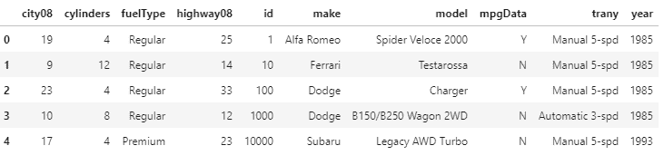

用户可以通过调用**将数据集加载到**数据框**中。用数据集 URL 读取 _csv()** 函数。我们缩小了列结果的范围，以便在低内存使用的情况下实现更快的输出。为了进一步限制内存消耗并快速预览数据，用户还可以使用“nrows”命令指定他们想要加载的行数。

## sort_values()函数

用户可以使用 **sort_values()** 功能对数据框中的值以及轴(行或列)进行排序。如果他们希望根据一列或多列的值对数据框中的行进行排序:

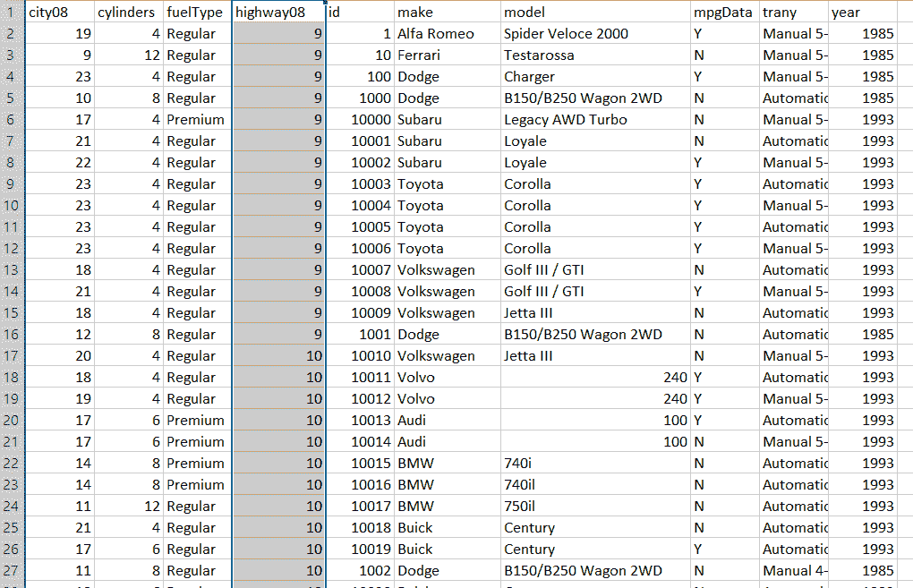

上图是使用 sort_values()函数根据 highway08 列的值对数据框行进行排序的结果。这是一个使用列对电子表格中的数据进行排序的例子。

## 函数的作用是

用户也可以使用 **sort_index()** 函数，根据数据框的行索引或列标签对数据框进行排序。

**sort_values()** 和 **sort_index()** 的区别在于 **sort_values()** 根据其在行或列中但在中的值对**数据框**进行排序。sort_index()我们根据数据帧的索引或列标签对其进行排序:

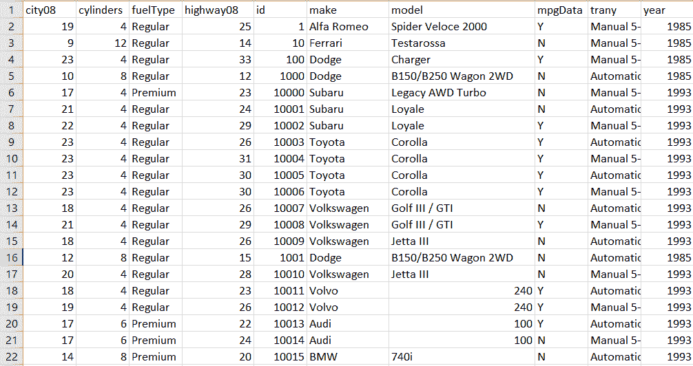

数据框的索引不被视为一列，可能只有一个原始索引。数据帧的行索引可以被视为行号，它很可能从零开始。

## 按单列对数据框进行排序

为了根据单个列的值对数据框进行排序，我们将使用 **sort_values()。**默认返回新的数据帧，按升序排序。但是它不会改变主数据帧。

### 按升序对列进行排序

用于使用。sort_values()，我们将向方法传递一个参数，该参数包含我们要排序的列的名称。在下一个示例中，我们将按照 city08 列对数据框进行排序。这仅代表燃油汽车的每加仑城市英里数。

**例如:**

```

df.sort_values("city08")

```

**输出:**

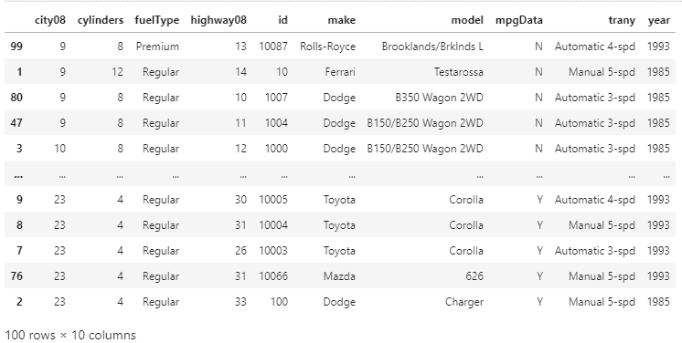

默认情况下，这将使用标记为“city08”的列的值按升序对数据框进行排序。但是，我们没有为传递给的参数指定名称。 **sort_values()，**我们实际上使用了 by-参数，我们将在下一个示例中解释。

### 更改排序顺序

默认情况下，sort_values()按升序对数据帧进行排序，但是如果我们想按降序对数据帧进行排序，我们可以将 False 值传递给参数。

例如:

```

df.sort_values(
...     by = "city08",
...     ascending = False
... )

```

**输出:**

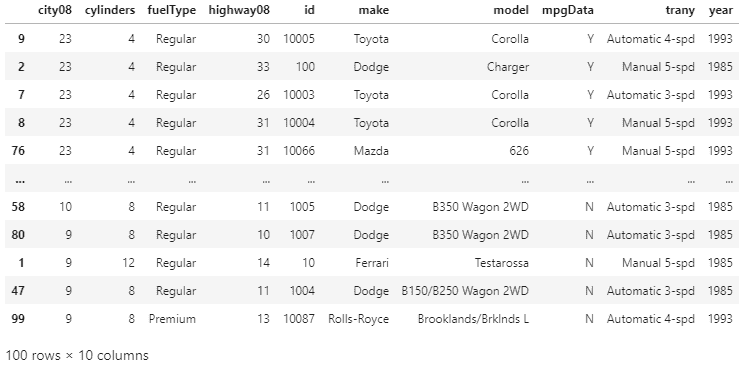

我们颠倒了排序顺序，将 False 值改为升序。现在，我们已经按照在城市条件下测量的每加仑平均英里数对数据帧进行了降序排序。在上面的输出中，我们的数据框中的车辆被排序，最大功率值在第一行。

## 选择排序算法

Pandas 允许用户在各种排序算法之间进行选择，以便同时使用。sort_values()和。sort_index()。排序算法如下:

*   海普索特
*   合并分类
*   快速分类

默认情况下，快速排序算法用于对单个列进行排序。要将其改为稳定排序算法，我们可以使用 **mergesort** 算法。我们可以通过使用 **sort_values()** 或 **sort_index()中的 kind 参数来实现。**我们也可以用 heapsort 算法来进行数据的 soring，但是 heapsort 只推荐在最坏的情况下使用，因为它是最慢的排序算法，不稳定。

例如:

```

df.sort_values(
        by = "city08",
        ascending = False,
        kind = "mergesort")

```

**输出:**

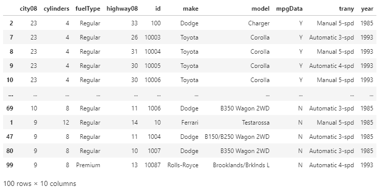

通过使用 kind 参数，我们将 mergesort 算法设置为排序算法。默认情况下，前面的输出使用快速排序算法。我们可以注意到两个算法的输出是不同的，因为 quicksort 算法不是一个稳定的排序算法。

请始终记住，在 pandas 中，当我们对多个列标签进行排序时，我们会忽略 kind 参数。

当我们对多个具有相同关键字的记录进行排序时，稳定的排序算法可以在排序后保持这些记录的原始顺序。我们有必要使用稳定的排序算法的原因是我们正在执行多种排序。

### 在多列上排序数据框

在数据分析过程中，我们有时希望根据多个列的值对数据进行排序。假设我们有一个数据集，上面有人们的名字和姓氏。我们想按人们的名字和姓氏来排序。这样人们就有了相同的名字，可以按照姓氏的字母顺序排列。

在以下示例中，我们将在名为 **city08** 的单个列上对数据帧进行排序。城市条件下的最大功率因数是决定汽车合意性的重要因素。假设我们还想看看除了城市条件下的最大行驶里程之外，高速公路条件下的每加仑英里数。为了通过两个键对数据框进行排序，我们可以通过参数传递一个列标签列表。

**例如:**

```

df.sort_values(
...     by = ["city08", "highway08"]
... )[["city08", "highway08"]]

```

**输出:**

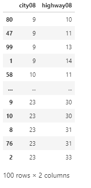

这里，通过指定列标签列表 **city08** 和 **highway08，**我们使用 **sort_values()对这两列进行了排序。**

在下一个示例中，我们将解释如何指定排序顺序，以及为什么用户关注他们使用的列标签列表很重要。

### 按多列升序排序

为了对多列上的数据框进行排序，我们必须提供列标签列表。假设，按照品牌和型号对数据帧进行排序。我们应该创建以下列表，然后将它们传递给 **sort_values()。**

**例如:**

```

df.sort_values(
        by = ["make", "model"]
        )[["make", "model"]]

```

**输出:**

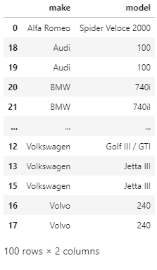

现在，我们的数据帧按 make 列以升序排序。如果有两个或更多相同的品牌，则数据框将按模型列排序。数据框将根据我们在列表中指定的列标签的顺序进行排序。

### 更改列排序顺序

当我们使用多列对数据框进行排序时，我们还可以指定列的排序顺序。如果我们想更改上一个示例中数据框的排序顺序，那么我们可以更改传递给 by 参数的列表中列标签的顺序。

**例如:**

```

df.sort_values(
        by = ["model", "make"]
        )[["make", "model"]]

```

**输出:**

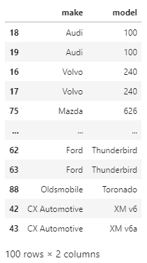

这里，现在我们的数据帧按照模型列以升序排序，如果有两个或更多相同的模型，那么数据帧将按照 make 列排序。我们可以注意到，当我们改变列的顺序时，值的排序顺序也会改变。

### 按多列降序排序

到目前为止，我们已经按照升序对多个列进行了排序。在下面的示例中，我们将按降序对多列进行排序。为了按降序对数据帧进行排序，我们将升序值设置为 False。

例如:

```

df.sort_values(
        by = ["make", "model"],
        ascending = False

```

**输出:**

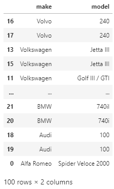

在这里，我们可以注意到，在数据框中，make 列是按照相反的字母顺序排序的，对于任何具有相同 **make** 的汽车，model 列的值都是按照降序排序的。对于文本数据，排序是区分大小写的，这意味着大写文本将按升序首先出现，按降序最后出现。

### 按不同排序顺序的多列排序

有了 Python 中的 Pandas，我们可以通过使用多个列进行排序，并通过使用不同的升序参数来拥有这些列，这也只需要一次函数调用。如果用户希望按升序对列进行排序，而某些列按降序进行排序，那么他们必须将布尔列表传递给升序。

在下面的例子中，我们将按照 **make、model 和 city08** 列对我们的数据框进行排序，前两列应该按升序排序， **city08** 列应该按降序排序。为此，我们将按参数传递列标签列表，并将布尔列表传递给升序。

**例如:**

s

```

df.sort_values(
...     by = ["make", "model", "city08"],
...     ascending = [True, True, False]
... )[["make", "model", "city08"]]

```

**输出:**

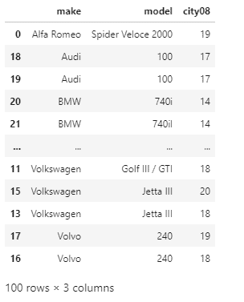

这里，现在我们的数据框是按品牌和型号列升序排序的，而 **city08** 列是按升序排序的。这是有帮助的，因为这是分类顺序中的汽车组，这首先显示了每加仑汽车的最高英里数。

### 根据索引对数据帧进行排序

在开始讨论如何对索引进行排序之前，让我们先了解一下索引代表什么。数据框有一个。index 属性，默认情况下是行位置的数字表示。索引就像行号。索引有助于快速查找和识别行。

### 按索引升序排序

我们可以使用 **sort_index()** 函数根据数据帧的行索引对其进行排序。按照列值排序就像我们在前面的示例中所做的那样，对数据框中的行进行重新排序，因此索引变得杂乱无章。当用户筛选数据框或添加或删除行时，也会发生这种情况。

用于说明。sort_index()，让我们从使用创建一个新的排序数据帧开始。sort_values()函数。

**示例:**

```

sorted_df = df.sort_values(by = ["make", "model"])
sorted_df

```

**输出:**

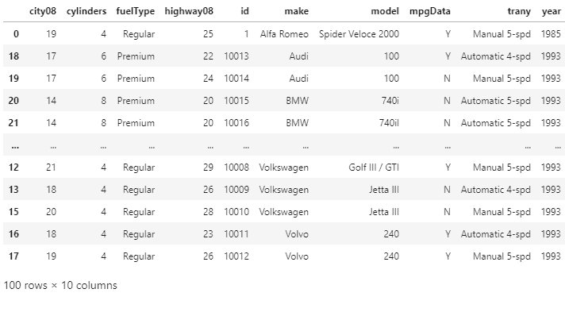

在这里，我们已经创建了数据框，它通过使用多个值进行排序。我们还可以注意到，索引的行没有任何特定的顺序。为了让我们的新**数据框**回到原始顺序，我们可以使用 **sort_index()** 函数。

**示例:**

```

sorted_df.sort_index()

```

**输出:**

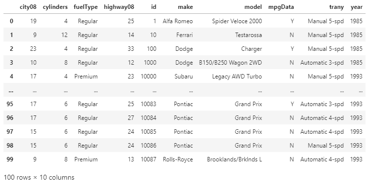

现在，我们的数据帧的索引是按升序排列的。在 **sort_index()** 中，升序的默认参数是 True，就像在 **sort_values()中一样。**我们可以绕过假值，改为降序。对索引进行排序不会对数据产生任何影响，因为值是不变的。

对于想要通过使用 **sort_index()来分配自定义索引的用户来说非常有用。**假设我们想用 make 和 model 列设置自定义索引，那么我们必须向 **set_index()传递一个列表。**

**示例:**

```

assigned_index_df = df.set_index(
...     ["make", "model"]
... )
assigned_index_df

```

**输出:**

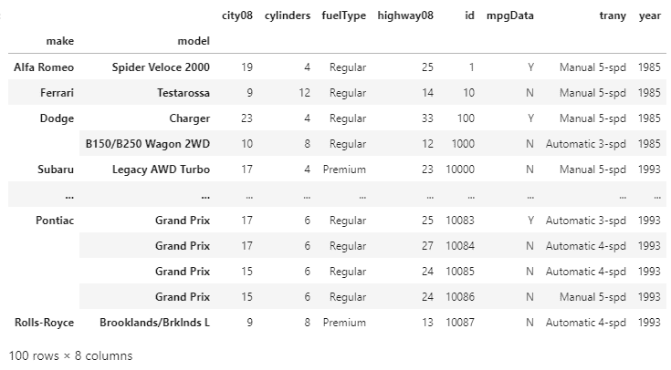

通过使用此方法，我们可以用两个轴标签替换默认的基于整数的行索引。这被认为是分层索引或多重索引。数据框现在由多个键索引，这些键可以通过使用。sort_index()。

**示例:**

```

assigned_index_df.sort_index()

```

**输出:**

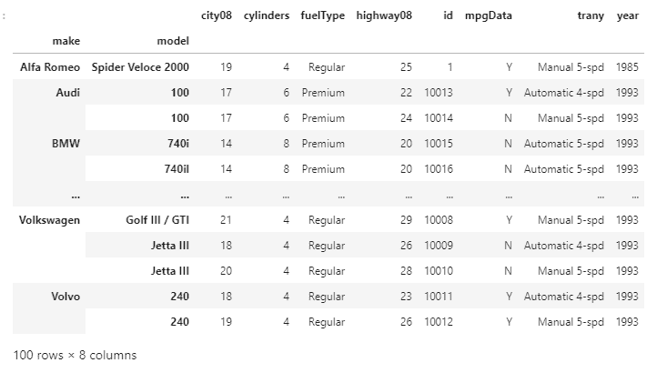

首先，我们使用 make 和 model 列为我们的 DataFrame 分配了一个新索引，然后使用。sort_index()函数。

### 按索引降序排序

现在，我们将按照索引降序对数据帧进行排序。为了以降序获得输出，我们必须将升序的值设置为 False，就像我们在中所做的那样。sort_values()。

**示例:**

```

assigned_index_df.sort_index(ascending = False)

```

**输出:**

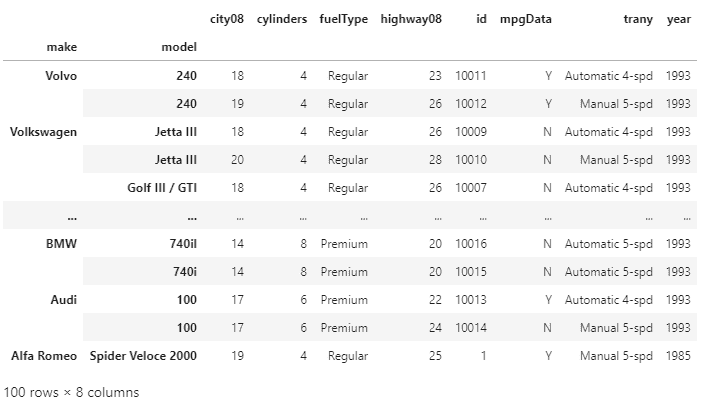

现在，我们的数据帧按其索引降序排序。有一个区别。sort_index()和。sort_values()也就是 **sort_index()** 没有参数，因为默认情况下它对行索引上的数据帧进行排序。

## 探索高级索引排序概念

当用户想要对分层索引进行排序时，在分析数据时会出现许多情况。我们已经看到了如何在 MultiIndex 中使用 make 和 model 列。对于这个数据集，我们也可以使用 id 列作为索引。

让我们将 id 列设置为索引，这将有助于链接相关的数据集。例如，环保局的排放数据集也使用标识来表示车辆记录标识。它会将排放数据集链接到燃油经济性数据集。现在，通过对数据框中两个数据集的索引进行排序，可以加快其他函数的使用速度，如 **merge()，join()和 concat()。**

## 对数据框的列进行排序

我们还可以使用数据框的列标签来对行值进行排序。在 **sort_index()，**中将可选参数轴设置为 1，我们可以根据列标签对数据帧进行排序。排序算法应用于轴标签，而不是实际数据。这将有助于数据框的可视化审查。

## 如何使用数据框轴

当用户使用。sort_index()而不传递任何显式参数。默认情况下，它使用 axis = 0 参数。数据框的轴指的是索引(轴= 0)和列(轴= 1)。用户可以使用轴来选择和索引数据框中的数据，也可以对数据进行排序。

### 使用列标签进行排序

我们还可以使用列标签作为 sort_index 函数的 DataFrame 的排序关键字。

让我们将轴设置为 1，以便根据列名对数据框的列进行排序。

**示例:**

```

df.sort_index(axis = 1)

```

**输出:**

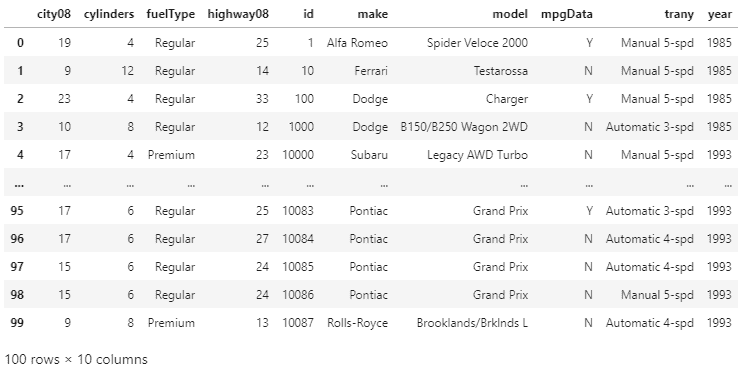

数据框的列按字母升序从左到右排序。现在，假设我们想要按降序对列进行排序，那么我们只需要将升序值设置为 False。

**示例:**

```

df.sort_index(axis = 1, ascending = False)

```

**输出:**

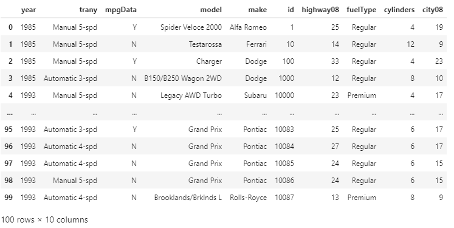

通过在。sort_index()函数，我们已经按照升序和降序对数据帧的列进行了排序。这在其他数据集中可能更有用，这些数据集中的列标签对应于一年中的月份。在这种情况下，按照月份的升序或降序排列我们的数据是有意义的。

## 结论:

在本文中，我们讨论了如何使用 **sort_values()** 和 **sort_index()** 对数据框中的数据进行高效排序。如何根据一列或多列的值对熊猫数据帧进行排序，并使用升序参数来更改排序顺序，以及如何使用。sort_index()函数。

* * *