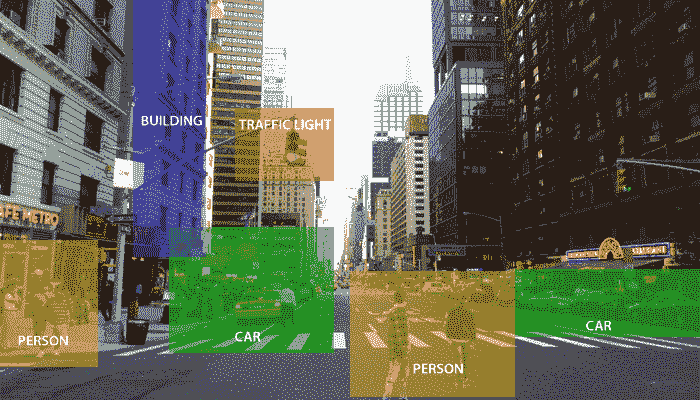
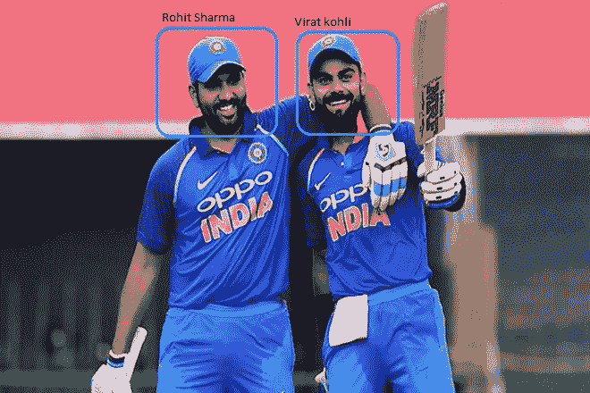
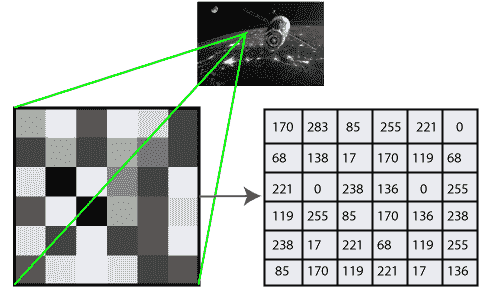
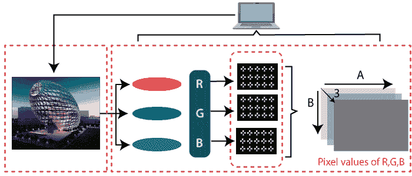

# OpenCV 教程|使用 Python 的 OpenCV

> 原文：<https://www.javatpoint.com/opencv>

OpenCV 教程提供了 OpenCV 的基本概念和高级概念。我们的 OpenCV 教程是为初学者和专业人士设计的。

OpenCV 是一个面向计算机视觉的开源库。它为机器识别人脸或物体提供了便利。在本教程中，我们将使用 Python 编程语言学习 OpenCV 的概念。

我们的 OpenCV 教程包括图像读取和保存、Canny 边缘检测、模板匹配、斑点检测、轮廓、鼠标事件、高斯模糊等所有主题。

## 什么是 OpenCV？

OpenCV 是一个 Python 开源库，用于人工智能、机器学习、人脸识别等领域的计算机视觉。

在 OpenCV 中，CV 是计算机视觉的缩写形式，它被定义为帮助计算机理解照片和视频等数字图像内容的研究领域。

计算机视觉的目的是理解图像的内容。它从图片中提取描述，图片可以是对象、文本描述、三维模型等等。例如，可以用计算机视觉来帮助汽车，计算机视觉将能够识别道路周围的不同物体，如交通灯、行人、交通标志等，并相应地采取行动。

计算机视觉允许计算机以同样的效率完成与人类相同的任务。下面定义了两个主要任务:

*   **对象分类-** 在对象分类中，我们在特定对象的数据集上训练模型，模型将新对象分类为属于您的一个或多个训练类别。
*   **对象识别-** 在对象识别中，我们的模型将识别对象的特定实例——例如，解析图像中的两张脸，并将一张标记为 Virat Kohli，另一张标记为 Rohit Sharma。

## 历史

OpenCV 代表开源计算机视觉库，广泛用于图像识别或身份识别。它于 1999 年由英特尔正式推出。它在早期是用 C/C++编写的，但现在它也常用于 Python 中的计算机视觉。

OpenCV 的第一个 alpha 版本是在 2000 年的 IEEE 计算机视觉和模式识别会议上发布的，供通用，在 2001 年到 2005 年之间，发布了五个 betas 版本。第一个 1.0 版本发布于 2006 年。

OpenCV 的第二版于 2009 年 10 月发布，并做了重大修改。第二个版本包含对 C++接口的重大改变，旨在实现更简单、更类型安全、模式化和更好的实现。目前，开发由一个独立的俄罗斯团队完成，每六个月发布一次新版本。

## OpenCV 是如何工作的

在本教程中，我们将学习计算机如何执行图像识别。

### 计算机如何识别图像？

人眼根据所见提供大量信息。机器可以看到一切，将视觉转换成数字并存储在内存中。这里就出现了计算机如何把图像转换成数字的问题。所以答案是像素值用来把图像转换成数字。像素是可以在数字显示设备上显示和表示的数字图像或图形的最小单位。

特定位置的图像强度由数字表示。在上面的图像中，我们显示了灰度图像的像素值仅由一个值组成，即该位置的黑色强度。

有两种常见的方法来识别图像:

**1。灰度**

灰度图像是那些只包含黑色和白色两种颜色的图像。强度的对比测量将黑色视为最弱强度，将白色视为最强强度。当我们使用灰度图像时，计算机会根据每个像素的暗度来分配像素值。

**2 .RGB**

RGB 是红、绿、蓝三种颜色的组合，共同构成一种新的颜色。计算机从每个像素中检索该值，并将结果放入数组中进行解释。

## 为什么 OpenCV 用于计算机视觉？

*   OpenCV 免费提供。
*   由于 OpenCV 库是用 C/C++编写的，所以退出速度很快。现在可以和 Python 一起使用了。
*   它需要更少的内存来使用，可能是 60-70 MB。
*   Computer Vision 像 OpenCV 一样便携，可以在任何能在 c 上运行的设备上运行。

## 先决条件

在学习 OpenCV 之前，必须具备 Python 编程语言的基础知识。

## 观众

我们的 OpenCV 教程旨在帮助初学者和专业人士。

## 问题

我们保证您在本 OpenCV 教程中不会发现任何问题。但是如果有任何错误，请在联系表格中发布问题。

* * *